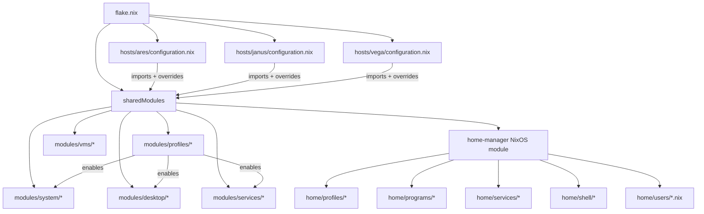

---
tags:
  - ai
  - reference
  - meta
---

# AI Agent Reference

> Dense, actionable reference for AI agents modifying this NixOS configuration. Cross-linked with [[Home]], [[Architecture Overview]], [[Module System]], [[Profile System]], [[Deployment Guide]], and [[Secrets Management]].

## 1. Quick Architecture Map



**Key principle:** `flake.nix` defines `sharedModules` — a list that every host inherits. Host configs (`hosts/<name>/configuration.nix`) import `sharedModules` via `++ [ ./hosts/<name>/configuration.nix ]` and override profile defaults with `lib.mkForce` when needed. Home Manager runs as a NixOS module (not standalone), so user config flows through the same `sharedModules` path.

---

## 2. Modification Patterns

### a. Add a System Package

- **Universal:** Edit `modules/profiles/base.nix` → add to `environment.systemPackages`
- **Profile-scoped:** Edit the relevant profile (`modules/profiles/desktop.nix`, `development.nix`, etc.)
- **Host-only:** Add `environment.systemPackages = [ pkgs.foobar ];` in `hosts/<name>/configuration.nix`

### b. Add a User Package

- Edit `home/profiles/<profile>.nix` → add to `home.packages`
- Example: `home/profiles/cli.nix` for CLI tools, `home/profiles/desktop.nix` for GUI apps

### c. Add a New System Module

1. Create `modules/system/<name>.nix` with `mkEnableOption`:
   ```nix
   { config, lib, pkgs, ... }:
   with lib;
   let cfg = config.modules.system.<name>; in
   {
     options.modules.system.<name> = {
       enable = mkEnableOption "<description>";
     };
     config = mkIf cfg.enable {
       # module implementation
     };
   }
   ```
2. Add import to `modules/system/default.nix`
3. Enable in host config: `modules.system.<name>.enable = true;`

### d. Add a New Home Module

1. Create `home/programs/<name>.nix` with `mkEnableOption`:
   ```nix
   { config, lib, pkgs, ... }:
   with lib;
   let cfg = config.programs.<name>; in
   {
     options.programs.<name> = {
       enable = mkEnableOption "<description>";
     };
     config = mkIf cfg.enable {
       # home-manager implementation
     };
   }
   ```
2. Add import to `home/programs/default.nix`
3. Enable in user config: `programs.<name>.enable = true;`

### e. Add a New Host

1. Create `hosts/<name>/configuration.nix` and `hosts/<name>/hardware-configuration.nix`
2. Add `nixosConfiguration` entry to `flake.nix`:
   ```nix
   <name> = nixpkgs.lib.nixosSystem {
     inherit system;
     specialArgs = { inherit inputs self; };
     modules = sharedModules ++ [ ./hosts/<name>/configuration.nix ];
   };
   ```
3. Choose system profiles and home profiles in the host config
4. Set `networking.hostName`, `system.stateVersion`, and bootloader

### f. Add a New User

1. Create `home/users/<name>.nix` using `mkUser` from `home/users/lib.nix`:
   ```nix
   { lib, ... }:
   let mkUser = import ./lib.nix { inherit lib; }; in
   mkUser {
     username = "<name>";
     fullName = "Full Name";
     email = "email@example.com";
     profiles = { cli.enable = true; };
   }
   ```
2. Add `users.users.<name>` to host config with `isNormalUser`, groups, shell
3. Add `home-manager.users.<name>` with import of user file and profile overrides

### g. Add a Secret

1. Run `sops secrets/secrets.yaml` to create/edit the encrypted file
2. Add secret reference to `modules/system/secrets.nix` or host config:
   ```nix
   sops.secrets."<name>" = {
     sopsFile = ./secrets/<file>.yaml;
   };
   ```
3. Reference in config: `config.sops.secrets.<name>.path` (for file paths in services, etc.)

### h. Change Desktop Environment

- In host config: `profiles.desktop.environment = "kde";` or `"hyprland"`
- This propagates through module conditionals in `modules/desktop/`
- Janus uses `lib.mkForce "kde"` because its default from jpolo.nix is hyprland

### i. Add a Dev Shell

1. Create `dev-shells/<name>.nix` following existing patterns (e.g., `dev-shells/python.nix`)
2. Add entry to `dev-shells/default.nix`
3. Add launcher script reference in `home/profiles/development.nix` if needed
4. Enter with: `nix develop /etc/nixos#<name>`

---

## 3. Profile Option Reference

### System Profiles (`modules/profiles/`)

| Option | File | Description |
|--------|------|-------------|
| `profiles.base.enable` | `base.nix` | Essential system packages (default: true) |
| `profiles.desktop.enable` | `desktop.nix` | Desktop environment support |
| `profiles.desktop.environment` | `desktop.nix` | `"hyprland"` or `"kde"` |
| `profiles.development.enable` | `development.nix` | Development tools |
| `profiles.development.languages.python.enable` | `development.nix` | Python toolchain |
| `profiles.development.languages.nodejs.enable` | `development.nix` | Node.js toolchain |
| `profiles.development.languages.rust.enable` | `development.nix` | Rust toolchain |
| `profiles.development.languages.go.enable` | `development.nix` | Go toolchain |
| `profiles.development.languages.cpp.enable` | `development.nix` | C++ toolchain |
| `profiles.development.tools.docker.enable` | `development.nix` | Docker |
| `profiles.development.tools.cloud.enable` | `development.nix` | Cloud CLI tools |
| `profiles.development.tools.kubernetes.enable` | `development.nix` | Kubernetes tools |
| `profiles.development.tools.ai.enable` | `development.nix` | AI/ML tools |
| `profiles.gaming.enable` | `gaming.nix` | Gaming infrastructure |
| `profiles.power-user.enable` | `power-user.nix` | Advanced system utilities |
| `profiles.server.enable` | `server.nix` | Server role |
| `profiles.server.role` | `server.nix` | Server role type |

### Home Profiles (`home/profiles/`)

| Option | File | Description |
|--------|------|-------------|
| `home.profiles.base.enable` | `base.nix` | Essential home packages (default: true) |
| `home.profiles.cli.enable` | `cli.nix` | CLI tools and shell enhancements |
| `home.profiles.desktop.enable` | `desktop.nix` | Desktop applications |
| `home.profiles.desktop.environment` | `desktop.nix` | `"hyprland"` or `"kde"` |
| `home.profiles.desktop.browsers.*` | `desktop.nix` | Browser configuration |
| `home.profiles.development.enable` | `development.nix` | Development home setup |
| `home.profiles.development.editors.*` | `development.nix` | Editor configuration |
| `home.profiles.development.ai.*` | `development.nix` | AI tool configuration |
| `home.profiles.work.enable` | `work.nix` | Work productivity tools |
| `home.profiles.work.communication.*` | `work.nix` | Communication tools |
| `home.profiles.power-user.enable` | `power-user.nix` | Advanced user utilities |
| `home.profiles.power-user.*` | `power-user.nix` | Power-user sub-options |
| `home.profiles.creative.enable` | `creative.nix` | Creative tools |
| `home.profiles.creative.*` | `creative.nix` | Creative sub-options |
| `home.profiles.personal.enable` | `personal.nix` | Personal tools |
| `home.profiles.personal.*` | `personal.nix` | Personal sub-options |
| `home.profiles.gaming.enable` | `gaming.nix` | Gaming home setup |
| `home.profiles.gaming.*` | `gaming.nix` | Gaming sub-options |
| `home.profiles.research.enable` | `research.nix` | Research tools |
| `home.profiles.research.*` | `research.nix` | Research sub-options |
| `home.profiles.master.enable` | `master.nix` | Meta-profile (enables all) |

### System Module Options

| Option | File | Description |
|--------|------|-------------|
| `modules.system.audio.enable` | `modules/system/audio.nix` | PipeWire audio |
| `modules.system.bluetooth.enable` | `modules/system/bluetooth.nix` | Bluetooth |
| `networking.eduroam.enable` | `modules/system/eduroam.nix` | Eduroam WiFi |
| `networking.universityVPN.enable` | `modules/system/university-vpn.nix` | University VPN |
| `system.powerProfiles.enable` | `modules/system/power-profiles.nix` | Power profile management |
| `vms.enable` | `modules/vms/default.nix` | Virtualization |
| `vms.windows11.*` | `modules/vms/windows11.nix` | Windows 11 VM options |
| `services.syncthing-jpolo.enable` | `modules/services/syncthing.nix` | Syncthing for jpolo |
| `modules.services.kmonad.enable` | `modules/services/kmonad.nix` | KMonad keyboard remap |
| `modules.services.printing.enable` | `modules/services/printing.nix` | CUPS printing |
| `modules.services.github-copilot.enable` | `modules/services/github-copilot.nix` | GitHub Copilot service |
| `services.plex-client.enable` | `modules/services/plex-client.nix` | Plex client firewall |

---

## 4. Common mkForce Patterns

Hosts override profile defaults with `lib.mkForce` when the host's purpose differs from the canonical profile selection.

### Ares (ThinkPad T14s Gen 6 AMD — primary dev machine)

```nix
# Power management overrides
services.power-profiles-daemon.enable = lib.mkForce false;  # TLP conflicts
# Touchpad natural scroll override
wayland.windowManager.hyprland.settings.input.touchpad.natural_scroll = lib.mkForce false;
# Thinkfan and TLP custom settings configured inline
```

### Janus (Family desktop — KDE, no dev tools)

```nix
profiles.desktop.environment = lib.mkForce "kde";           # Override default hyprland
home.profiles.development.enable = lib.mkForce false;       # No dev tools
home.profiles.work.enable = lib.mkForce false;              # No work profile
home.profiles.research.enable = lib.mkForce false;           # No research
home.profiles.master.enable = lib.mkForce false;             # No meta-profile
home.profiles.creative.enable = lib.mkForce false;           # No creative
home.profiles.power-user.upscayl.enable = lib.mkForce false; # Lighter power-user
home.profiles.power-user.torrenting.enable = lib.mkForce false;
services.ollama-service.enable = lib.mkForce false;          # No ROCm
services.power-profiles-daemon.enable = lib.mkForce false;   # TLP active
# TLP settings overridden for Intel CPU
```

### Vega (Headless GPU compute — no GUI)

```nix
profiles.desktop.enable = false;                              # No desktop
home.profiles.desktop.enable = lib.mkForce false;             # No home desktop
documentation.enable = false;                                   # Space savings
documentation.nixos.enable = false;
documentation.man.enable = false;
powerManagement.cpuFreqGovernor = lib.mkForce "performance";  # Compute workload
```

---

## 5. File Path Quick Reference

| Path | Purpose |
|------|---------|
| `flake.nix` | Entry point — defines hosts, overlays, shared modules |
| `hosts/<name>/configuration.nix` | Host-specific config (profiles, overrides) |
| `hosts/<name>/hardware-configuration.nix` | Auto-generated hardware config (**never edit**) |
| `modules/system/` | System-level modules (audio, bluetooth, network, power, security, etc.) |
| `modules/desktop/` | Desktop environment modules (KDE, Hyprland, fonts, XDG, display manager) |
| `modules/services/` | System services (kmonad, printing, syncthing, plex, github-copilot) |
| `modules/profiles/` | System profile definitions (base, desktop, development, gaming, server) |
| `modules/vms/` | Virtualization modules (Windows 11 VM) |
| `modules/themes/` | Theme assets |
| `home/profiles/` | Home profile definitions (base, cli, desktop, development, work, etc.) |
| `home/programs/` | Home program modules (firefox, git, kitty, neovim, etc.) |
| `home/services/` | Home services (ollama, hypridle, mako, etc.) |
| `home/shell/` | Shell configs (zsh, starship, power-user functions) |
| `home/hyprland/` | Hyprland config, waybar, hyprlock, noctalia |
| `home/users/` | User definitions (jpolo, elena, padres, gaming) + `lib.nix` for `mkUser` |
| `overlays/` | Custom overlays (stable package pinning, firefox addons) |
| `dev-shells/` | Development shells (python, node, rust, go) |
| `scripts/` | System scripts (scriptctl, update-system, cleanup-system, vmctl, etc.) |
| `secrets/` | SOPS-encrypted secrets |

---

## 6. Rebuild Commands

| Action | Command |
|--------|---------|
| Build (dry) | `nh os build --impure` or `sudo nixos-rebuild build --flake /etc/nixos#hostname` |
| Switch (apply) | `sudo nh os switch --impure` or `sudo nixos-rebuild switch --flake /etc/nixos#hostname` |
| Test (temporary) | `sudo nixos-rebuild test --flake /etc/nixos#hostname` |
| Home Manager | `home-manager switch --flake /etc/nixos` |
| Flake check | `nix flake check` |
| Update inputs | `nix flake update` |
| Tagged rebuild | `REBUILD_TAG="tag" sudo nh os switch --impure` |

> `nh` is the preferred rebuild tool over `nixos-rebuild`. The `--impure` flag is needed because some configs reference environment variables.

---

## 7. Important Constraints

1. **NEVER modify** `hardware-configuration.nix` — it is auto-generated by `nixos-generate-config`
2. **Use `lib.mkForce` sparingly** — prefer enable/disable toggles in profiles; `mkForce` creates hard-to-override settings
3. **All new modules MUST use the `mkEnableOption` pattern** — no module should unconditionally enable itself
4. **Secrets MUST go through sops-nix** — never hardcode credentials, API keys, or passwords in `.nix` files
5. **Home Manager is a NixOS module** — it is not standalone; config flows through `home-manager.nixosModules.home-manager` in `sharedModules`
6. **`documentation.enable` is `false` on all hosts** by design — saves disk space, especially on Vega
7. **The `stable` overlay provides `pkgs.stable.*`** for version-pinned packages from `nixpkgs-stable`
8. **`nh` is the preferred rebuild tool** over `nixos-rebuild`
9. **`system.stateVersion` MUST NEVER be changed** after initial install — it controls migration behavior
10. **`home-manager.backupFileExtension` is set to `"hm-backup"`** — conflicts produce `.hm-backup` files rather than failing
11. **All unfree packages are allowed** via `nixpkgs.config.allowUnfree = true` in `flake.nix`

---

**See also:** [[Home]] · [[Architecture Overview]] · [[Module System]] · [[Profile System]] · [[Deployment Guide]] · [[Secrets Management]]