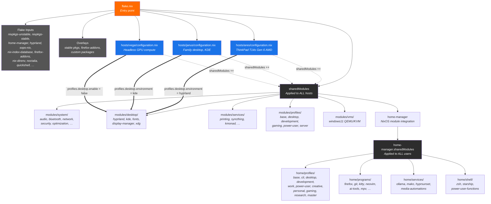

---
tags:
  - architecture
  - overview
---

# Architecture Overview

This repository is a **flake-based, multi-host NixOS configuration** with integrated Home Manager. It manages three machines — ares, janus, and vega — from a single source of truth, sharing system modules and home-manager modules across all hosts while allowing per-host overrides.

## Dependency Flow



Each `nixosConfiguration` composes `sharedModules` with a single host-specific `configuration.nix`. The host config then enables or disables profiles and overrides defaults with `lib.mkForce`.

## Directory Tree

```
/etc/nixos/
├── flake.nix              # Entry point: inputs, overlays, sharedModules, host configs
├── flake.lock             # Pinned input hashes
├── hosts/                 # Per-host configuration and hardware specs
│   ├── ares/              # ThinkPad T14s Gen 6 AMD — primary dev laptop
│   │   ├── configuration.nix
│   │   ├── hardware-configuration.nix
│   │   ├── eduroam.nix
│   │   └── university-vpn.nix
│   ├── janus/             # Family desktop — KDE, multi-user
│   │   ├── configuration.nix
│   │   └── hardware-configuration.nix
│   ├── vega/              # Headless GPU compute (Vega 56)
│   │   ├── configuration.nix
│   │   └── hardware-configuration.nix
│   └── *-example.nix      # Template host configs (not in use)
├── modules/               # NixOS system modules
│   ├── system/            # Hardware & system services (audio, bluetooth, network, security, …)
│   ├── desktop/           # Desktop environment modules (hyprland, kde, fonts, xdg, display-manager)
│   ├── services/          # System services (printing, syncthing, kmonad, github-copilot, …)
│   ├── profiles/          # System-level feature toggles (base, desktop, development, gaming, server)
│   ├── vms/               # Virtual machine configs (windows11)
│   └── themes/            # Theme assets (wallpapers)
├── home/                  # Home Manager user-level config
│   ├── profiles/          # User-level feature toggles (base, cli, desktop, development, …, master)
│   ├── programs/          # Per-program HM modules (firefox, git, kitty, neovim, ai-tools, …)
│   ├── services/          # Per-user services (ollama, mako, hyprsunset, media-automations)
│   ├── shell/             # Shell config (zsh, starship, power-user-functions)
│   ├── hyprland/          # Hyprland ecosystem (hyprland, hyprlock, hypridle, waybar, noctalia)
│   ├── kde/               # KDE-specific user config
│   └── users/             # Per-user entry points (jpolo, elena, padres, gaming, shared, lib)
├── overlays/              # Custom nixpkgs overlays (stable pkgs, firefox-addons, custom pkgs)
├── dev-shells/             # Dev shells (default, python, node, rust, go)
├── scripts/                # Shell scripts (systemctl, update, dev, power, vm utilities)
├── secrets/                # sops-nix encrypted secrets (secrets.yaml)
├── certs/                  # TLS certificates (HARICA root CAs for eduroam/VPN)
└── docs/                   # This wiki
```

## How the Module System Works

### sharedModules — the universal baseline

In `flake.nix`, the `sharedModules` list is applied to **every** `nixosConfigurations` entry. It includes:

- **`modules/system`** — hardware support, networking, security, optimization
- **`modules/desktop`** — desktop environment choices
- **`modules/services`** — system services like printing and syncthing
- **`modules/profiles`** — system-level feature toggles
- **`modules/vms`** — virtualization support
- **`nix-index-database`** — command-not-found integration
- **`sops-nix`** — secrets management
- **Overlays** — stable packages, firefox addons, custom packages
- **Home Manager NixOS module** — with its own `sharedModules` for all users

Each host's `configuration.nix` then **imports host-specific modules** (like `hardware-configuration.nix`, eduroam, VPN) and **enables or disables profiles** to shape the system.

### Layered composition

```
flake.nix sharedModules       ← applies to ALL hosts
  └─ modules/system            ← always present
  └─ modules/desktop           ← always present (host picks environment)
  └─ modules/services          ← always present (services opt-in per host)
  └─ modules/profiles          ← toggles applied per host
  └─ home-manager.sharedModules ← applies to ALL users on ALL hosts
       └─ home/profiles          ← toggles applied per user
       └─ home/programs          ← per-program config
       └─ home/services         ← per-user services
       └─ home/shell            ← shell environment
```

A host config enables a profile with `profiles.desktop.enable = true;` and optionally sets `profiles.desktop.environment = "hyprland"` or `"kde"`. The profile module then conditionally pulls in the corresponding desktop modules. Individual features within a profile can be toggled further (e.g., `profiles.development.languages.python.enable = true`).

## How Profiles Compose

### System profiles (`modules/profiles/`)

| Profile | Purpose |
|---------|---------|
| `base` | Essential packages, nix settings, zsh — **enabled by default** on all hosts |
| `desktop` | Desktop environment toggle with `environment` option (`"hyprland"` or `"kde"`) |
| `development` | Language toolchains, docker, AI tools — with fine-grained `languages.*` and `tools.*` toggles |
| `gaming` | GPU drivers, isolated gaming user, steam |
| `power-user` | Advanced system utilities |
| `server` | Server-oriented packages and hardening |

System profiles use `mkEnableOption` with per-option defaults. A host enables what it needs:

```nix
# ares — full dev workstation
profiles.base.enable = true;
profiles.desktop.enable = true;
profiles.development.enable = true;

# vega — headless compute
profiles.base.enable = true;
profiles.development.enable = true;
profiles.desktop.enable = false;  # no GUI
```

### Home profiles (`home/profiles/`)

| Profile | Purpose |
|---------|---------|
| `base` | Core CLI tools and shell config |
| `cli` | Extended command-line utilities |
| `desktop` | GUI apps and desktop integration (has `environment` option) |
| `development` | IDE configs, language servers, debug tools |
| `work` | Work-specific apps (Slack, Zoom, etc.) |
| `power-user` | Advanced user tools (tunneling, torrenting, upscayl) |
| `creative` | Media creation tools |
| `personal` | Personal apps and configs |
| `gaming` | Steam, game launchers |
| `research` | Academic tools, LaTeX, reference managers |
| `master` | Meta-profile that enables everything |

Home profiles are toggled in each user's config (`home/users/*.nix`) or overridden per-host in `home-manager.users.<name>` blocks. The `master` profile acts as an umbrella that enables all other profiles.

**Cross-host override pattern**: The host config can override per-user home profiles using `lib.mkForce`:

```nix
# janus disables dev tools for jpolo
home-manager.users.jpolo = { lib, ... }: {
  home.profiles.development.enable = lib.mkForce false;
};
```

## The Overlay System

Three overlays are defined in `flake.nix` and applied globally via `nixpkgs.overlays`:

1. **Stable packages overlay** — exposes `pkgs.stable.*` from `nixpkgs-stable` for packages that need a stable version (e.g., kernel modules, critical libraries)
2. **Firefox addons overlay** — provided by the `firefox-addons` input (`rycee/nur-expressions`), making `pkgs.firefox-addons.*` available for the Firefox module
3. **Custom packages overlay** — defined in `overlays/default.nix`, currently a placeholder for custom scripts and tools

All overlays use `nixpkgs.follows = "nixpkgs"` where applicable to avoid dependency duplication.

## Key Design Decisions

| Decision | Rationale |
|----------|-----------|
| **Home Manager as NixOS module** (not standalone `home-manager switch`) | System and user config rebuild in one `nh os switch` invocation. No drift between system and user states. Rollback covers both. |
| **`useGlobalPkgs = true`** | Home Manager uses the system `pkgs` with all overlays applied. No version mismatch between system and home packages. |
| **`useUserPackages = true`** | Packages installed via Home Manager appear in the system profile, ensuring `nix-collect-garbage` respects them. |
| **`sops-nix` for secrets** | Secrets are encrypted at rest in `secrets/secrets.yaml`, decrypted at activation time using age keys. No plaintext secrets in the nix store. |
| **`nix-index-database` + `comma`** | Provides command-not-found suggestions and lets you run unmapped commands with `comma <cmd>` without installing them first. |
| **`nh` for rebuild management** | `nh os switch` wraps `nixos-rebuild` with better UX, automatic Flake detection, and rollback support. |
| **Documentation disabled on all hosts** | `documentation.enable = false` on every host to reduce build time and closure size. The wiki you're reading replaces in-system docs. |
| **ZRAM swap** | Enabled on all hosts — compresses swap in RAM for better performance under memory pressure. |
| **`backupFileExtension`** | Home Manager keeps `.hm-backup` files when overwriting existing dotfiles, preventing accidental data loss. |
| **`verbose = true`** | Home Manager activation is more verbose for easier debugging. |

## Host Summary

| Host | Hardware | Desktop | Users | Key Profiles |
|------|----------|---------|-------|-------------|
| **ares** | ThinkPad T14s Gen 6 AMD | Hyprland (Noctalia shell) | jpolo, gaming | base, desktop (hyprland), development |
| **janus** | Intel i5 8th gen desktop | KDE Plasma 6 | jpolo, elena, padres | base, desktop (kde) |
| **vega** | Vega 56 GPU, headless | None | jpolo | base, development (headless) |

---

**Related pages**: [[Module System]] · [[Profile System]] · [[Flake Inputs]] · [[Deployment Guide]]