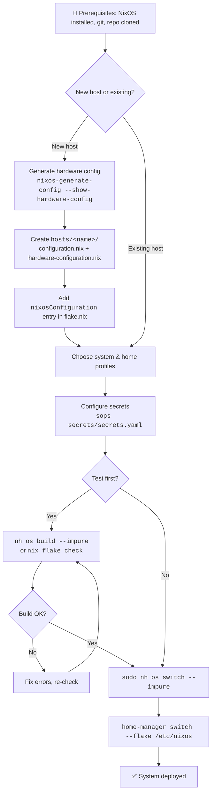

# Deployment Guide

Quickstart reference for deploying NixOS configurations to new and existing machines. See [[Architecture Overview]] for system structure and [[Profile System]] for profile selection.

## Prerequisites

- NixOS installed on the target machine (or running the NixOS installer)
- `git` available
- Basic familiarity with NixOS module syntax and the [[Flake Inputs]] model
- Access to this repository at `/etc/nixos`

## Adding a New Host

### 1. Create host directory

```
hosts/<hostname>/
├── configuration.nix
└── hardware-configuration.nix
```

On the target machine, generate hardware config:

```bash
nixos-generate-config --show-hardware-config > hosts/<hostname>/hardware-configuration.nix
```

### 2. Write `configuration.nix`

Follow the pattern from existing hosts (e.g., [[Ares]]). Minimal template:

```nix
{ config, pkgs, inputs, lib, ... }:

{
  imports = [
    ./hardware-configuration.nix
  ];

  networking.hostName = "<hostname>";
  system.stateVersion = "25.11"; # Match the NixOS release at install time

  # Bootloader
  boot.loader = {
    systemd-boot.enable = true;
    systemd-boot.configurationLimit = 10;
    efi.canTouchEfiVariables = true;
  };

  # Enable system profiles (see Profile System)
  profiles.base.enable = true;
  # profiles.desktop.enable = true;
  # profiles.development.enable = true;

  # Users
  users.users.<username> = {
    isNormalUser = true;
    extraGroups = [ "wheel" "networkmanager" "video" "audio" "input" ];
    shell = pkgs.zsh;
  };

  # Home Manager
  home-manager.users.<username> = { ... }: {
    imports = [ ../../home/users/<username>.nix ];
  };
}
```

### 3. Register in `flake.nix`

Add a new entry under `nixosConfigurations`:

```nix
<hostname> = nixpkgs.lib.nixosSystem {
  inherit system;
  specialArgs = { inherit inputs self; };
  modules = sharedModules ++ [
    ./hosts/<hostname>/configuration.nix
  ];
};
```

### 4. Choose profiles

System profiles (in `configuration.nix`):

| Profile | Purpose |
|---------|---------|
| `profiles.base.enable` | Essential packages, Nix settings |
| `profiles.desktop.enable` | Desktop environment, fonts, XDG |
| `profiles.development.enable` | Dev shells, editors, AI tools |
| `profiles.gaming.enable` | Steam, Wine, GPU drivers |

Home profiles (in `home/users/<username>.nix`):

| Profile | Purpose |
|---------|---------|
| `home.profiles.base` | Home-manager, XDG dirs |
| `home.profiles.cli` | Terminal tools |
| `home.profiles.desktop` | Environment choice, browsers, apps |
| `home.profiles.development` | Dev shells, editors |
| `home.profiles.work` | Slack, Teams, Zoom |
| `home.profiles.gaming` | Steam, Lutris, emulators |
| `home.profiles.research` | LaTeX, Zotero, Obsidian |

See [[Profile System]] for the full list and options.

### 5. Set hostname and stateVersion

- `networking.hostName` — must match the `nixosConfigurations` key in `flake.nix`
- `system.stateVersion` — set once at install, never change afterward; see [[Ares]] for examples

## Building and Switching

### First build (impure, to resolve flake paths)

```bash
sudo nh os switch --impure
# or:
sudo nixos-rebuild switch --impure --flake /etc/nixos#<hostname>
```

### Subsequent builds

```bash
sudo nh os switch
```

### Tagged builds

Tag a generation for easy identification in rollback:

```bash
REBUILD_TAG="my-tag" nh os switch --impure
```

The tag appears in `nixos-rebuild list-generations` output.

### Home Manager rebuild

```bash
home-manager switch --flake /etc/nixos
```

## Secrets Setup

This repo uses [sops-nix](https://github.com/Mic92/sops-nix) with [age](https://github.com/FiloSottile/age) encryption.

### 1. Generate an age key

```bash
age-keygen -o ~/.config/sops/age/keys.txt
```

### 2. Add your public key to `.sops.yaml`

```bash
age-keygen -y ~/.config/sops/age/keys.txt
# Copy the public key output
```

Add it to `.sops.yaml` under `keys:` and `creation_rules:`:

```yaml
keys:
  - &newhost age1xxxxxxxxxxxxxxxxxxxxxxxxxxxxxxxxxxxxxxxxxxxxxx

creation_rules:
  - path_regex: secrets/secrets\.yaml$
    key_groups:
    - age:
      - *ares
      - *newhost
```

### 3. Edit secrets

```bash
sops secrets/secrets.yaml
```

This opens the encrypted file in your `$EDITOR`. Add keys like `ssh_key`, `tailscale_key`, etc.

### 4. Reference in NixOS config

```nix
sops.secrets.tailscale_key = {
  path = "/run/secrets/tailscale_key";
};
# Use with: config.sops.secrets.tailscale_key.path
```

## Testing Configurations

| Command | Purpose |
|---------|---------|
| `nh os build --impure` | Build without switching (dry run) |
| `nh os test --impure` | Build and activate in a VM, then discard |
| `nix flake check` | Validate flake outputs and syntax |

> **Tip:** Always run `nix flake check` after editing `flake.nix`. It catches missing inputs, broken module paths, and type errors before a full build.

## Common Operations

### Update flake inputs

```bash
nix flake update              # Update all inputs
nix flake update nixpkgs      # Update a specific input
```

### Garbage collection

```bash
nh clean all --keep 5 --keep-since 14d
```

### List generations

```bash
nix-env --list-generations --profile /nix/var/nix/profiles/system
```

### Rollback

```bash
sudo nixos-rebuild switch --rollback
```

This activates the previous generation. Use after a broken build.

## Troubleshooting

| Symptom | Cause | Fix |
|---------|-------|-----|
| Build fails with syntax error | Bad Nix syntax | Run `nix flake check`; check for missing brackets, trailing commas |
| Home Manager creates `.hm-backup` files | Conflicting files already exist | Remove the backup files and the conflicting originals, then rebuild |
| SOPS decryption fails | Missing age key | Verify `~/.config/sops/age/keys.txt` exists and matches a key in `.sops.yaml` |
| Profile settings not applying | `mkForce` override in host config | Check host `configuration.nix` for `lib.mkForce` that shadows profile defaults |
| `nixos-rebuild` can't find hostname | Hostname mismatch | Ensure `networking.hostName` matches the key in `nixosConfigurations` |
| Flake lock is stale | Outdated `flake.lock` | Run `nix flake update` |

## Deployment Flowchart



## See Also

- [[Home]] — wiki index
- [[Architecture Overview]] — how modules, profiles, and hosts connect
- [[Profile System]] — full profile reference and options
- [[Flake Inputs]] — input sources and versioning
- [[Ares]], [[Janus]], [[Vega]], [[Dionysus]] — per-host configuration details