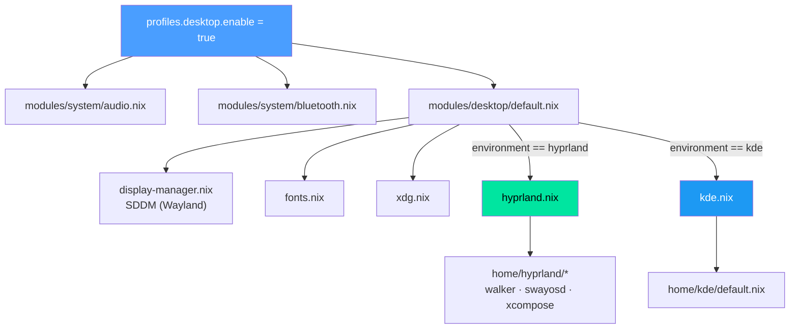

# Desktop Environment

This configuration supports two desktop environments via a profile-driven selection system. The chosen DE determines which system modules activate, which home-manager packages install, and which XDG portal backend is configured.

## Dual-DE Architecture

| Environment | Type | Host | Primary User |
|-------------|------|------|--------------|
| [[Hyprland]] | Wayland compositor | [[Ares]] | jpolo |
| [[KDE Plasma]] | Wayland (Plasma 6) | [[Janus]] | jpolo, elena, padres |

On [[Ares]], the `gaming` user runs KDE while jpolo runs Hyprland — this is a per-home-manager override, not a system-wide switch.

## DE Selection

The `profiles.desktop.environment` option selects the DE at two levels:

**System level** — `modules/profiles/desktop.nix`:
```nix
profiles.desktop.environment = "hyprland";  # or "kde"
```

**Home-manager level** — `home/profiles/desktop.nix`:
```nix
home.profiles.desktop.environment = "hyprland";  # or "kde"
```

Both default to `"hyprland"`. Host configs override as needed:

- [[Ares]]: `profiles.desktop.environment` defaults to `"hyprland"` (jpolo); `gaming` user overrides to `"kde"`
- [[Janus]]: `profiles.desktop.environment = "kde"` system-wide; jpolo's home profile uses `lib.mkForce "kde"`
- [[Vega]]: `profiles.desktop.enable = false` (headless)

## Module Composition

When `profiles.desktop.enable = true`, the system profile module (`modules/profiles/desktop.nix`) imports `modules/desktop/` and enables audio + bluetooth automatically:

```nix
config = mkIf config.profiles.desktop.enable {
  modules.system.audio.enable = true;
  modules.system.bluetooth.enable = true;
};
```

The desktop module index (`modules/desktop/default.nix`) imports all sub-modules:

| Module | Gate | Purpose |
|--------|------|---------|
| `display-manager.nix` | `profiles.desktop.enable` | SDDM login screen |
| `hyprland.nix` | `profiles.desktop.enable` + `environment == "hyprland"` | Hyprland compositor, portals, Wayland env |
| `kde.nix` | `profiles.desktop.enable` + `environment == "kde"` | Plasma 6, KDE apps |
| `fonts.nix` | `profiles.desktop.enable` | System font packages |
| `xdg.nix` | `profiles.desktop.enable` | XDG base dirs, MIME defaults |



## Display Manager

SDDM is configured in `modules/desktop/display-manager.nix` and activates for any desktop-enabled host:

- **Wayland backend** enabled (`wayland.enable = true`)
- **Breeze theme** for the login screen
- **Default session** follows the DE choice: `"plasma"` for KDE, `"hyprland"` otherwise
- User face icons symlinked from `/home/<user>/.face.icon` into SDDM faces directory

## Fonts Module

`modules/desktop/fonts.nix` installs system-wide font packages:

- **Nerd Fonts**: Fira Code, JetBrains Mono, Iosevka, Meslo LG, Ubuntu Mono
- **Noto**: Sans, CJK Sans, CJK Serif, Color Emoji
- **General**: Liberation, Fira Code + Symbols, Font Awesome, DejaVu, Ubuntu Classic

Fontconfig defaults:
- **Monospace**: JetBrainsMono Nerd Font, FiraCode Nerd Font
- **Serif**: Noto Serif, DejaVu Serif
- **Sans-serif**: Noto Sans, DejaVu Sans
- **Emoji**: Noto Color Emoji

## XDG Module

`modules/desktop/xdg.nix` configures:

- **Autostart** and **menus** directories enabled
- **MIME default applications** (system level): Firefox for web, imv for images, mpv for video, nvim for text, Dolphin for directories, Ark for archives, Okular for PDFs
- **`xdg-utils`** and **`xdg-user-dirs`** installed

The home-manager profile (`home/profiles/desktop.nix`) adds a more comprehensive MIME override at the user level, including source code types and scheme handlers.

## Home-Manager Desktop Profile

The home-manager desktop profile (`home/profiles/desktop.nix`) adapts packages and portal configuration based on `home.profiles.desktop.environment`:

### Hyprland-specific packages

When `environment == "hyprland"`, the home profile installs Wayland-native tools:

| Package | Purpose |
|---------|---------|
| `grim`, `slurp`, `grimblast` | Screenshots (region/whole screen) |
| `swappy` | Screenshot editor |
| `wl-clipboard`, `cliphist` | Clipboard manager |
| `hyprpicker` | Color picker |
| `swayosd` | Volume/brightness OSD |
| `walker` | Application launcher |
| `xcompose` | Custom compose key sequences |
| `qalculate-gtk` | Calculator |
| `pwvucontrol` | Pipewire volume control |
| `rquickshare` | Quick Share (Android nearby share) |
| `freetube` | YouTube client |

Additionally, Hyprland-specific home modules activate: hyprland window manager config, waybar, hyprlock, hypridle, hyprsunset, mako notifications, and noctalia theming. See [[Hyprland]] for details.

**XDG portal**: `xdg-desktop-portal-hyprland` + `xdg-desktop-portal-gtk`

### KDE-specific packages

When `environment == "kde"`, the system module (`modules/desktop/kde.nix`) installs KDE-native applications:

| Package | Purpose |
|---------|---------|
| `kcalc` | Calculator |
| `spectacle` | Screenshot tool |
| `ark` | Archive manager |
| `dolphin` | File manager |
| `konsole` | Terminal emulator |

KDE excludes: elisa (music), kate (editor — nvim is preferred), discover, systemsettings.

**XDG portal**: `xdg-desktop-portal-kde` + `xdg-desktop-portal-gtk`

The home-manager KDE module (`home/kde/default.nix`) is intentionally minimal — most KDE configuration is done via GUI.

## Cursor Theme

Both environments use the **Bibata-Modern-Classic** cursor theme at size 24, configured in the home-manager desktop profile:

```nix
home.pointerCursor = {
  gtk.enable = true;
  x11.enable = true;
  package = pkgs.bibata-cursors;
  name = "Bibata-Modern-Classic";
  size = 24;
};
```

## Switching Desktop Environment

To change the DE for a host, set the environment in the host configuration:

```nix
# For KDE Plasma
profiles.desktop.environment = "kde";

# For Hyprland
profiles.desktop.environment = "hyprland";
```

For per-user overrides in home-manager:

```nix
home-manager.users.jpolo = {
  home.profiles.desktop.environment = lib.mkForce "kde";
};
```

> **Note:** Use `lib.mkForce` when overriding a value that was already set by an imported profile. On [[Janus]], the system default is `"kde"`, but jpolo's home config defaults to `"hyprland"` — hence the `lib.mkForce` override.

After changing, rebuild:

```bash
nh os switch --impure
```

Then select the new session at the SDDM login screen.

## Cross-References

- [[Hyprland]] — Wayland compositor setup, window rules, keybindings
- [[KDE Plasma]] — Plasma 6 configuration and exclusions
- [[Ares]] — Hyprland primary host (gaming user runs KDE)
- [[Janus]] — KDE family desktop host
- [[Home Profiles]] — Full profile composition and per-user overrides
- [[System Modules]] — Audio, bluetooth, and other system-level modules