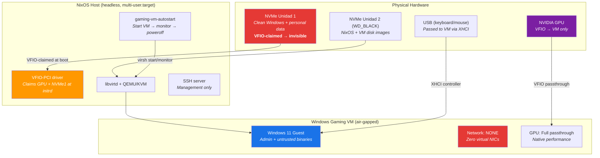
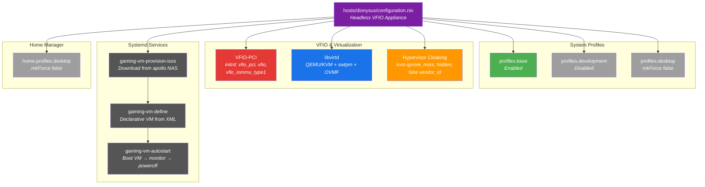

---
tags:
  - host
  - gaming
  - vfio
  - security
  - dionysus
---

# Dionysus

**Headless VFIO gaming appliance** — Single-GPU passthrough to an air-gapped Windows VM for running untrusted software in total hardware isolation.

## Overview

Dionysus is a purpose-built "hypervisor appliance" with no graphical interface on the host. Its sole function is to boot, pass its GPU and display through to a Windows VM via IOMMU/VFIO, and shut down when the VM powers off. The Windows guest runs offline (no virtual NIC) and is designed for executing untrusted binaries (pirated games, potential malware) without any path to the host filesystem or network.

The NVMe drive containing the user's "clean" native Windows installation is claimed by VFIO at early boot, making it completely invisible to both NixOS and the VM — physically isolating personal data from malware.

| Field | Value |
|-------|-------|
| Hostname | `dionysus` |
| State version | 25.11 |
| Access | SSH (`dionysus.local` via Avahi mDNS) |
| Primary role | VFIO gaming appliance (headless) |
| VM name | `WindowsGaming` |
| GPU passthrough | Single-GPU (NVIDIA, full device) |
| Network isolation | Total air-gap (VM has zero NICs) |

## Hardware

- **CPU**: AMD Ryzen 5 5600X (6C/12T, no integrated graphics)
- **Motherboard**: ASUS TUF B450 Gaming
- **GPU**: Single NVIDIA dedicated GPU (passed through entirely to VM)
- **Boot drive (Unidad 2)**: WD_BLACK SN7100 NVMe — hosts NixOS + VM disk images
- **Protected drive (Unidad 1)**: Primary NVMe — contains native "clean" Windows + personal data (claimed by VFIO, invisible to NixOS)

> [!warning]
> The `hardware-configuration.nix` is a placeholder. It must be regenerated on the actual machine:
> ```bash
> sudo nixos-generate-config --show-hardware-config > /etc/nixos/hosts/dionysus/hardware-configuration.nix
> ```

## Threat Model & Security Architecture



### Isolation layers

| Layer | Mechanism | What it protects |
|-------|-----------|------------------|
| **NVMe VFIO claim** | NVMe controller bound to `vfio-pci` at initrd | Personal data on Unidad 1 — NixOS cannot see, mount, or read it |
| **Air-gap networking** | VM defined with zero `<interface>` elements | Malware cannot phone home, exfiltrate data, or spread laterally |
| **GPU VFIO claim** | GPU + audio bound to `vfio-pci` before `nouveau`/`nvidia` load | Host has no framebuffer — pure text console. GPU belongs exclusively to VM |
| **Hypervisor cloaking** | `kvm.hidden`, fake `vendor_id`, disabled `hypervisor` CPUID | Anti-VM checks in game cracks/DRM don't detect virtualization |
| **Appliance lifecycle** | `gaming-vm-autostart` powers off host when VM stops | No lingering attack surface — machine is only on while gaming |

## Enabled Profiles & Modules



## Boot Configuration

| Setting | Value |
|---------|-------|
| Bootloader | `systemd-boot` |
| Configuration limit | 5 generations |
| Kernel | `linuxPackages_latest` |
| Default unit | `multi-user.target` (text mode) |
| EFI | `canTouchEfiVariables = true` |

### Kernel parameters

```
amd_iommu=on iommu=pt
vfio-pci.ids=<GPU>,<GPU_AUDIO>,<NVMe_Unidad1>
kvm.ignore_msrs=1 kvm.report_ignored_msrs=0
video=efifb:off video=vesafb:off nofb nomodeset
```

### Initrd modules (loaded before any GPU driver)

| Module | Purpose |
|--------|---------|
| `vfio_pci` | Claims PCI devices for passthrough |
| `vfio` | Core VFIO framework |
| `vfio_iommu_type1` | IOMMU backend for VFIO |

### Modprobe soft dependencies

```
softdep nouveau pre: vfio-pci
softdep nvidia pre: vfio-pci
softdep nvidia_drm pre: vfio-pci
softdep snd_hda_intel pre: vfio-pci
```

These ensure `vfio-pci` binds to the GPU and audio controller before any display or audio driver can claim them.

## VFIO Device Configuration

Three PCI devices are claimed by `vfio-pci` at early boot via kernel parameters:

| Device | Placeholder ID | Purpose |
|--------|---------------|---------|
| GPU VGA controller | `10de:XXXX` | NVIDIA GPU — passed to VM for native gaming performance |
| GPU HDMI/DP audio | `10de:XXXX` | GPU audio output — follows GPU into VM |
| NVMe controller (Unidad 1) | `XXXX:XXXX` | Protects "clean" Windows drive — invisible to NixOS and VM |

> [!important]
> These IDs must be filled in from the actual hardware. On the machine, run:
> ```bash
> lspci -nn | grep -E "VGA|Audio|NVMe"
> ```
> Then update the `gpuVideoId`, `gpuAudioId`, and `nvmeControllerId` variables at the top of `hosts/dionysus/configuration.nix`.

Additionally, the PCI bus addresses in the VM domain XML (`bus='0xXX'`) must match the actual hardware. Get these from the first column of `lspci -nn` output.

## Virtualization Stack

### libvirtd

```nix
virtualisation.libvirtd = {
  enable = true;
  qemu = {
    package = pkgs.qemu_kvm;
    runAsRoot = true;
    swtpm.enable = true;       # TPM 2.0 for Windows 11
    ovmf = {
      enable = true;
      packages = [ OVMFFull (secureBoot + tpmSupport) ];
    };
  };
};
```

### Hypervisor cloaking (anti-VM evasion)

Game cracks and DRM often detect virtualization and refuse to run. The following countermeasures are applied:

| Technique | Where | Effect |
|-----------|-------|--------|
| `kvm.ignore_msrs=1` | Kernel params | Prevents crashes from unsupported MSR reads |
| `kvm.report_ignored_msrs=0` | Kernel params | Suppresses dmesg spam for ignored MSRs |
| `<kvm><hidden state='on'/>` | VM XML | Hides KVM CPUID leaf from guest |
| `<feature policy='disable' name='hypervisor'/>` | VM XML | Removes hypervisor CPUID flag |
| `<vendor_id state='on' value='GenuineIntel'/>` | VM XML | Spoofs Hyper-V vendor ID |

### VM specification (`WindowsGaming`)

| Setting | Value |
|---------|-------|
| Machine type | `pc-q35-9.2` (UEFI) |
| RAM | 12 GB |
| vCPUs | 10 (5 cores x 2 threads) |
| CPU mode | `host-passthrough` with `topoext` |
| Disk | 200 GB qcow2, VirtIO, `cache=writeback`, `discard=unmap` |
| GPU | Full VFIO passthrough (VGA + audio) |
| TPM | swtpm 2.0 emulator |
| Firmware | OVMFFull with Secure Boot |
| Network | **None** (air-gapped) |
| USB | XHCI controller (4 ports) for keyboard/mouse |
| SPICE | Port 5900, `127.0.0.1` (fallback for BIOS/setup) |
| Video model | `none` (GPU passthrough provides display) |

### Hyper-V enlightenments

The VM enables a full set of Hyper-V enlightenments for Windows performance:

`relaxed`, `vapic`, `spinlocks` (8191), `vpindex`, `runtime`, `synic`, `stimer`, `reset`, `frequencies`

## Systemd Service Chain

The boot-to-gaming pipeline is fully automated:

```mermaid
sequenceDiagram
    participant Boot as System Boot
    participant Net as network-online.target
    participant Prov as gaming-vm-provision-isos
    participant Libvirt as libvirtd.service
    participant Define as gaming-vm-define
    participant Auto as gaming-vm-autostart
    participant VM as WindowsGaming VM
    participant Off as systemctl poweroff

    Boot->>Net: Network comes up
    Boot->>Libvirt: libvirtd starts
    Net->>Prov: Download ISOs (best-effort)
    Prov->>Define: ISOs ready (or skipped)
    Libvirt->>Define: libvirtd ready
    Define->>Define: Create qcow2 disk if missing
    Define->>Define: virsh define WindowsGaming.xml
    Define->>Auto: VM defined
    Auto->>VM: virsh start WindowsGaming
    Auto->>Auto: Monitor loop (every 5s)
    VM->>VM: User plays games...
    VM->>Auto: User shuts down Windows
    Auto->>Off: systemctl poweroff (3s delay)
```

### Service details

| Service | Type | After | Purpose |
|---------|------|-------|---------|
| `gaming-vm-provision-isos` | oneshot | `network-online.target` | Best-effort download of Windows ISO from apollo NAS + VirtIO from Fedora |
| `gaming-vm-define` | oneshot | `libvirtd`, `provision-isos` | Create disk image + `virsh define` from declarative XML |
| `gaming-vm-autostart` | simple | `libvirtd`, `vm-define` | `virsh start` + poll loop + `systemctl poweroff` when VM stops |

## ISO Provisioning

ISOs are stored at `/var/lib/libvirt/images/` and downloaded automatically on first boot.

| ISO | Source | Fallback |
|-----|--------|----------|
| Windows 11 | `http://apollo.local/isos/windows11.iso` | Manual SCP or `dionysus-provision download-windows` |
| VirtIO drivers | `https://fedorapeople.org/groups/virt/virtio-win/direct-downloads/stable-virtio/virtio-win.iso` | Manual SCP or `dionysus-provision download-virtio` |

The provisioning service is **best-effort** — if apollo is unreachable, it logs a warning and continues. Failed downloads use `.part` temp files so a partial download never leaves a corrupt ISO.

### `dionysus-provision` CLI

```bash
dionysus-provision                    # Show status + available commands
dionysus-provision download-windows   # Download Windows ISO from apollo NAS
dionysus-provision download-virtio    # Download VirtIO ISO from Fedora
dionysus-provision download-all       # Download both
```

**Manual transfer** (if apollo is offline):

```bash
scp windows11.iso  jpolo@dionysus.local:/var/lib/libvirt/images/windows11.iso
scp virtio-win.iso jpolo@dionysus.local:/var/lib/libvirt/images/virtio-win.iso
```

### NAS setup (apollo)

The Windows 11 ISO must be hosted at:

```
http://apollo.local/isos/windows11.iso
```

Place the ISO in the appropriate directory on apollo's HTTP file server.

## Networking

| Component | Configuration |
|-----------|---------------|
| NetworkManager | Enabled (host needs network for NixOS updates and ISO download) |
| SSH | Enabled, port 22 |
| Avahi | Enabled, mDNS publishing — reachable as `dionysus.local` |
| Firewall | Port 22 only |
| VM networking | **None** — zero virtual NICs in the VM XML |

## Users

### jpolo

| Property | Value |
|----------|-------|
| Description | Javier Polo Gambin |
| Shell | zsh |
| Groups | `wheel`, `libvirtd`, `kvm` |
| Home Manager | Desktop profile force-disabled |

## Storage

| Path | Contents |
|------|----------|
| `/var/lib/libvirt/images/WindowsGaming.qcow2` | VM disk image (200 GB, sparse qcow2) |
| `/var/lib/libvirt/images/windows11.iso` | Windows 11 installation ISO |
| `/var/lib/libvirt/images/virtio-win.iso` | VirtIO drivers for Windows |
| `/var/lib/libvirt/qemu/nvram/WindowsGaming_VARS.fd` | UEFI NVRAM variables (Secure Boot state) |

### Space management

| Setting | Value |
|---------|-------|
| GC | Weekly, delete older than 3 days |
| `auto-optimise-store` | true |
| Documentation | Disabled |

## Initial Setup Guide

### Step 1 — Install NixOS on the WD_BLACK SN7100

Boot the NixOS installer from USB. Install to the WD_BLACK SN7100 (Unidad 2). The primary NVMe (Unidad 1 with "clean" Windows) should not be touched.

### Step 2 — Generate hardware configuration

```bash
sudo nixos-generate-config --show-hardware-config > /etc/nixos/hosts/dionysus/hardware-configuration.nix
```

### Step 3 — Fill in VFIO device IDs

```bash
lspci -nn | grep -E "VGA|Audio|NVMe"
```

Example output:
```
01:00.0 VGA compatible controller [0300]: NVIDIA ... [10de:2484]
01:00.1 Audio device [0403]: NVIDIA ... [10de:228b]
02:00.0 Non-Volatile memory controller [0108]: Samsung ... [144d:a80a]
03:00.0 Non-Volatile memory controller [0108]: WD ... [15b7:5030]
```

Edit `hosts/dionysus/configuration.nix` and replace the placeholders:

```nix
gpuVideoId = "10de:2484";       # GPU VGA
gpuAudioId = "10de:228b";       # GPU Audio
nvmeControllerId = "144d:a80a"; # NVMe of Unidad 1 (the one to PROTECT)
```

> [!warning]
> Be very careful to identify the correct NVMe controller. VFIO-claiming the wrong one would make the boot drive invisible. The WD_BLACK SN7100 (boot drive) must NOT be claimed. Only claim the NVMe that holds the "clean" Windows.

Also update the PCI bus addresses in the VM XML `<hostdev>` sections. The bus number is the first hex value in `lspci` output (e.g., `01` in `01:00.0`):

```xml
<!-- GPU: bus 01 from lspci -->
<address domain='0x0000' bus='0x01' slot='0x00' function='0x0'/>
```

### Step 4 — Place Windows ISO on apollo NAS

Copy the Windows 11 ISO to your NAS so it's accessible at:
```
http://apollo.local/isos/windows11.iso
```

Or skip this and SCP the ISO directly to dionysus after first boot.

### Step 5 — Build and switch

```bash
sudo nixos-rebuild switch --flake /etc/nixos#dionysus
```

### Step 6 — First boot (Windows installation)

On the first boot:
1. The provision service downloads ISOs (if apollo is reachable)
2. The define service creates the 200 GB qcow2 disk and defines the VM
3. The autostart service starts the VM

Since this is a fresh install with no Windows yet, you need to connect via SPICE from another machine to complete the Windows installer:

```bash
# From ares or another machine on the LAN:
remote-viewer spice://dionysus.local:5900
```

During Windows Setup:
1. When prompted for a disk, click **Load driver** and browse the VirtIO CD-ROM
2. Complete installation normally
3. Install VirtIO drivers from the secondary CD-ROM after first Windows boot

Once GPU passthrough is working, display output goes to the physical monitor connected to the NVIDIA GPU. SPICE becomes a fallback for BIOS/UEFI access only.

### Step 7 — Subsequent boots

After Windows is installed, the appliance is fully automatic:
1. Power on the PC
2. NixOS boots headless, starts the VM
3. Windows appears on the monitor (via GPU passthrough)
4. Play games
5. Shut down Windows from its Start menu
6. NixOS detects the VM stopped and powers off the hardware

## Troubleshooting

| Symptom | Cause | Fix |
|---------|-------|-----|
| No display output after boot | GPU not passed through correctly | Verify VFIO IDs match `lspci -nn`. Check `dmesg | grep vfio` via SSH |
| VM fails to start | Missing ISOs or disk image | SSH in and run `dionysus-provision` to check status |
| Windows shows "This PC doesn't meet requirements" | TPM or Secure Boot issue | TPM 2.0 is configured via swtpm — check `journalctl -u gaming-vm-define` |
| Game crashes with "VM detected" | Anti-cheat/DRM detecting KVM | Cloaking is enabled. Try also adding `<smbios mode='host'/>` to the VM XML |
| Host doesn't power off after VM shutdown | Autostart service not running | Check `systemctl status gaming-vm-autostart` |
| NVMe Unidad 1 is visible in `lsblk` | VFIO didn't claim the controller | Wrong device ID in `nvmeControllerId`. Verify with `lspci -nn` |
| Apollo NAS unreachable during boot | Network timing or NAS offline | SSH in and run `dionysus-provision download-windows` manually, or SCP the ISO |
| IOMMU groups too broad | Multiple devices share a group | Check groups with `for d in /sys/kernel/iommu_groups/*/devices/*; do echo "$(basename $(dirname $(dirname $d))) $(lspci -nns $(basename $d))"; done` and consider ACS override patch if needed |

## Cross-References

- [[Architecture Overview]] — how hosts, profiles, and modules compose
- [[Virtualization]] — VM module and Windows 11 setup on other hosts
- [[Vega]] — another headless host (GPU compute, not VFIO)
- [[Deployment Guide]] — general host deployment steps
- [[Security]] — system-wide security modules
- [[Ares]] — primary workstation for remote management via SSH
