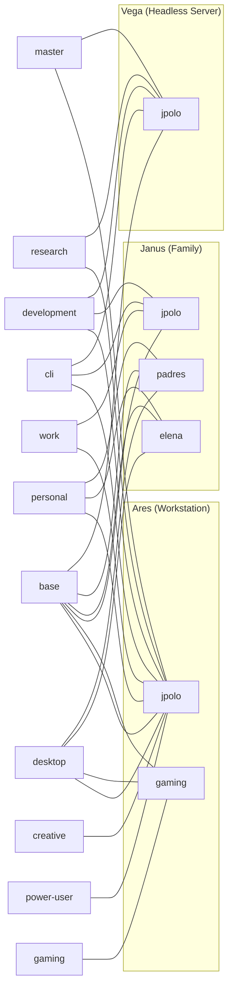

---
tags:
  - profiles
  - home-manager
  - reference
---

# Home Profiles

Home profiles are user-level capability bundles defined in `home/profiles/`. Each profile groups related packages, programs, services, and configuration behind a single `home.profiles.<name>.enable` option with optional sub-options for fine-grained control. They are composed per-user via [[#User Configuration|mkUser]] — see [[Profile System]] for the full two-level architecture.

All profiles are imported together via `home/profiles/default.nix` and selectively enabled per-user. The base profile defaults to enabled for all users; everything else is opt-in.

> **Source**: `home/profiles/` — each profile lives in its own `.nix` file matching the option name.

---

## Profile Composition per User per Host

> **Note**: On [[Vega]], `desktop.enable` is force-disabled via `lib.mkForce false` for headless operation. `jpolo` on Vega inherits the same `jpolo.nix` user definition — the host overrides only the desktop profile.

---

## 1. `base`

**Option**: `home.profiles.base.enable` (boolean, default `true`)

Foundation profile enabled for every user. No packages — only essential configuration.

| Sub-option | Type | Default | Effect |
|---|---|---|---|
| *(none)* | — | — | — |

**Enables**:
- `programs.home-manager.enable = true` — home-manager self-management
- `xdg.enable = true` + `xdg.userDirs` — XDG base directories with auto-creation (`Desktop`, `Documents`, `Downloads`, `Music`, `Pictures`, `Videos`, `Templates`, `Public`)
- `programs.bash.enable = true` — bash as fallback shell

**Users**: All users on all hosts (default `true` via `mkDefault` in `mkUser`).

---

## 2. `cli`

**Option**: `home.profiles.cli.enable` (boolean, default `false`)

Terminal power-user essentials. This profile does not install packages directly — it sets session variables and serves as the opt-in gate for shell/terminal tooling configured elsewhere (see [[Home Programs]]).

| Sub-option | Type | Default | Effect |
|---|---|---|---|
| *(none)* | — | — | — |

**Enables**:
- `home.sessionVariables.EDITOR = "nvim"`
- `home.sessionVariables.VISUAL = "nvim"`
- Advanced shell (Zsh + Starship), Git & GitHub CLI, Neovim, Tmux, FZF, Ripgrep — all configured via `home/shell/` and `home/programs/`

**Users**: `jpolo` on all hosts.

---

## 3. `desktop`

**Option**: `home.profiles.desktop.enable` (boolean, default `false`)

Full desktop environment configuration — environment choice, browsers, applications, mime types, cursor theme, XDG portal, and directory scaffolding.

### Sub-options

| Option | Type | Default | Description |
|---|---|---|---|
| `environment` | `enum ["hyprland" "kde"]` | `"hyprland"` | Desktop environment |
| `browsers.firefox` | boolean | `false` | Enable Firefox |
| `browsers.chromium` | boolean | `false` | Enable Chromium |

### Packages (always)

| Package | Purpose |
|---|---|
| `kitty` | GPU-accelerated terminal |
| `alacritty` | Alternative terminal |
| `yazi` | Terminal file manager |
| `bitwarden-desktop` | Password manager |
| `qt6Packages.qt6ct` | Qt6 theme configuration |
| `gtk3` | GTK launcher support |

### Packages (Hyprland only)

| Package | Purpose |
|---|---|
| `kdePackages.dolphin` | File manager |
| `kdePackages.okular` | Document viewer |
| `zathura` | Minimal PDF viewer |
| `imv` | Image viewer |
| `feh` | Image viewer (fallback) |
| `wl-clipboard` | Wayland clipboard |
| `cliphist` | Clipboard history |
| `hyprpicker` | Color picker |
| `grim` | Screenshot tool |
| `slurp` | Region selector |
| `grimblast` | Screenshot wrapper |
| `swappy` | Screenshot editor |
| `pwvucontrol` | Volume control (PipeWire) |
| `swayosd` | On-screen display |
| `qalculate-gtk` | Calculator |
| `walker` | Application launcher |
| `rquickshare` | QuickShare (Android nearby share) |
| `freetube` | YouTube ad-free |

### Imports

The desktop profile pulls in these home modules:
- `../hyprland` — Hyprland, Hyprlock, Hypridle, Waybar, Noctalia
- `../kde` — KDE-specific home config
- `../programs/walker.nix` — Walker app launcher
- `../programs/swayosd.nix` — OSD config
- `../programs/xcompose.nix` — XCompose key mappings

### Firefox configuration

When `browsers.firefox = true`:
- Default profile with DuckDuckGo search, tracking protection, HTTPS-only mode

### Directory scaffolding

| Path | Condition |
|---|---|
| `Projects/Work/` | always |
| `Projects/Personal/` | always |
| `Projects/Master/` | always |
| `Projects/Playground/` | always |
| `Vault/` | `power-user.productivity.enable` |
| `VMs/ISOs/` | always |
| `VMs/Disks/` | always |
| `Pictures/Wallpapers/` | always |
| `Pictures/Screenshots/` | always |
| `Downloads/Torrents/` | always |

### MIME type defaults

| MIME type | Application |
|---|---|
| `text/*`, `application/{json,yaml,toml}` | `nvim.desktop` |
| `text/html` | `firefox.desktop` |
| `application/pdf` | `okular.desktop` |
| `image/{png,jpeg,gif,webp}` | `imv.desktop` |
| `image/svg+xml` | `firefox.desktop` |
| `video/{mp4,mkv,webm}`, `audio/*` | `mpv.desktop` |
| `x-scheme-handler/{http,https,mailto}` | `firefox.desktop` |
| `inode/directory` | `dolphin.desktop` |
| `application/{zip,x-tar,x-7z-compressed,x-rar}` | `ark.desktop` |

### Other configuration

- **Cursor**: `Bibata-Modern-Classic` at size 24 (GTK + X11)
- **Kitty**: `enable_audio_bell = false`, `confirm_os_window_close = 0`
- **Neovim**: default editor, vi/vim aliases
- **XDG Portal**: `hyprland` or `kde` portal based on `environment` + `gtk` portal

**Users by environment**:

| User | Host | Environment | Browsers |
|---|---|---|---|
| `jpolo` | [[Ares]] | `hyprland` | firefox |
| `jpolo` | [[Janus]] | `hyprland` | firefox |
| `gaming` | [[Ares]] | `hyprland` | — |
| `elena` | [[Janus]] | `kde` | — |
| `padres` | [[Janus]] | `kde` | — |

---

## 4. `development`

**Option**: `home.profiles.development.enable` (boolean, default `false`)

Development toolchain: dev shells, editors, AI coding tools, web apps, and lazygit.

### Sub-options

| Option | Type | Default | Description |
|---|---|---|---|
| `devShells.enable` | boolean | `true` | Generic dev shells |
| `devShells.enableLaunchers` | boolean | `true` | `~/.local/bin/dev-{python,node,rust,go}` scripts |
| `devShells.enableDirenvTemplates` | boolean | `true` | `~/.config/direnv/templates/*.envrc` |
| `editors.vscode.enable` | boolean | `false` | Visual Studio Code |
| `editors.neovim.enable` | boolean | `true` | Neovim + LazyVim |
| `ai.enable` | boolean | `true` | AI development tools gate |
| `ai.tools.gemini-cli.enable` | boolean | `true` | Gemini CLI |
| `ai.tools.github-copilot-cli.enable` | boolean | `true` | GitHub Copilot CLI |
| `ai.tools.claude-code.enable` | boolean | `false` | Claude Code |
| `ai.tools.pi-coding-agent.enable` | boolean | `true` | Pi Coding Agent (omp) |
| `web.enable` | boolean | `true` | Development web apps |

### Dev shell launchers

Created at `~/.local/bin/` when `devShells.enableLaunchers = true`:

| Script | Command |
|---|---|
| `dev-python` | `nix develop /etc/nixos#python` |
| `dev-node` | `nix develop /etc/nixos#node` |
| `dev-rust` | `nix develop /etc/nixos#rust` |
| `dev-go` | `nix develop /etc/nixos#go` |

### Direnv templates

At `~/.config/direnv/templates/` when `devShells.enableDirenvTemplates = true`:

| Template | Flake output |
|---|---|
| `python.envrc` | `#python` |
| `node.envrc` | `#node` |
| `rust.envrc` | `#rust` |
| `go.envrc` | `#go` |

### Packages

- `vscode` — when `editors.vscode.enable = true`
- `direnv` + `nix-direnv` — always (with `warn_timeout = "30s"`)

### Programs

- `programs.ai-tools` — configured from `ai.tools.*` sub-options (see [[Home Programs]])
- `programs.web-apps` — enables `github`, `gitlab`, `overleaf`, `chatgpt`
- `programs.lazygit` — dark theme, blue active border

**Users**: `jpolo` on all hosts (with `editors.vscode.enable = false`, `ai.tools.claude-code.enable = true` on [[Ares]]).

---

## 5. `work`

**Option**: `home.profiles.work.enable` (boolean, default `false`)

Work communication and VPN.

### Sub-options

| Option | Type | Default | Description |
|---|---|---|---|
| `communication.enable` | boolean | `true` | Communication apps gate |
| `communication.slack` | boolean | `communication.enable` | Slack |
| `communication.teams` | boolean | `communication.enable` | Microsoft Teams |
| `communication.zoom` | boolean | `communication.enable` | Zoom |
| `vpn.enable` | boolean | `work.enable` | Cisco AnyConnect VPN |
| `vpn.server` | string | `"cdel.c-lab.ee"` | VPN server address |

### Packages

| Package | Condition |
|---|---|
| `slack` | `communication.slack` |
| `teams-for-linux` | `communication.teams` |
| `zoom-us` | `communication.zoom` |
| `openconnect` | `vpn.enable` |
| `networkmanager-openconnect` | `vpn.enable` |

### Citadel VPN script

When `vpn.enable = true`, an executable script is placed at `~/.local/bin/setup-citadel-vpn`. It:
1. Creates or updates the NM connection `Citadel VPN` via `nmcli`
2. Configures split tunneling (`ipv4.never-default yes`)
3. Sets DNS priority to 50 (low) so VPN DNS doesn't override primary
4. Server address comes from `vpn.server` (default: `cdel.c-lab.ee`)

### Zoom configuration

When `communication.zoom = true`: `~/.config/zoomus.conf` enables GPU compute and CEF GPU.

**Users**: `jpolo` on [[Ares]] and [[Janus]] (full communication + VPN).

---

## 6. `power-user`

**Option**: `home.profiles.power-user.enable` (boolean, default `false`)

Advanced tools for power users — network analysis, system monitoring, CLI utilities, productivity, torrenting, and AI upscaling.

### Sub-options

| Option | Type | Default | Description |
|---|---|---|---|
| `network.enable` | boolean | `true` | Network analysis tools |
| `system.enable` | boolean | `true` | System monitoring & disk tools |
| `dev-gui.enable` | boolean | `true` | Development GUI tools |
| `productivity.enable` | boolean | `true` | Obsidian, Taskwarrior, rclone |
| `cli-utils.enable` | boolean | `true` | CLI power utilities |
| `torrenting.enable` | boolean | `true` | qBittorrent |
| `upscayl.enable` | boolean | `false` | AI image upscaler |

### Packages by category

**Network analysis** (`network.enable`):
`nmap`, `socat`, `mtr`, `bandwhich`, `gping`, `dog`

**System & disk** (`system.enable`):
`qdirstat`, `gparted`, `btop`, `virt-manager`, `kmonad`, `krusader`, `strace`, `ltrace`, `lsof`, `iotop`, `iftop`, `sysstat`, `duf`, `dust`, `gdu`, `plocate`

**CLI utilities** (`cli-utils.enable`):
`jq`, `yq-go`, `miller`, `fx`, `ripgrep`, `fd`, `eza`, `bat`, `tealdeer`, `ffmpeg`, `imagemagick`, `p7zip`, `unzip`, `zip`, `hyperfine`, `parallel`, `yt-dlp`

**Productivity** (`productivity.enable`):
`obsidian`, `timewarrior`, `taskwarrior3`, `taskwarrior-tui`, `rclone`

**Torrenting** (`torrenting.enable`):
`qbittorrent`

**AI upscaling** (`upscayl.enable`):
`upscayl`

### Obsidian vault configuration

When `productivity.enable = true`:
- `~/.config/obsidian/obsidian.json` — declares two vaults:
  - `knowledge-base` → `/home/jpolo/Vault/Knowledge Base`
  - `phd-vault` → `/home/jpolo/Vault/phd`
- Activation script `obsidianTheme` forces themes:
  - Knowledge Base → Dark (`obsidian`)
  - PhD → Light (`moonstone`)

**Users**: `jpolo` on [[Ares]] (`productivity`, `cli-utils`, `torrenting`, `upscayl` all enabled).

---

## 7. `creative`

**Option**: `home.profiles.creative.enable` (boolean, default `false`)

Graphics, video, audio, and creative web apps.

### Sub-options

| Option | Type | Default | Description |
|---|---|---|---|
| `graphics.enable` | boolean | `true` | GIMP, Krita |
| `video.enable` | boolean | `false` | Kdenlive, OBS Studio, wf-recorder |
| `audio.enable` | boolean | `false` | Audacity |
| `web.enable` | boolean | `true` | Creative web apps |
| `web.figma` | *(via web-apps)* | `false` | Figma |
| `web.canva` | *(via web-apps)* | `false` | Canva |
| `web.excalidraw` | *(via web-apps)* | `true` | Excalidraw |

### Packages

| Package | Condition |
|---|---|
| `gimp` | `graphics.enable` |
| `krita` | `graphics.enable` |
| `kdePackages.kdenlive` | `video.enable` |
| `obs-studio` | `video.enable` |
| `wf-recorder` | `video.enable` |
| `audacity` | `audio.enable` |

**Users**: `jpolo` on [[Ares]] (with `video.enable = true`).

---

## 8. `personal`

**Option**: `home.profiles.personal.enable` (boolean, default `false`)

Daily-driver applications — communication, media, productivity, office, tools, and web apps.

### Sub-options

| Option | Type | Default | Description |
|---|---|---|---|
| `communication.enable` | boolean | `true` | Communication apps gate |
| `communication.discord` | boolean | `communication.enable` | Discord |
| `communication.telegram` | boolean | `communication.enable` | Telegram |
| `media.enable` | boolean | `true` | Media apps gate |
| `media.spotify` | boolean | `media.enable` | Spotify |
| `media.plexamp` | boolean | `media.enable` | Plexamp |
| `media.plex` | boolean | `media.enable` | Plex Desktop |
| `media.vlc` | boolean | `media.enable` | VLC |
| `media.mpv` | boolean | `media.enable` | MPV |
| `productivity.enable` | boolean | `true` | Productivity gate |
| `productivity.bitwarden` | boolean | `productivity.enable` | Bitwarden |
| `productivity.syncthing` | boolean | `productivity.enable` | Syncthing |
| `office.enable` | boolean | `true` | Office suite gate |
| `office.onlyoffice` | boolean | `false` | OnlyOffice Desktop Editors |
| `office.libreoffice` | boolean | `office.enable` | LibreOffice Fresh |
| `office.okular` | boolean | `office.enable` | Okular + hunspell dicts |
| `tools.enable` | boolean | `true` | General utility tools gate |
| `tools.image-editing` | boolean | `tools.enable` | Pinta |
| `tools.screenshot` | boolean | `tools.enable` | Flameshot |
| `tools.video-tools` | boolean | `tools.enable` | LosslessCut |
| `web.enable` | boolean | `true` | Web apps gate |
| `web.communication` | boolean | `web.enable` | Gmail, WhatsApp |
| `web.media` | boolean | `web.enable` | YouTube |
| `web.ai` | boolean | `web.enable` | Perplexity |

### Packages

| Package | Condition |
|---|---|
| `discord` | `communication.discord` |
| `telegram-desktop` | `communication.telegram` |
| `spotify` | `media.spotify` |
| `plexamp` | `media.plexamp` |
| `plex-desktop` | `media.plex` |
| `vlc` | `media.vlc` |
| `mpv` | `media.mpv` |
| `bitwarden-desktop` | `productivity.bitwarden` |
| `syncthing` | `productivity.syncthing` |
| `onlyoffice-desktopeditors` | `office.onlyoffice` |
| `libreoffice-fresh` | `office.libreoffice` |
| `kdePackages.okular` + `hunspell` + `hunspellDicts.en_US` + `hunspellDicts.es_ES` | `office.okular` |
| `pinta` | `tools.image-editing` |
| `flameshot` | `tools.screenshot` |
| `losslesscut-bin` | `tools.video-tools` |
| `cmatrix`, `pipes`, `cbonsai` | always (fun) |

### Services

- `services.media-automations.enable = true` — always when profile enabled

### Web apps (via `programs.web-apps`)

`gmail`, `whatsapp`, `youtube`, `perplexity` — controlled by `web.*` sub-options.

**Users**:

| User | Host | Overrides |
|---|---|---|
| `jpolo` | [[Ares]] | `media.spotify = false`, `office.onlyoffice = false` |
| `elena` | [[Janus]] | defaults |
| `padres` | [[Janus]] | defaults |

---

## 9. `gaming`

**Option**: `home.profiles.gaming.enable` (boolean, default `false`)

Gaming launchers, compatibility layers, emulators, and performance utilities.

### Sub-options

| Option | Type | Default | Description |
|---|---|---|---|
| `steam.enable` | boolean | `true` | Steam |
| `wine.enable` | boolean | `true` | Wine + Proton (wow64) |
| `lutris.enable` | boolean | `false` | Lutris |
| `heroic.enable` | boolean | `false` | Heroic Games Launcher |
| `emulation.enable` | boolean | `false` | RetroArch |
| `utils.enable` | boolean | `true` | MangoHud, Gamescope, gamemode |

### Packages

| Package | Condition |
|---|---|
| `steam` | `steam.enable` |
| `wineWow64Packages.stable` | `wine.enable` |
| `winetricks` | `wine.enable` |
| `lutris` | `lutris.enable` |
| `heroic` | `heroic.enable` |
| `retroarch` | `emulation.enable` |
| `gamescope` | `utils.enable` |
| `mangohud` | `utils.enable` |
| `gamemode` | `utils.enable` |

**Users**: `gaming` on [[Ares]] (`steam + utils` only; `wine`, `lutris`, `heroic`, `emulation` disabled).

---

## 10. `research`

**Option**: `home.profiles.research.enable` (boolean, default `false`)

Academic research tools — LaTeX, reference management, PDF viewers, and diagrams.

### Sub-options

| Option | Type | Default | Description |
|---|---|---|---|
| `latex.enable` | boolean | `true` | TeX Live (scheme-full) |
| `tools.enable` | boolean | `true` | Pandoc, Zotero, Obsidian |
| `visualization.enable` | boolean | `true` | Zathura + synctex, Sioyek |
| `diagrams.enable` | boolean | `true` | Diagramming tools |

### Packages

| Package | Condition |
|---|---|
| `texlive.combined.scheme-full` | `latex.enable` |
| `pandoc` | `tools.enable` |
| `zotero` | `tools.enable` |
| `obsidian` | `tools.enable` |
| `zathura` | `visualization.enable` |
| `sioyek` | `visualization.enable` |

### Zathura configuration

When `visualization.enable = true`:
- `selection-clipboard = "clipboard"`
- `synctex = true`
- `synctex-editor-command = "nvim --headless -c \"VimtexInverseSearch %{line} '%{input}'\""`

**Users**: `jpolo` on [[Ares]] (`latex`, `tools`, `diagrams` enabled; `visualization` uses default `true`).

---

## 11. `master`

**Option**: `home.profiles.master.enable` (boolean, default `false`)

AI Master's degree profile — Python data science stack and Orange3 data mining environment.

### Sub-options

| Option | Type | Default | Description |
|---|---|---|---|
| *(none)* | — | — | — |

### Packages

**Python 3 (system Python)** with packages:

| Package | Purpose |
|---|---|
| `numpy` | Numerical computing |
| `pandas` | Data manipulation |
| `scikit-learn` | Machine learning |
| `matplotlib` | Plotting |
| `seaborn` | Statistical visualization |
| `jupyter` | Notebook environment |
| `notebook` | Jupyter Notebook |
| `ipython` | Interactive Python |
| `scipy` | Scientific computing |
| `torch` | Deep learning (PyTorch) |
| `xgboost` | Gradient boosting |

**Orange3** (isolated Python 3.12 environment):

The `orange-canvas` launcher uses a separate Python 3.12 environment to avoid file conflicts with the main Python. It includes:
- `orange3` — core data mining application
- `orange3-educational` (v0.8.1) — educational add-on
- `orange3-explain` (v0.6.11) — model explainability add-on (SHAP)
- Supporting packages: `numpy`, `scipy`, `shap`, `pandas`

Both Orange add-ons are built as custom Python packages with patches to remove conflicting sphinx dependencies.

**Users**: `jpolo` on [[Ares]] and [[Vega]].

---

## User Configuration Summary

Users are defined via `mkUser` in `home/users/lib.nix`, which:
1. Imports `shared.nix` (common packages: `ncdu`, `duf`, `age`, `sops`; `direnv` + `nix-index`)
2. Imports all profiles from `home/profiles/default.nix`
3. Merges user-specified profile selections with `base.enable = mkDefault true`
4. Sets `programs.git.settings.user.{name,email}`

| User | File | Profiles | Hosts |
|---|---|---|---|
| `jpolo` | `home/users/jpolo.nix` | base, cli, desktop (hyprland), development, work, power-user, creative, personal, research, master | [[Ares]], [[Janus]], [[Vega]] |
| `gaming` | `home/users/gaming.nix` | base, desktop (hyprland), gaming (steam+utils) | [[Ares]] |
| `elena` | `home/users/elena.nix` | base, desktop (kde), personal | [[Janus]] |
| `padres` | `home/users/padres.nix` | base, desktop (kde), personal | [[Janus]] |

### jpolo profile overrides

On [[Ares]] (via `extraConfig`):
- `desktop.environment = "hyprland"`, `browsers.firefox = true`
- `development.editors.vscode.enable = false`, `ai.tools.claude-code.enable = true`
- `creative.video.enable = true`
- `power-user`: `productivity`, `cli-utils`, `torrenting`, `upscayl` enabled
- `work`: full communication + VPN
- `personal.media.spotify = false`, `office.onlyoffice = false`
- `research.latex + tools + diagrams` enabled
- Firefox vim navigation enabled
- Additional directories: `Documents/{important,books,scans,work}`
- Web app: `outlook = true`
- SSH config: `dgx-spark`, `um-machine`, `apollo`, `jureca`, `aws-public`

On [[Vega]]: desktop force-disabled (`mkForce false`); Ollama service with ROCm.

---

## Related

- [[Profile System]] — full two-level profile architecture (system + home)
- [[Architecture Overview]] — how profiles fit into the overall config structure
- [[Ares]] — primary workstation (jpolo + gaming)
- [[Janus]] — family machine (jpolo + elena + padres)
- [[Vega]] — headless server (jpolo, no desktop)
- [[Home Programs]] — individual home-manager program modules