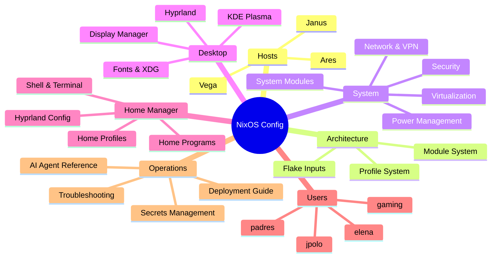

# NixOS Configuration Wiki

NixOS Configuration Wiki — declarative, flake-based, multi-host.

## Hosts

- [[Ares]] — ThinkPad T14s Gen 6 AMD, primary dev laptop, Hyprland + Noctalia
- [[Janus]] — Family desktop, KDE Plasma, users: jpolo/elena/padres
- [[Vega]] — Headless GPU compute node, Vega 56

## Architecture

- [[Architecture Overview]] — system design and data flow
- [[Module System]] — how NixOS modules compose and toggle features
- [[Profile System]] — layered profiles for system and home configs
- [[Flake Inputs]] — external dependencies and pinning strategy

## System

- [[System Modules]] — audio, bluetooth, network, optimization, and more
- [[Network & VPN]] — Tailscale mesh, firewall, eduroam, university VPN
- [[Security]] — fprintd, polkit, GPG, sops-nix secrets
- [[Power Management]] — profiles, TLP-style tuning, power-profiles-daemon
- [[Virtualization]] — QEMU/KVM, Windows 11 VM

## Desktop

- [[Hyprland]] — Wayland compositor, Noctalia shell, waybar, hyprlock/hypridle
- [[KDE Plasma]] — Plasma desktop for Janus
- [[Display Manager]] — login and session management
- [[Fonts & XDG]] — font packages and XDG default applications

## Home Manager

- [[Home Profiles]] — layered user profiles (base → cli → desktop → …)
- [[Home Programs]] — per-program configs (neovim, firefox, kitty, git, …)
- [[Hyprland Config]] — window rules, keybinds, Noctalia theme
- [[Shell & Terminal]] — zsh, starship, tmux, power-user functions
- [[Dev Shells]] — nix develop environments (python, node, rust, go)
- [[Dev Shells]] — nix develop environments (python, node, rust, go)

## Users

- [[User jpolo]] — primary developer, full development + power-user setup
- [[Family Users]] — accounts for elena and padres
- [[User elena]] — family user, KDE desktop with personal apps
- [[User padres]] — family user, restricted desktop

## Operations

- [[Deployment Guide]] — building, switching, and updating hosts
- [[Secrets Management]] — sops-nix, age keys, secret rotation
- [[Troubleshooting]] — common issues and diagnostics
- [[AI Agent Reference]] — conventions for AI-assisted edits

---

## Quick Links

- [[Deployment Guide]]
- [[Profile System]]
- [[Architecture Overview]]
- [[AI Agent Reference]]