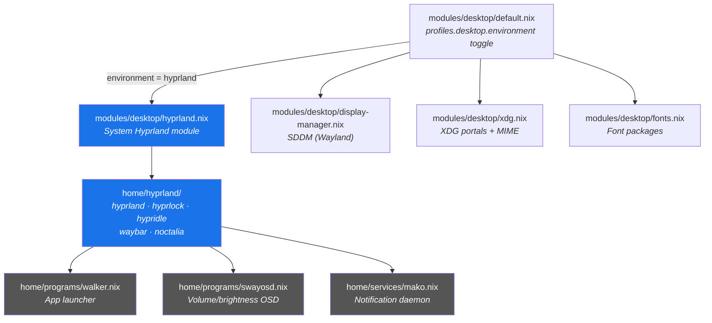
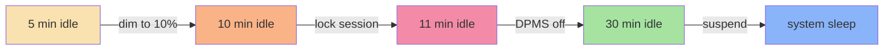

---
tags:
  - desktop
  - hyprland
  - wayland
---

# Hyprland

Hyprland is the Wayland compositor used on [[Ares]] (ThinkPad T14s Gen 6 AMD). It is selected by setting `profiles.desktop.environment = "hyprland"` — all Hyprland modules activate conditionally via `mkIf` guards on this option.

This page covers the system module, home-manager config, related tools, and customization points.

## Module Overview



## System Module — `modules/desktop/hyprland.nix`

Activated when `profiles.desktop.enable && profiles.desktop.environment == "hyprland"`.

### Hyprland package and plugins

| Setting | Value |
|---------|-------|
| `programs.hyprland.enable` | `true` |
| `programs.hyprland.package` | Hyprland from flake input (`inputs.hyprland.packages.<system>.hyprland`) |
| `programs.hyprland.xwayland.enable` | `true` |
| `programs.hyprland.portalPackage` | `xdg-desktop-portal-hyprland` |

Using the flake input ensures the Hyprland version matches the plugin ABI — plugins from `inputs.hyprland-plugins` work without rebuilds.

### XDG Portal

```nix
xdg.portal = {
  enable = true;
  extraPortals = [ xdg-desktop-portal-gtk ];        # GTK file dialogs, etc.
  configPackages = [ inputs.hyprland.packages.<system>.hyprland ];
  config.common.default = "*";                        # Hyprland portal is default
};
```

The `xdg-desktop-portal-hyprland` package is pulled in automatically via `portalPackage`. The GTK portal provides file dialogs and other desktop integration for non-Hyprland-native apps.

### Session variables

| Variable | Value | Purpose |
|----------|-------|---------|
| `NIXOS_OZONE_WL` | `1` | Forces Electron/Chromium apps to use Wayland |
| `WLR_NO_HARDWARE_CURSORS` | `1` | Fixes cursor issues on some GPUs |
| `XDG_SESSION_TYPE` | `wayland` | Declares Wayland session type |
| `XDG_CURRENT_DESKTOP` | `Hyprland` | Desktop identifier for portals/toolkits |
| `XDG_SESSION_DESKTOP` | `Hyprland` | Session identifier for XDG |

### System packages

| Category | Packages |
|----------|----------|
| Wayland core | `wayland`, `wayland-protocols`, `wayland-utils`, `wl-clipboard`, `wlr-randr` |
| Screenshots & recording | `grim`, `slurp`, `grimblast`, `wf-recorder` |
| Notifications | `mako`, `libnotify` |
| File manager | `kdePackages.dolphin` |
| Image viewer | `imv` |
| PDF viewers | `zathura`, `kdePackages.okular` |
| Archive managers | `file-roller`, `kdePackages.ark` |
| Polkit | `polkit_gnome` |

## Home Hyprland — `home/hyprland/`

The `home/hyprland/default.nix` aggregates five sub-modules:

```
home/hyprland/
├── default.nix        # imports all below
├── hyprland.nix       # window manager config, keybinds, scripts
├── hyprlock.nix       # lock screen
├── hypridle.nix       # idle daemon (dim → lock → suspend)
├── waybar.nix         # status bar
└── noctalia.nix       # Noctalia shell theme (flake input)
```

All are gated on `home.profiles.desktop.enable && home.profiles.desktop.environment == "hyprland"`.

### Window Manager — `hyprland.nix`

**Package**: `null` (managed by the system module to avoid version mismatch).

**Plugin**: `hyprscrolling` from `inputs.hyprland-plugins` — provides a scrollable tiling layout (columns).

**Monitors**:

| Output | Resolution | Position | Notes |
|--------|-----------|----------|-------|
| `eDP-1` | 1920×1200@60 | 0×0 | Internal laptop |
| `HDMI-A-1` | 1920×1080@60 | 1920×0 | External HDMI |
| `DP-1` | 1920×1080@60 | 3840×0, rotated | Portrait display port |
| fallback | preferred | auto | Unmatched outputs |

**Layout**: Scrolling layout with `gaps_in = 5`, `gaps_out = 10`, `border_size = 2`, `rounding = 3`, `active_opacity = 0.9`, `inactive_opacity = 0.8`.

**Custom scripts** (packaged as shell wrappers):

| Script | Purpose |
|--------|---------|
| `universal-copy` / `universal-paste` | Detects whether the focused window is a terminal and sends the appropriate key combo (Ctrl+Shift+C/V for terminals, Ctrl+C/V for GUI apps) |
| `toggle-transparency` | Toggles between opaque and translucent window decorations |
| `focus-obsidian` | Focuses existing Obsidian window or launches it |
| `walker-launcher` | Activates a Walker submap, runs Walker, then resets |
| `smart-resize` | Context-aware resize: pixel-based for floating, column-based for tiled; supports fine/normal modes |

**Key bindings** (selection — see the full list in `home/hyprland/hyprland.nix`):

| Binding | Action |
|---------|--------|
| `Super+Return` | Terminal (kitty) |
| `Super+Space` | Walker launcher |
| `Super+B` | Firefox |
| `Super+Shift+F` | Dolphin file manager |
| `Super+Y` | Floating tmux sessionizer |
| `Super+N` | Noctalia control center |
| `Super+O` | Focus Obsidian |
| `Super+C/V` | Universal copy/paste |
| `Super+Ctrl+V` | Clipboard history (Walker) |
| `Super+W` | Close window |
| `Super+F` | Fullscreen |
| `Super+T` | Toggle floating |
| `Super+R` | Rotate layout (row ↔ column) |
| `Super+Backspace` | Toggle transparency |
| `Super+H/J/K/L` | Focus left/down/up/right |
| `Super+1-0` | Switch workspace 1–10 |
| `Super+Shift+1-0` | Move window to workspace |
| `Super+S` | Toggle special workspace "magic" |
| `Super+Escape` | Noctalia session menu |
| `Print` | Screenshot region (grimblast) |
| `Shift+Print` | Screenshot full screen |
| `Super+KP_1-9,0,/,*` | "Stream Deck" numpad (media, volume, clipboard, OCR, etc.) |

**Walker submap**: When Walker is active, `Alt+Q…P` and `Alt+A…L` send `F1…F12` key events, letting Walker respond to single-key presses.

**Environment variables** (per-session, complementary to system ones):

| Variable | Value | Purpose |
|----------|-------|---------|
| `XCURSOR_SIZE` / `HYPRCURSOR_SIZE` | 18 | Cursor size |
| `GDK_BACKEND` | `wayland,x11,*` | GTK Wayland preference |
| `QT_QPA_PLATFORM` | `wayland;xcb` | Qt Wayland preference |
| `QT_QPA_PLATFORMTHEME` | `qt6ct` | Qt theme engine |
| `SDL_VIDEODRIVER` | `wayland` | SDL Wayland preference |
| `MOZ_ENABLE_WAYLAND` | `1` | Firefox Wayland |
| `ELECTRON_OZONE_PLATFORM_HINT` | `wayland` | Electron Wayland |
| `OZONE_PLATFORM` | `wayland` | Ozone Wayland |

**Clipboard**: `services.cliphist` enabled with `allowImages = true`.

### Lock Screen — `hyprlock.nix`

- Blurred screenshot background (3 blur passes, contrast/brightness adjustments)
- Large clock display (JetBrains Mono, 120pt)
- Date line below (24pt)
- Username label ("Hi $USER", 20pt)
- Password input field with visual feedback (dots, color changes on check/fail)
- No grace period, cursor hidden

### Idle Daemon — `hypridle.nix`

Idle progression on inactivity:



| Timeout | Action | Resume |
|---------|--------|--------|
| 300s (5 min) | `brightnessctl -s set 10` | `brightnessctl -r` |
| 600s (10 min) | `loginctl lock-session` | — |
| 660s (11 min) | `hyprctl dispatch dpms off` | `hyprctl dispatch dpms on` |
| 1800s (30 min) | `systemctl suspend` | — |

Before-sleep hook: `loginctl lock-session`. After-resume hook: `hyprctl dispatch dpms on`.

### Status Bar — `waybar.nix`

Waybar runs as a systemd-managed service at the top of the screen (height 26px) with Catppuccin Mocha–inspired styling.

**Module layout**:

| Left | Center | Right |
|------|--------|-------|
| Custom menu (Walker) · Workspaces | Clock · System update indicator · Screen recording indicator | Tray expander · Bluetooth · Network · PulseAudio · CPU · Battery |

Key modules:
- **Workspaces**: 5 persistent workspaces, icon-based format, click-to-activate
- **Clock**: Long format (weekday + time), alt format (date + week number)
- **Network**: Signal strength icons, tooltip shows SSID + bandwidth
- **Battery**: Multi-icon charging states, warning at 20%, critical at 10%
- **PulseAudio**: Click opens pavucontrol, right-click toggles mute
- **Custom update**: Click runs `update-system` in Kitty
- **Custom screen recording**: Detects `wf-recorder` process, shows "REC" indicator

### Noctalia Shell — `noctalia.nix`

[Noctalia](https://github.com/noctalia-dev/noctalia-shell) is a QuickShell-based desktop shell providing a panel, control center, notifications, launcher, and wallpaper manager — all themed via Material You (matugen).

**Package sources**:
- `inputs.noctalia.packages.<system>.default` — Noctalia shell
- `inputs.quickshell.packages.<system>.default` — QuickShell runtime
- `pkgs.matugen` — Material You color generator

**Features configured**:

| Feature | Settings |
|---------|----------|
| Bar | Top, height 42, non-floating, exclusive zone. Modules: workspaces (L), media + clock (C), updates + VPN + network + volume + brightness + battery + quicksettings (R) |
| Control Center | Right side, 400px wide. Modules: brightness, volume, network, bluetooth, settings |
| Notifications | Top-right, 5s timeout, max 3 visible |
| Launcher | Center, 400×500, shows descriptions and category icons |
| Theme | Dark mode, lavender accent (`#b4a7e6`), JetBrains Mono font, Material You colors from wallpaper |
| Night Light | 20:00–08:00, 4000K via wlsunset |
| VPN | Toggle for `um-vpn` connection |
| Battery | Shows percentage + estimate, warns at 20%, critical at 5% |

**Matugen templates** generate color schemes for:
- Kitty (`kitty.conf` → `noctalia.conf`)
- Alacritty
- btop
- Walker (`walker.css` → `noctalia.css`)
- Discord/Vencord
- KDE (`kdeglobals`)

**Systemd service**: `noctalia-shell.service` starts after `graphical-session-pre.target`, restarts on failure with 3s delay.

## Related Wayland Tools

### Walker — `home/programs/walker.nix`

Application launcher and multi-purpose picker, backed by the Elephant service.

| Walker module | Prefix | Purpose |
|---------------|--------|---------|
| applications | *(none)* | App search |
| runner | `>` | Command runner |
| websearch | `?` | Google / DuckDuckGo |
| finder | `~` | File search |
| custom | `:` | Power Profiles menu |
| clipboard | *(via Hyprland bind)* | Clipboard history via cliphist |

Runs as a `--gapplication-service` with Elephant backend, both as systemd user services.

### SwayOSD — `home/programs/swayosd.nix`

On-screen display for volume and brightness changes. Runs as a systemd user service (`swayosd-server`), activated by the hardware key binds in Hyprland (`XF86Audio*`, `XF86MonBrightness*`).

### Mako — `home/services/mako.nix`

Lightweight notification daemon (shared across Hyprland and KDE):

- Anchored top-right, 350×150px, 10px margin, 15px padding, 10px border radius
- 5s default timeout, groups by app-name
- Urgency-based timeouts: low 3s, normal 5s, high (sticky)

### xcompose — `home/programs/xcompose.nix`

Custom Compose key mappings. The Hyprland env sets `XCOMPOSEFILE=~/.XCompose` so compose sequences work under Wayland.

## SDDM Wayland Integration — `modules/desktop/display-manager.nix`

SDDM is the display manager, running natively on Wayland:

```nix
services.displayManager.sddm = {
  enable = true;
  wayland.enable = true;
  theme = "breeze";
};
```

- Default session: `"hyprland"` when `profiles.desktop.environment == "hyprland"`, `"plasma"` for KDE
- User face icons: symlinked from `/home/jpolo/.face.icon` into SDDM faces directory
- SDDM Qt5 dependencies (qtgraphicaleffects, qtsvg, qtquickcontrols2) are included

## XDG Portal Configuration

The XDG portal setup (`modules/desktop/xdg.nix`) runs on all desktop hosts (not Hyprland-specific):

- **Autostart, menus, icons, MIME**: enabled
- **Default applications**: Firefox (web), imv (images), okular (PDF), ark (archives), mpv (video), nvim (text), dolphin (directories)
- **User directories**: managed via `xdg-utils` and `xdg-user-dirs`

In the Hyprland profile, the portal layer adds:
- `xdg-desktop-portal-hyprland` (via `portalPackage`) — screenshots, screen sharing, global shortcuts
- `xdg-desktop-portal-gtk` — file dialogs, settings

The portal selection order is controlled by `config.common.default = "*"` which makes Hyprland the primary portal backend.

## How to Customize

### Change key bindings

Edit `home/hyprland/hyprland.nix` — the `bind`, `binde`, `bindel`, `bindl`, and `bindm` lists. After rebuilding, Hyprland picks up changes via `hyprctl reload` (or restart).

### Adjust idle timeouts

Edit `home/hyprland/hypridle.nix` — the `listener` list. Each entry has `timeout` (seconds) and `onTimeout`/`onResume` commands.

### Modify the lock screen

Edit `home/hyprland/hyprlock.nix` — change `background` blur settings, `label` text/formatting, or the `input-field` in `extraConfig`.

### Change Waybar modules or style

- **Layout**: edit `programs.waybar.settings.mainBar` in `home/hyprland/waybar.nix`
- **Colors/fonts**: edit `programs.waybar.style` in the same file

### Customize Noctalia

Edit `xdg.configFile."quickshell/noctalia/settings.json"` in `home/hyprland/noctalia.nix`. Key sections:
- `Bar` — module layout, position, height
- `ControlCenter` — toggle modules
- `Theme` — accent color, font, corner radius
- `Wallpaper` — wallpaper directory and fill mode

To add Matugen templates for new apps, add entries under `xdg.configFile."matugen/config.toml"` and create the corresponding template file.

### Adjust monitor layout

Edit the `monitor` list in `home/hyprland/hyprland.nix`. Format: `"output,resolution@refresh,position,scale,transform"`.

### Change default applications

Edit `xdg.mime.defaultApplications` in `modules/desktop/xdg.nix`.

### Switch to KDE Plasma

Set `profiles.desktop.environment = "kde"` in the host config. This disables all Hyprland modules and activates the KDE module instead. See [[KDE Plasma]].

---

**Related pages**: [[KDE Plasma]] · [[Ares]] · [[Desktop Environment]] · [[Home Programs]]