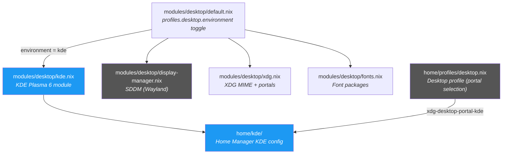

---
tags:
  - desktop
  - kde
  - reference
---

# KDE Plasma

KDE Plasma 6 is the desktop environment used on [[Janus]] (family desktop). It is selected by setting `profiles.desktop.environment = "kde"` — all KDE modules activate conditionally via `mkIf` guards on this option.

This page covers the system module, display manager integration, XDG portal configuration, and key differences from the [[Hyprland]] setup.

## Module Overview



## System Module — `modules/desktop/kde.nix`

Activated when `profiles.desktop.enable && profiles.desktop.environment == "kde"`.

```nix
config = mkIf (config.profiles.desktop.enable && config.profiles.desktop.environment == "kde") { ... };
```

### Plasma 6

```nix
services.desktopManager.plasma6.enable = true;
```

Enables the full Plasma 6 desktop — Wayland session, KWin, KDE System Settings, and all default KDE applications (minus exclusions below).

### Excluded Packages

The following default KDE packages are removed to keep the system lean:

| Package | Reason |
|---------|--------|
| `elisa` | Music player — not needed |
| `kate` | Text editor — nvim is the default editor |
| `discover` | Software center — Nix handles package management |
| `systemsettings` | Replaced by Plasma 6's built-in settings; excluded to avoid duplication conflicts |

> `okular` and `gwenview` are intentionally **kept** (PDF viewer and image viewer respectively).

### Included Packages

| Package | Purpose |
|---------|---------|
| `kcalc` | Scientific calculator |
| `spectacle` | Screenshot utility (KDE native) |
| `ark` | Archive manager (zip, tar, 7z, etc.) |
| `dolphin` | File manager |
| `konsole` | Terminal emulator |

Additionally, `programs.partition-manager.enable = true` provides KDE Partition Manager for disk management.

## Display Manager — SDDM Wayland

`modules/desktop/display-manager.nix` configures SDDM with Wayland support, shared across both desktop environments:

```nix
services.displayManager.sddm = {
  enable = true;
  wayland.enable = true;
  theme = "breeze";
};
```

The default session is set dynamically:

```nix
services.displayManager.defaultSession =
  if config.profiles.desktop.environment == "kde" then "plasma"
  else "hyprland";
```

When KDE is selected, SDDM boots directly into the Plasma session. See [[Network & VPN]] for network configuration within the Plasma session.

## XDG Portal Selection

The home-manager desktop profile (`home/profiles/desktop.nix`) selects the portal backend based on the environment:

```nix
xdg.portal = {
  enable = true;
  extraPortals = [
    (if config.home.profiles.desktop.environment == "hyprland" then
       pkgs.xdg-desktop-portal-hyprland
     else
       pkgs.kdePackages.xdg-desktop-portal-kde)
    pkgs.xdg-desktop-portal-gtk
  ];
};
```

When `environment == "kde"`, the portal uses `kdePackages.xdg-desktop-portal-kde`, which provides:
- Screen sharing via PipeWire
- File dialogs native to KDE
- Background portal for wallpaper pickers

The GTK portal is kept as a fallback for non-KDE applications.

## Home Manager KDE Config — `home/kde/`

`home/kde/default.nix` is minimal by design — KDE Plasma is primarily configured through its GUI (System Settings). The module is gated on the same `mkIf` condition:

```nix
config = mkIf (config.home.profiles.desktop.environment == "kde") {
  # Most KDE configuration is done via GUI
};
```

This is a stub that can be extended with `home.file` declarations for autostart entries, `kcminputrc` overrides, or other dotfiles as needed.

## Differences from Hyprland

Since KDE Plasma provides its own compositor, shell, and utilities, the following Hyprland-specific packages are **not installed** on KDE hosts:

| Not installed on KDE | Purpose | KDE alternative |
|---|---|---|
| `grim` | Screenshot capture | `spectacle` |
| `slurp` | Screen region selection | `spectacle` (built-in) |
| `walker` | Application launcher | KDE Application Launcher (kickoff) |
| `swayosd` | Volume/brightness OSD | KDE Plasma volume/brightness OSD |
| `hyprpicker` | Color picker | KDE color picker |
| `hyprlock` | Screen locker | KDE Screen Locker (loginctl) |
| `hypridle` | Idle manager | KDE Power Management / Screen Energy Saving |
| `waybar` | Status bar | KDE Plasma Panel |
| `mako` | Notification daemon | KDE Plasma Notifications |
| `hyprsunset` | Blue light filter | KDE Night Color |
| `cliphist` + `wl-clipboard` | Clipboard manager | KDE Klipper |
| `swappy` | Screenshot editor | Spectacle annotate |
| `feh` | Image viewer (X11) | `gwenview` |
| `imv` | Image viewer (Wayland) | `gwenview` |
| `zathura` | PDF viewer | `okular` |
| `pwvucontrol` | PulseAudio volume GUI | KDE Volume Control |
| `qalculate-gtk` | Calculator | `kcalc` |

The `dolphin` and `okular` packages are installed on both environments via the home profile (they are in the Hyprland-specific block but are KDE-native apps).

## Janus-Specific Configuration

Janus (`hosts/janus/configuration.nix`) has several KDE-relevant customizations:

### SDDM

SDDM is configured with the breeze theme and Wayland backend (shared config from `display-manager.nix`). User face icons are symlinked from `/home/jpolo/.face.icon`.

### Libinput — Natural Scrolling

```nix
services.libinput = {
  enable = true;
  touchpad = {
    tapping = true;
    naturalScrolling = true;
    disableWhileTyping = true;
  };
};
```

Natural scrolling is enabled for family-friendly trackpad usage.

### Battery Care via TLP

```nix
services.tlp = {
  enable = true;
  settings = {
    START_CHARGE_THRESH_BAT0 = lib.mkForce 20;
    STOP_CHARGE_THRESH_BAT0 = lib.mkForce 80;
  };
};
```

TLP keeps battery charge between 20–80% to extend lifespan. `power-profiles-daemon` is disabled where TLP is active (see [[Power Management]]).

### Home Profile Overrides

Janus forces KDE and disables development/work/research/creative profiles:

```nix
home.profiles.desktop.environment = lib.mkForce "kde";
home.profiles.development.enable = lib.mkForce false;
home.profiles.work.enable = lib.mkForce false;
home.profiles.research.enable = lib.mkForce false;
```

This ensures Janus remains a general-purpose family machine. See [[Home Profiles]] for details on `mkForce` overrides.

## Switching Desktop Environments

To switch between KDE and Hyprland, set the environment in the **host configuration**:

```nix
# For KDE Plasma
profiles.desktop.environment = "kde";

# For Hyprland
profiles.desktop.environment = "hyprland";
```

After changing, rebuild:

```bash
sudo nh os build -- .#hostname   # test build
sudo nh os switch -- .#hostname   # apply
```

The change propagates through the module system via `mkIf` guards:
1. System modules: `kde.nix` or `hyprland.nix` activates
2. Display manager: SDDM default session switches to `plasma` or `hyprland`
3. Home profile: XDG portal switches to `xdg-desktop-portal-kde` or `xdg-desktop-portal-hyprland`
4. Home-manager: KDE or Hyprland submodules activate

> **Note:** On [[Ares]], the `gaming` user runs KDE via `home.profiles.desktop.environment = "kde"` while the primary user runs Hyprland. This is a per-user override, not a system-wide switch.

## Cross-References

- [[Hyprland]] — the alternative Wayland compositor
- [[Janus]] — host that uses KDE Plasma
- [[Home Profiles]] — desktop profile and package selection logic
- [[Architecture Overview]] — how profiles and modules compose