# Module System

The NixOS module system provides a declarative way to compose system configuration from reusable, independently toggleable pieces. This repository leverages it heavily — every subsystem (audio, networking, security, etc.) is a self-contained module that can be enabled or disabled through configuration options.

## How It Works

A **NixOS module** is a Nix file that declares:

1. **Options** — configuration knobs exposed to other modules and host configs (e.g. `modules.system.audio.enable`).
2. **Config** — what gets activated when those options are set.

The module system resolves all option references and merges configs deterministically, so the order of imports doesn't matter — only the final set of values.

## Custom Module Pattern

Every custom module under `modules/` follows a consistent pattern:

```nix
{ config, pkgs, lib, ... }:

let
  cfg = config.modules.system.audio;
in
with lib;

{
  # 1. Declare the option
  options.modules.system.audio = {
    enable = mkEnableOption "Audio (PipeWire)";
  };

  # 2. Conditionally activate config
  config = mkIf cfg.enable {
    services.pipewire = { enable = true; /* ... */ };
  };
}
```

Key conventions:

- **`mkEnableOption`** creates a boolean option defaulting to `false`.
- **`cfg = config.<path>`** at the top provides a short alias for the option value.
- **`mkIf cfg.enable`** ensures the config block is inert until the option is set to `true`.
- Some modules have no `options` block — they are **always-on** (see below).

## Auto-Import via `default.nix`

Each module directory contains a `default.nix` that imports all its submodules:

```nix
# modules/system/default.nix
{ config, pkgs, ... }:

{
  imports = [
    ./audio.nix
    ./bluetooth.nix
    ./network.nix
    # ...
  ];
}
```

The flake's `sharedModules` list imports these directories:

```nix
sharedModules = [
  ./modules/system
  ./modules/desktop
  ./modules/services
  ./modules/profiles
  ./modules/vms
  # + external modules: home-manager, sops-nix, nix-index-database
];
```

Every host inherits all shared modules, then selectively enables what it needs.

## System Modules

### Toggleable Modules (opt-in via `enable` option)

| Option Path | Description |
|---|---|
| `modules.system.audio.enable` | PipeWire audio stack (PipeWire, WirePlumber, ALSA compat) |
| `modules.system.bluetooth.enable` | Bluetooth support (BlueZ) |
| `system.powerProfiles.enable` | Power profile management (eco / balanced / performance / performance-plus) |
| `modules.system.ssh.enable` | OpenSSH server (hardened config, **default: true**) |
| `networking.eduroam.enable` | Eduroam WiFi configuration (with `networks` sub-option) |
| `networking.universityVPN.enable` | University VPN via strongSwan (with `connections` sub-option) |
| `modules.services.kmonad.enable` | KMonad keyboard remapping service (with `keyboards` sub-option) |
| `services.syncthing-jpolo.enable` | Syncthing instance for the jpolo user |
| `services.github-copilot.enable` | GitHub Copilot CLI with sops-managed token |
| `services.plex-client.enable` | Plex client firewall rules (downloads/sync/GDM) |

### Always-Enabled Modules (no `enable` option)

These modules are imported in `modules/system/default.nix` and activate unconditionally:

| Module | What it provides |
|---|---|
| `network` | NetworkManager, systemd-resolved, Tailscale mesh VPN, firewall |
| `power` | TLP, UPower, thermald, powertop — laptop power management |
| `power-profile-apply` | Udev rules + systemd service to reapply power profile on AC plug/unplug |
| `security` | Polkit, fprintd (fingerprint), PAM, sudo, GPG agent |
| `optimization` | Nix daemon settings, zram-swap (zstd, 50%), systemd-udev-settle disable, AppArmor, nh |
| `secrets` | sops-nix for encrypted secrets in git |
| `scripts` | System-wide utility scripts (scriptctl, update-system, etc.) |
| `perf-tuning` | sysstat, fwupd, smartd, plocate, I/O scheduler rules, v4l2loopback |
| `port-management` | Port registry (`/etc/port-registry.yaml`) + network diagnostic tools |
| `printing` | CUPS, SANE, Avahi (network printer discovery) |
| `location` | Geoclue2 location services (night light support) |

### Profile-Gated Modules

These modules activate when a **profile** is enabled, not a direct `enable` option:

| Module | Gate | Description |
|---|---|---|
| `gaming-basic` | `profiles.gaming.enable` | Basic gaming packages, controller support, gaming user |
| `gaming-isolated` | `profiles.gaming.enable` | Isolated gaming user with resource limits (commented out of default.nix) |
| `virtualization` | *(always on, imported via `modules/vms/`)* | libvirt/KVM, QEMU, Cockpit web UI |

### Desktop Modules

Desktop modules activate based on `profiles.desktop.enable` and the `profiles.desktop.environment` option:

| Module | Gate | Description |
|---|---|---|
| `display-manager` | `profiles.desktop.enable` | SDDM with Wayland support (Breeze theme) |
| `hyprland` | `profiles.desktop.enable` + `environment == "hyprland"` | Hyprland compositor, XDG portals, Noctalia shell |
| `kde` | `profiles.desktop.enable` + `environment == "kde"` | KDE Plasma 6, SDDM, partition manager |
| `fonts` | `profiles.desktop.enable` | Nerd Fonts, Noto, default fontconfig |
| `xdg` | `profiles.desktop.enable` | XDG base dirs, mime defaults, user dirs |

## Service Modules

| Module | Option Path | Description |
|---|---|---|
| `printing` | *(always on)* | CUPS, SANE scanner support, Avahi for network discovery |
| `location` | *(always on)* | Geoclue2 for location services |
| `syncthing` | `services.syncthing-jpolo.enable` | Syncthing file sync for jpolo |
| `kmonad` | `modules.services.kmonad.enable` | KMonad keyboard configuration (dual-role keys) |
| `github-copilot` | `services.github-copilot.enable` | GitHub Copilot CLI with sops token |
| `plex-client` | `services.plex-client.enable` | Plex firewall rules |

## Commented-Out Modules

These exist in `modules/system/` but are commented out of `default.nix`:

| Module | Status | Reason |
|---|---|---|
| `btrbk` | Commented out | Btrfs snapshot tooling — available but not active |
| `gaming-isolated` | Commented out | Isolated gaming user — superseded by `gaming-basic` |
| `virtualization` | Commented out of system/ | Moved to `modules/vms/` directory |

## Module Import Hierarchy

```mermaid
graph TD
    FLAKE["flake.nix<br/>sharedModules"]
    FLAKE --> SYS["modules/system/<br/>default.nix"]
    FLAKE --> DESK["modules/desktop/<br/>default.nix"]
    FLAKE --> SVC["modules/services/<br/>default.nix"]
    FLAKE --> PROF["modules/profiles/<br/>default.nix"]
    FLAKE --> VMS["modules/vms/<br/>default.nix"]
    FLAKE --> HM["home-manager<br/>nixosModules"]
    FLAKE --> SOPS["sops-nix"]
    FLAKE --> NIXIDX["nix-index-database"]

    SYS --> NET["network.nix<br/><i>always on</i>"]
    SYS --> PWR["power.nix<br/><i>always on</i>"]
    SYS --> PPA["power-profile-apply.nix<br/><i>always on</i>"]
    SYS --> SEC["security.nix<br/><i>always on</i>"]
    SYS --> OPT["optimization.nix<br/><i>always on</i>"]
    SYS --> SCR["scripts.nix<br/><i>always on</i>"]
    SYS --> PT["perf-tuning.nix<br/><i>always on</i>"]
    SYS --> PM["port-management.nix<br/><i>always on</i>"]
    SYS --> AUD["audio.nix<br/><code>.enable</code>"]
    SYS --> BT["bluetooth.nix<br/><code>.enable</code>"]
    SYS --> SSH["ssh.nix<br/><code>.enable</code>"]
    SYS --> EDU["eduroam.nix<br/><code>.enable</code>"]
    SYS --> VPN["university-vpn.nix<br/><code>.enable</code>"]
    SYS --> PP["power-profiles.nix<br/><code>.enable</code>"]

    DESK --> HYP["hyprland.nix<br/><i>profile-gated</i>"]
    DESK --> KDE["kde.nix<br/><i>profile-gated</i>"]
    DESK --> DM["display-manager.nix<br/><i>profile-gated</i>"]
    DESK --> FNT["fonts.nix<br/><i>profile-gated</i>"]
    DESK --> XDG["xdg.nix<br/><i>profile-gated</i>"]

    SVC --> PRT["printing.nix<br/><i>always on</i>"]
    SVC --> LOC["location.nix<br/><i>always on</i>"]
    SVC --> SYN["syncthing.nix<br/><code>.enable</code>"]
    SVC --> KM["kmonad.nix<br/><code>.enable</code>"]
    SVC --> GHC["github-copilot.nix<br/><code>.enable</code>"]
    SVC --> PLX["plex-client.nix<br/><code>.enable</code>"]

    PROF --> BASE["base.nix"]
    PROF --> DPROF["desktop.nix<br/><code>environment: hyprland|kde</code>"]
    PROF --> DEV["development.nix"]
    PROF --> GAM["gaming.nix"]
    PROF --> PU["power-user.nix"]
    PROF --> SRV["server.nix"]

    VMS --> W11["windows11.nix"]

    HM --> HPROF["home/profiles/"]
    HM --> HPROG["home/programs/"]
    HM --> HSVC["home/services/"]
    HM --> HSHELL["home/shell/"]

    style SYS fill:#2a4,stroke:#171,stroke-width:2px
    style DESK fill:#48a,stroke:#257,stroke-width:2px
    style SVC fill:#a62,stroke:#740,stroke-width:2px
    style PROF fill:#a4a,stroke:#727,stroke-width:2px
    style VMS fill:#a84,stroke:#762,stroke-width:2px
    style HM fill:#4a8,stroke:#276,stroke-width:2px
```



## Key Architectural Points

1. **`sharedModules` applies to all three hosts** (ares, janus, vega). Every host gets the same base system module set — differences emerge only through profile selection and per-host overrides.

2. **Two enabling mechanisms**: Direct `mkEnableOption` toggles (opt-in) and profile gates (`mkIf config.profiles.<name>.enable`). Profile-gated modules don't need their own `enable` option — the profile controls them.

3. **Always-on modules have no `options` block**. They contribute config unconditionally. This is intentional for security-critical modules (security, ssh, secrets, optimization) — they should never be accidentally disabled.

4. **Home Manager is a NixOS module** with `useGlobalPkgs = true` and `useUserPackages = true`, so home-level packages are visible system-wide and share the nixpkgs overlay.

5. **`default.nix` files are the import registry**. Adding a new `.nix` file to a directory without updating `default.nix` has no effect — the module system won't discover it.

## Related Pages

- [[Architecture Overview]] — full system architecture and host descriptions
- [[Profile System]] — how profiles compose modules and packages
- [[System Modules]] — detailed per-module configuration reference