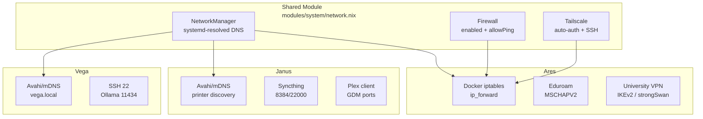
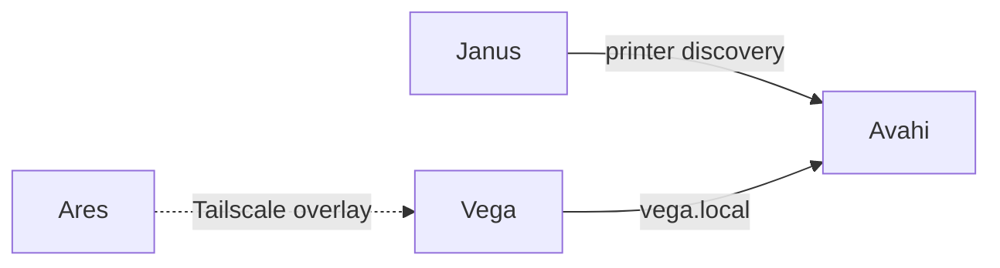

# Network & VPN

Network, firewall, and VPN configuration across all three hosts. The shared module (`modules/system/network.nix`) provides a baseline; each host layers its own firewall rules and services on top.



---

## NetworkManager

All hosts use NetworkManager with systemd-resolved for DNS resolution.

| Setting | Value | Source |
|---|---|---|
| `networking.networkmanager.enable` | `true` | shared module + per-host |
| `networking.networkmanager.dns` | `"systemd-resolved"` | `modules/system/network.nix` |
| `networking.networkmanager.wifi.powersave` | `true` | `modules/system/network.nix` |
| `services.resolved.enable` | `true` | `modules/system/network.nix` |

### Plugins

The shared module includes `networkmanager-openconnect` (Cisco AnyConnect VPN support, used by the work profile's Citadel VPN script). The university VPN module adds `networkmanager-strongswan`.

---

## Firewall

The shared `network.nix` module establishes the baseline:

```nix
networking.firewall = {
  enable = true;
  allowPing = true;
  allowedTCPPorts = [ ];
  allowedUDPPorts = [ config.services.tailscale.port ];
  trustedInterfaces = [ "tailscale0" ];
};
```

### Tailscale trusted interface

All traffic on `tailscale0` is trusted — no port restrictions between mesh nodes. This allows SSH, file sharing, and direct communication between [[Ares]], [[Janus]], and [[Vega]] over the Tailscale overlay.

---

## Tailscale

```nix
services.tailscale = {
  enable = true;
  useRoutingFeatures = "client";
  authKeyFile = config.sops.secrets.tailscale_key.path;
  extraUpFlags = [
    "--operator=jpolo"   # non-root control
    "--ssh"              # Tailscale SSH
  ];
};
```

| Property | Value |
|---|---|
| Auth | sops-managed key (`tailscale_key`) |
| Operator | `jpolo` |
| SSH | enabled |
| Routing features | client |
| UDP port | auto (default 41641) |

The auth key is stored encrypted in `secrets/secrets.yaml` and deployed via sops-nix at build time — no manual login required.

---

## Eduroam

A custom NixOS module (`modules/system/eduroam.nix`) declaratively creates NetworkManager connection profiles for WPA-Enterprise eduroam networks.

### Module options

| Option | Type | Default | Description |
|---|---|---|---|
| `networking.eduroam.enable` | bool | `false` | Enable the module |
| `networking.eduroam.networks` | attrsOf submodule | `{}` | Named network configurations |
| `.ssid` | str | `"eduroam"` | SSID to connect to |
| `.identity` | str | — | Username (e.g. `user@um.es`) |
| `.passwordFile` | path | — | sops-managed password file |
| `.phase2Auth` | str | `"MSCHAPV2"` | Phase 2 auth method |
| `.anonymousIdentity` | str | `"anonymous"` | Outer identity for privacy |
| `.domain` | nullOr str | `null` | Certificate domain match |
| `.caCertificate` | nullOr path | `null` | CA cert for server validation |

### Ares configuration

Enabled on [[Ares]] only (`hosts/ares/eduroam.nix`):

- **Identity:** `javier.polog@um.es`
- **Anonymous identity:** `anonymous@um.es`
- **Phase 2:** MSCHAPV2
- **Password:** sops-managed (`eduroam_password` in `secrets/secrets.yaml`)

A systemd oneshot service (`eduroam-password-injector`) waits for NetworkManager and injects the sops password into the connection profile at boot.

### Connecting manually

```bash
nmcli connection up university-eduroam
```

> See also: [[System Modules]] for the full module listing.

---

## University VPN (UM)

A custom NixOS module (`modules/system/university-vpn.nix`) creates IKEv2/strongSwan VPN connections managed through NetworkManager.

### Module options

| Option | Type | Default | Description |
|---|---|---|---|
| `networking.universityVPN.enable` | bool | `false` | Enable the module |
| `networking.universityVPN.connections` | attrsOf submodule | `{}` | Named VPN connections |
| `.gateway` | str | — | VPN server address |
| `.username` | str | — | Auth username |
| `.passwordFile` | nullOr path | `null` | sops password file (null = prompt) |
| `.autoConnect` | bool | `false` | Connect on boot |
| `.certificate` | nullOr path | `null` | CA certificate path |
| `.proposal` | str | `"aes256-sha256-modp1024"` | IKE encryption proposal |
| `.esp` | str | `"aes256-sha256"` | ESP encryption |
| `.splitTunnelRoutes` | listOf str | `[]` | CIDRs routed through VPN |
| `.searchDomains` | listOf str | `[]` | DNS domains routed to VPN |

### Ares configuration

Enabled on [[Ares]] only (`hosts/ares/university-vpn.nix`):

- **Connection name:** `um-vpn`
- **Gateway:** `vpn.um.es`
- **Username:** `javier.polog@um.es`
- **Protocol:** IKEv2 (EAP), strongSwan via NetworkManager
- **Certificate:** `certs/harica-tls-root-2021.pem` (HARICA TLS Root CA 2021)
- **Encryption:** `aes256-sha256-modp1024` (IKE), `aes256-sha256` (ESP)
- **Split tunneling:** `155.54.0.0/16` (university traffic only)
- **Search domains:** `um.es`
- **Password:** currently prompted on connect (`passwordFile = null`); sops option commented out

### Connecting manually

```bash
nmcli connection up um-vpn
```

### Split tunneling

When `splitTunnelRoutes` is non-empty, the module sets `never-default=true` and routes only specified CIDRs through the VPN. DNS queries for `searchDomains` are also directed to the VPN DNS servers (with `~` prefix for systemd-resolved routing).

---

## Docker Networking (Ares)

[[Ares]] runs Docker for AI services. The host firewall uses `extraCommands` to allow traffic on Docker bridges since `trustedInterfaces` doesn't support wildcards:

```nix
networking.firewall = {
  allowedTCPPorts = [
    12000 12001 12010 12011 12012 12013 12014  # Traefik + AI services
    3000    # Langfuse
    8081    # Mongo Express
    11434   # Ollama
  ];
  extraCommands = ''
    iptables -A INPUT -i docker0 -j ACCEPT
    iptables -A INPUT -i br-+ -j ACCEPT
    iptables -A FORWARD -i docker0 -j ACCEPT
    iptables -A FORWARD -o docker0 -m conntrack --ctstate RELATED,ESTABLISHED -j ACCEPT
    iptables -A FORWARD -i br-+ -j ACCEPT
    iptables -A FORWARD -o br-+ -m conntrack --ctstate RELATED,ESTABLISHED -j ACCEPT
  '';
};
```

IP forwarding is enabled at the kernel level for Docker bridge networking:

```nix
boot.kernel.sysctl = {
  "net.ipv4.ip_forward" = 1;
  "net.ipv6.conf.all.forwarding" = 1;
};
```

Docker's daemon is configured with `iptables = true` to manage bridge NAT/FORWARD chains for published ports.

---

## Avahi / mDNS



| Host | `services.avahi.enable` | `nssmdns4` | `publish` | `openFirewall` | Purpose |
|---|---|---|---|---|---|
| [[Janus]] | true | true | — | true | Network printer auto-discovery |
| [[Vega]] | true | true | addresses + workstation | — | Reachable as `vega.local` |

The `printing.nix` module also enables Avahi with `nssmdns4` and `openFirewall` when printing is active. [[Ares]] does not run Avahi — it reaches [[Vega]] via Tailscale (`vega` in the tailnet).

---

## Port Reference

### Ares

| Port | Protocol | Service | Source |
|---|---|---|---|
| 12000 | TCP | Traefik HTTP | `configuration.nix` |
| 12001 | TCP | Traefik Dashboard | `configuration.nix` |
| 12010 | TCP | Auth Service | `configuration.nix` |
| 12011 | TCP | Pipeline Config Service | `configuration.nix` |
| 12012 | TCP | Artifacts Service | `configuration.nix` |
| 12013 | TCP | LangGraph Orchestrator | `configuration.nix` |
| 12014 | TCP | Webapp | `configuration.nix` |
| 3000 | TCP | Langfuse (observability) | `configuration.nix` |
| 8081 | TCP | Mongo Express (dev profile) | `configuration.nix` |
| 11434 | TCP | Ollama | `configuration.nix` |
| 41641 | UDP | Tailscale | `network.nix` |
| docker0 | — | Docker bridge (all traffic) | `configuration.nix` |
| br-+ | — | Docker compose bridges (all traffic) | `configuration.nix` |

### Janus

| Port | Protocol | Service | Source |
|---|---|---|---|
| 8384 | TCP | Syncthing Web UI | `syncthing.nix` |
| 22000 | TCP | Syncthing sync | `syncthing.nix` |
| 22000 | UDP | Syncthing sync | `syncthing.nix` |
| 21027 | UDP | Syncthing discovery | `syncthing.nix` |
| 32410 | UDP | Plex GDM discovery | `plex-client.nix` |
| 32412 | UDP | Plex GDM discovery | `plex-client.nix` |
| 32413 | UDP | Plex GDM discovery | `plex-client.nix` |
| 32414 | UDP | Plex GDM discovery | `plex-client.nix` |
| 41641 | UDP | Tailscale | `network.nix` |
| 5353 | UDP | mDNS (Avahi) | auto |

### Vega

| Port | Protocol | Service | Source |
|---|---|---|---|
| 22 | TCP | SSH | `configuration.nix` |
| 11434 | TCP | Ollama | `configuration.nix` |
| 41641 | UDP | Tailscale | `network.nix` |
| 5353 | UDP | mDNS (Avahi) | auto |

---

## Syncthing Firewall

The `syncthing-jpolo` service module (`modules/services/syncthing.nix`) opens these ports when enabled:

| Port | Protocol | Purpose |
|---|---|---|
| 8384 | TCP | Web UI |
| 22000 | TCP | Sync protocol |
| 22000 | UDP | Sync protocol (QUIC) |
| 21027 | UDP | Local discovery |

Currently enabled on [[Janus]] only.

---

## Plex Client Firewall

The `plex-client` module (`modules/services/plex-client.nix`) opens GDM discovery ports for Plex local network discovery, downloads, and sync:

| Port | Protocol | Purpose |
|---|---|---|
| 32410 | UDP | GDM network discovery |
| 32412 | UDP | GDM network discovery |
| 32413 | UDP | GDM network discovery |
| 32414 | UDP | GDM network discovery |

Currently enabled on [[Janus]] only.

---

## OpenConnect / Work VPN

The `home.profiles.work` profile provides a `setup-citadel-vpn` helper script that creates a Cisco AnyConnect (openconnect) VPN connection in NetworkManager. This is separate from the university VPN and uses the `networkmanager-openconnect` plugin from the shared network module.

---

## Related Pages

- [[Ares]] — full host configuration for the primary dev laptop
- [[Janus]] — family desktop with printing and media services
- [[Vega]] — headless GPU compute node
- [[Security]] — fprintd, polkit, GPG, sops-nix secrets
- [[System Modules]] — all shared modules including network, eduroam, university-vpn