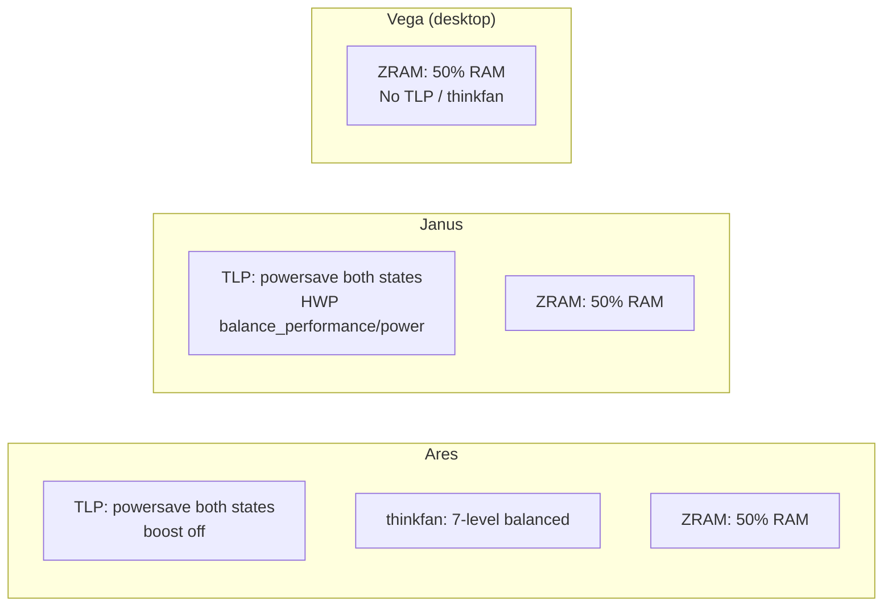

# Power Management

Power management is layered across several tools that must not conflict with each other. The system uses **TLP** as the primary power manager on laptops, **thinkfan** for fan control, **UPower** for battery policy, **thermald** for passive thermal management, and **ZRAM** for swap compression. `power-profiles-daemon` is explicitly **disabled** wherever TLP is active.

```mermaid
graph TD
    subgraph Stack
        TLP[TLP<br/>CPU / Platform / Battery]
        TF[thinkfan<br/>Fan curves]
        UP[UPower<br/>Battery thresholds]
        TH[thermald<br/>Passive thermal]
        ZR[ZRAM<br/>Compressed swap]
    end

    PPD[power-profiles-daemon] -->|DISABLED on<br/>ares & janus| X[&#10060; Conflict]

    TLP -->|governor + platform<br/>profile| CPU[CPU / Platform]
    TF -->|fan levels| FAN[Fan Hardware]
    UP -->|critical action| HIB[Hibernate at 5%]
    TH -->|passive cooling| CPU
    ZR -->|zstd 50% RAM| MEM[Memory]
```



## TLP — Primary Power Manager

The default TLP configuration lives in `modules/system/power.nix`. It provides a baseline that hosts override with `lib.mkForce`.

### Default settings (`modules/system/power.nix`)

| Setting | AC | Battery |
|---|---|---|
| Scaling governor | `performance` | `powersave` |
| Energy performance policy | `performance` | `power` |
| CPU min perf | 0% | 0% |
| CPU max perf | 100% | 50% |
| Platform profile | `performance` | `low-power` |
| Battery charge thresholds | 20% start / 80% stop | — |

### Per-host overrides

#### Ares (ThinkPad T14s Gen 6 AMD)

```nix
services.tlp.settings = {
  CPU_SCALING_GOVERNOR_ON_AC  = lib.mkForce "powersave";
  CPU_SCALING_GOVERNOR_ON_BAT = lib.mkForce "powersave";
  CPU_ENERGY_PERF_POLICY_ON_AC = lib.mkForce "balance_performance";
  CPU_ENERGY_PERF_POLICY_ON_BAT = lib.mkForce "balance_power";
  CPU_BOOST_ON_AC  = lib.mkForce 0;   # Boost disabled
  CPU_BOOST_ON_BAT = lib.mkForce 0;   # Boost disabled
  USB_DENYLIST = "046d:c52b";         # Logitech K850 Unifying Receiver
};
```

- Both AC and battery use `powersave` governor — the Ryzen AI 7 PRO 350 is efficient enough that `performance` governor adds heat without meaningful gains.
- **CPU boost disabled** on both power states to keep the system cool and quiet.
- **USB denylist** prevents autosuspend on the Logitech K850 receiver (`046d:c52b`) to avoid keyboard lag.

#### Janus (Intel 8th gen)

```nix
services.tlp.settings = {
  CPU_SCALING_GOVERNOR_ON_AC  = lib.mkForce "powersave";
  CPU_SCALING_GOVERNOR_ON_BAT = lib.mkForce "powersave";
  CPU_ENERGY_PERF_POLICY_ON_AC = lib.mkForce "balance_performance";
  CPU_ENERGY_PERF_POLICY_ON_BAT = lib.mkForce "balance_power";
  START_CHARGE_THRESH_BAT0 = lib.mkForce 20;
  STOP_CHARGE_THRESH_BAT0  = lib.mkForce 80;
};
```

- Intel HWP handles frequency scaling; `powersave` governor works well with it on AC too.
- Battery charge limited to 20–80% to prolong lifespan.

> **Why `lib.mkForce`?** The default module sets values at priority 100. Host overrides use `mkForce` (priority 1000) to guarantee they win, even if the base module changes.

## thinkfan — Intelligent Fan Control

Enabled **only on [[Ares]]** (ThinkPad T14s Gen 6 AMD). The T14s Gen 6 has unreliable ThinkPad ACPI temp sensors — only `k10temp` (AMD CPU) and `acpitz` (ACPI thermal zone) work reliably.

### Sensor configuration

```nix
sensors = [
  { type = "hwmon"; query = "/sys/class/hwmon"; name = "k10temp"; indices = [ 1 ]; }
  { type = "hwmon"; query = "/sys/class/hwmon"; name = "acpitz";  indices = [ 1 ]; }
];
```

### 7-level balanced fan profile

| Level | Min °C | Max °C | Behavior |
|---|---|---|---|
| 0 | 0 | 42 | Fan off — silent |
| 1 | 38 | 48 | Very quiet — light activity |
| 2 | 45 | 55 | Quiet — moderate load |
| 3 | 52 | 62 | Comfortable — sustained work |
| 4 | 58 | 68 | Active cooling |
| 5 | 64 | 74 | Strong cooling |
| 6 | 70 | 78 | Aggressive cooling |
| 7 | 75 | 32767 | Maximum — emergency |

Each step uses 10–12°C hysteresis to prevent rapid fan cycling.

The `modules/system/power-profiles.nix` module provides **switchable thinkfan profiles** (eco, balanced, balanced-eco, performance, performance-plus) stored in `/etc/power-profiles/`. The thinkfan service reads from `/var/lib/thinkfan/active.yaml`, which is initialized to the eco profile on first start. The `power-balanced`, `power-eco`, `power-performance`, etc. scripts swap the active YAML and restart thinkfan.

## UPower — Battery Policy

Configured in `modules/system/power.nix`:

| Setting | Value |
|---|---|
| `percentageLow` | 20% |
| `percentageCritical` | 10% |
| `percentageAction` | 5% |
| `criticalPowerAction` | Hibernate |

When battery drops to 5%, the system **hibernates** (not suspends) to prevent data loss from a fully drained battery.

## thermald — Passive Thermal Management

```nix
services.thermald.enable = true;
```

Enabled globally by the power module. thermald provides passive cooling via CPU frequency throttling when hardware temperature limits are approached — a safety net independent of TLP and thinkfan.

## power-profiles-daemon — Disabled

```nix
services.power-profiles-daemon.enable = lib.mkForce false;
```

**Always disabled** on hosts running TLP. TLP and power-profiles-daemon both manage CPU governors and platform profiles — running both causes conflicts. This is set with `lib.mkForce` on both [[Ares]] and [[Janus]].

> **Vega** (desktop) does not run TLP, so power-profiles-daemon is not disabled there — it's left at the NixOS default.

## Power Profiles Module

`modules/system/power-profiles.nix` provides the `system.powerProfiles` option, which when enabled:

- Installs TLP, thinkfan, and the **power-profile scripts** (`power-balanced`, `power-eco`, `power-performance`, `power-performance-plus`, `power-balanced-eco`)
- Manages thinkfan YAML profile configs in `/etc/power-profiles/`
- Overrides the thinkfan service to read from `/var/lib/thinkfan/active.yaml`
- Creates tmpfiles rules for `/etc/tlp.d/` and `/var/lib/thinkfan/`

This module is **not** enabled by default — hosts that need it opt in explicitly.

## ZRAM — Compressed Swap

All hosts enable ZRAM swap with zstd compression at 50% of physical memory:

```nix
zramSwap.enable = true;            # ares, janus
zramSwap = { enable = true; memoryPercent = 50; };  # vega (explicit)
```

ZRAM creates a compressed swap device in RAM, avoiding disk I/O for swap and significantly improving responsiveness under memory pressure — especially useful on laptops with limited RAM and on [[Vega]] for large compile jobs.

## Performance vs. Power by Host



| Host | Governor AC | Governor BAT | Boost | Fan Control | ZRAM |
|---|---|---|---|---|---|
| [[Ares]] | powersave | powersave | Disabled | thinkfan 7-level | 50% RAM |
| [[Janus]] | powersave | powersave | Default (HWP) | None | 50% RAM |
| [[Vega]] | Default (no TLP) | — | Default | None | 50% RAM |

## How to Customize Power Settings

### Override TLP for a host

Add settings with `lib.mkForce` in the host's `configuration.nix`:

```nix
services.tlp.settings = {
  CPU_BOOST_ON_AC = lib.mkForce 1;  # re-enable boost on AC
};
```

### Switch thinkfan profile at runtime

```bash
# Available profiles: eco, balanced, balanced-eco, performance, performance-plus
sudo power-balanced          # switch to balanced thinkfan curve
sudo power-performance       # switch to performance curve (more aggressive cooling)
```

### Check current TLP status

```bash
sudo tlp-stat -s             # overall status
sudo tlp-stat -c             # CPU configuration
sudo tlp-stat -b             # battery information
```

### Adjust battery thresholds temporarily

```bash
# One-time override (resets on boot)
sudo tlp startcharge 30     # start charging at 30%
sudo tlp fullcharge          # charge to 100% (for travel, etc.)
```

### Monitor temperatures

```bash
# Read thinkfan sensors directly
cat /sys/class/hwmon/hwmon*/temp1_input

# thermald status
systemctl status thermald
```

## Cross-References

- [[Ares]] — ThinkPad T14s Gen 6 AMD with TLP overrides, thinkfan, and USB denylist
- [[Janus]] — Intel 8th gen laptop with TLP and HWP
- [[System Modules]] — `modules/system/power.nix` and `modules/system/power-profiles.nix`
- [[Architecture Overview]] — how modules compose with host configs