---
tags:
  - architecture
  - profiles
---

# Profile System

The NixOS configuration uses a **two-level profile system** to compose system and user-level capabilities. Profiles are declarative toggle groups — each one bundles related packages, services, and configuration behind a single `enable` option. Hosts and users compose profiles by enabling what they need, and the NixOS module system resolves conflicts and defaults automatically.

## Architecture

```
flake.nix
  └── sharedModules
        ├── modules/profiles/     ← System profiles (OS-level)
        └── home/profiles/        ← Home profiles  (user-level)
```

System profiles live in `modules/profiles/` and are prefixed with `profiles.<name>.enable`. Home profiles live in `home/profiles/` and are prefixed with `home.profiles.<name>.enable`. Both levels use the same pattern: an option to enable, plus optional sub-options for fine-grained control.

This separation means a single host can run different home profiles per user — the machine-level profile sets what the OS provides, while each user's home profile adds their personal toolset.

---

## System Profiles

All system profiles live under the `profiles.` option namespace and are defined in `modules/profiles/`. Each has a top-level `enable` flag; several expose sub-options for selective toggling.

### `profiles.base`

> Default: **enabled** (`default = true`)

The foundation every host inherits. Provides essential CLI tools, editors, and core Nix settings:

- **Editors**: vim, neovim, nano
- **Network**: wget, curl
- **VCS**: git
- **Monitoring**: htop, btop, fastfetch, pciutils, usbutils, lshw, dmidecode
- **File tools**: tree, eza, fd, ripgrep, bat, unzip, zip, p7zip
- **Shell**: ZSH enabled globally
- **Nix**: experimental-features (nix-command, flakes), auto-optimise-store

### `profiles.desktop`

Desktop environment support. Imports `modules/desktop/` and enables audio + bluetooth automatically.

| Option | Type | Default | Description |
|--------|------|---------|-------------|
| `enable` | bool | `false` | Enable desktop profile |
| `environment` | enum | `"hyprland"` | `"hyprland"` or `"kde"` |

System-level packages depend on the chosen environment:
- **Common**: fastfetch, vim, wget, curl, pavucontrol
- **Hyprland-only**: brightnessctl, networkmanagerapplet

Enabling this profile also activates `modules.system.audio` and `modules.system.bluetooth`.

### `profiles.development`

Full development environment. Installs common tools and a la carte language/tool sub-sets.

| Option | Type | Default |
|--------|------|---------|
| `enable` | bool | `false` |
| `languages.python.enable` | bool | `true` |
| `languages.nodejs.enable` | bool | `true` |
| `languages.rust.enable` | bool | `false` |
| `languages.go.enable` | bool | `false` |
| `languages.cpp.enable` | bool | `false` |
| `languages.java.enable` | bool | `false` |
| `languages.zig.enable` | bool | `false` |
| `languages.lua.enable` | bool | `false` |
| `tools.docker.enable` | bool | `true` |
| `tools.cloud.enable` | bool | `false` |
| `tools.kubernetes.enable` | bool | `false` |
| `tools.databases.enable` | bool | `false` |
| `tools.api.enable` | bool | `false` |
| `tools.ai.enable` | bool | `false` |

Common tools always included: git, gh, lazygit, jq, cmake, gdb, lldb, hyperfine, nmap, tmux, fzf, zoxide, shellcheck, nil, alejandra, and more.

Also configures: `programs.direnv` (with nix-direnv), `programs.git` (defaultBranch = "main", rebase = true), and disables `programs.command-not-found`.

### `profiles.gaming`

Imports `modules/system/gaming-isolated.nix`. Provides Steam and isolation infrastructure for the dedicated gaming user.

| Option | Type | Default |
|--------|------|---------|
| `enable` | bool | `false` |

### `profiles.power-user`

Scientific and creative tools for advanced users.

| Option | Type | Default |
|--------|------|---------|
| `enable` | bool | `false` |
| `scientific.octave.enable` | bool | `false` |
| `scientific.jupyter.enable` | bool | `false` |
| `creative.enable` | bool | `false` |
| `creative.video.enable` | bool | `false` |
| `creative.modeling3d.enable` | bool | `false` |

Base tools (always installed with the profile): ranger, yazi, fzf, ripgrep, delta, btop, bandwhich, nmap, lazygit, gh. Creative sub-option adds GIMP and Krita; video adds kdenlive + obs-studio; 3D adds Blender.

### `profiles.server`

Headless, minimal server configuration with role-based presets.

| Option | Type | Default | Description |
|--------|------|---------|-------------|
| `enable` | bool | `false` | Enable server profile |
| `role` | enum | `"general"` | `"general"`, `"web"`, `"database"`, `"docker"`, `"storage"`, `"monitoring"` |
| `services.ssh.enable` | bool | `true` | SSH server |
| `services.ssh.port` | int | `22` | SSH port |
| `services.ssh.passwordAuth` | bool | `false` | Allow password auth |
| `services.webserver.enable` | bool | `false` | Nginx web server |
| `services.webserver.acme` | bool | `false` | Let's Encrypt SSL |
| `services.docker.enable` | bool | `false` | Docker daemon |
| `services.docker.portainer` | bool | `false` | Portainer UI |
| `services.database.postgresql.enable` | bool | `false` | PostgreSQL |
| `services.database.redis.enable` | bool | `false` | Redis |
| `services.database.mysql.enable` | bool | `false` | MariaDB |
| `services.storage.nfs.enable` | bool | `false` | NFS server |
| `services.storage.samba.enable` | bool | `false` | Samba/SMB |
| `services.monitoring.prometheus.enable` | bool | `false` | Prometheus |
| `services.monitoring.grafana.enable` | bool | `false` | Grafana |
| `services.monitoring.loki.enable` | bool | `false` | Loki log aggregation |
| `services.monitoring.node-exporter.enable` | bool | `true` | Node exporter |
| `services.backup.restic.enable` | bool | `false` | Restic backups |
| `optimization.minimal` | bool | `true` | Strip docs/man pages |
| `optimization.autoUpgrade` | bool | `false` | Auto system updates |
| `optimization.autoGC` | bool | `true` | Auto garbage collection |

Disables GUI, X libs, documentation, and udisks. Hardens SSH (no root login, limited ciphers). Tunes kernel for server workloads (BBR congestion control, swap = 10, file-max = 2M).

---

## Home Profiles

All home profiles live under the `home.profiles.` option namespace and are defined in `home/profiles/`. They configure user-level packages, dotfiles, and session variables.

### `home.profiles.base`

> Default: **enabled** (`default = true`)

Foundation for every user. Configures:

- `programs.home-manager.enable = true`
- XDG user directories (Desktop, Documents, Downloads, etc.)
- Bash as fallback shell

Does **not** install packages — those come from system profiles.

### `home.profiles.cli`

Terminal essentials. Sets `EDITOR = nvim` and `VISUAL = nvim` session variables. The actual shell (zsh + starship), git, and terminal tools come from `home/shell/` and `home/programs/`.

| Option | Type | Default |
|--------|------|---------|
| `enable` | bool | `false` |

### `home.profiles.desktop`

Desktop applications and environment setup. Imports `home/hyprland/`, `home/kde/`, and programs (walker, swayosd, xcompose).

| Option | Type | Default |
|--------|------|---------|
| `enable` | bool | `false` |
| `environment` | enum `"hyprland"` / `"kde"` | `"hyprland"` |
| `browsers.firefox` | bool | `false` |
| `browsers.chromium` | bool | `false` |

Provides: kitty, alacritty, yazi, bitwarden-desktop, Qt/GTK theming, XDG portal config (hyprland or kde portal), XDG mime associations, cursor theme (Bibata-Modern-Classic), and Hyprland-specific tools (grim, slurp, walker, swayosd, rquickshare, etc.) when environment = `"hyprland"`.

### `home.profiles.development`

Development shells, editors, AI tools, and workflow config. Imports `home/programs/ai-tools.nix`.

| Option | Type | Default |
|--------|------|---------|
| `enable` | bool | `false` |
| `devShells.enable` | bool | `true` |
| `devShells.enableLaunchers` | bool | `true` |
| `devShells.enableDirenvTemplates` | bool | `true` |
| `editors.vscode.enable` | bool | `false` |
| `editors.neovim.enable` | bool | `true` |
| `web.enable` | bool | `true` |
| `ai.enable` | bool | `true` |
| `ai.tools.gemini-cli.enable` | bool | `true` |
| `ai.tools.github-copilot-cli.enable` | bool | `true` |
| `ai.tools.claude-code.enable` | bool | `false` |
| `ai.tools.pi-coding-agent.enable` | bool | `true` |

Installs: VS Code (optional), lazygit, direnv + nix-direnv, dev shell launchers (`dev-python`, `dev-node`, `dev-rust`, `dev-go`), and direnv templates. Web apps (GitHub, GitLab, Overleaf, ChatGPT) via `programs.web-apps`.

### `home.profiles.work`

Communication and VPN tools.

| Option | Type | Default |
|--------|------|---------|
| `enable` | bool | `false` |
| `communication.enable` | bool | `true` |
| `communication.slack` | bool | follows `communication.enable` |
| `communication.teams` | bool | follows `communication.enable` |
| `communication.zoom` | bool | follows `communication.enable` |
| `vpn.enable` | bool | follows profile enable |
| `vpn.server` | string | `"cdel.c-lab.ee"` |

Provides: Slack, Microsoft Teams, Zoom, openconnect (Cisco AnyConnect VPN). Creates a `setup-citadel-vpn` helper script for NetworkManager split-tunnel VPN.

### `home.profiles.power-user`

Advanced productivity, CLI power tools, and niche utilities.

| Option | Type | Default |
|--------|------|---------|
| `enable` | bool | `false` |
| `network.enable` | bool | `true` |
| `system.enable` | bool | `true` |
| `dev-gui.enable` | bool | `true` |
| `productivity.enable` | bool | `true` |
| `cli-utils.enable` | bool | `true` |
| `torrenting.enable` | bool | `true` |
| `upscayl.enable` | bool | `false` |

Provides: nmap, socat, gparted, btop, strace, jq, ffmpeg, imagemagick, Obsidian, taskwarrior, rclone, qBittorrent, upscayl. Also configures Obsidian vault paths and theme activation.

### `home.profiles.creative`

Graphics, video, and audio production tools.

| Option | Type | Default |
|--------|------|---------|
| `enable` | bool | `false` |
| `graphics.enable` | bool | `true` |
| `video.enable` | bool | `false` |
| `audio.enable` | bool | `false` |
| `web.enable` | bool | `true` |

Graphics: GIMP, Krita. Video: kdenlive, obs-studio, wf-recorder. Audio: Audacity. Web: Excalidraw web app.

### `home.profiles.personal`

Daily-driver applications — media, office, communication, and general tools.

| Option | Type | Default |
|--------|------|---------|
| `enable` | bool | `false` |
| `communication.enable` | bool | `true` |
| `communication.discord` | bool | follows parent |
| `communication.telegram` | bool | follows parent |
| `media.enable` | bool | `true` |
| `media.spotify` | bool | follows parent |
| `media.plexamp` | bool | follows parent |
| `media.plex` | bool | follows parent |
| `media.vlc` | bool | follows parent |
| `media.mpv` | bool | follows parent |
| `productivity.bitwarden` | bool | follows parent |
| `productivity.syncthing` | bool | follows parent |
| `office.enable` | bool | `true` |
| `office.onlyoffice` | bool | `false` |
| `office.libreoffice` | bool | follows parent |
| `office.okular` | bool | follows parent |
| `tools.enable` | bool | `true` |
| `tools.image-editing` | bool | follows parent |
| `tools.screenshot` | bool | follows parent |
| `tools.video-tools` | bool | follows parent |
| `web.enable` | bool | `true` |
| `web.communication` | bool | follows parent |
| `web.media` | bool | follows parent |
| `web.ai` | bool | follows parent |

Installs: Discord, Telegram, Spotify/Plexamp/Plex, Bitwarden, Syncthing, LibreOffice, Okular, Pinta, Flameshot, LosslessCut, and more. Also enables `services.media-automations`.

### `home.profiles.gaming`

Game launchers, compatibility layers, and utilities.

| Option | Type | Default |
|--------|------|---------|
| `enable` | bool | `false` |
| `steam.enable` | bool | `true` |
| `wine.enable` | bool | `true` |
| `lutris.enable` | bool | `false` |
| `heroic.enable` | bool | `false` |
| `emulation.enable` | bool | `false` |
| `utils.enable` | bool | `true` |

Steam, Wine/Proton, Lutris, Heroic, RetroArch, MangoHud, Gamescope, GameMode.

### `home.profiles.research`

Academic and research tools — LaTeX, reference managers, PDF viewers.

| Option | Type | Default |
|--------|------|---------|
| `enable` | bool | `false` |
| `latex.enable` | bool | `true` |
| `tools.enable` | bool | `true` |
| `visualization.enable` | bool | `true` |
| `diagrams.enable` | bool | `true` |

LaTeX: texlive.combined.scheme-full. Tools: pandoc, Zotero, Obsidian. Visualization: zathura (with synctex), sioyek.

### `home.profiles.master`

AI Master's degree profile — Python data science stack and Orange.

| Option | Type | Default |
|--------|------|---------|
| `enable` | bool | `false` |

Provides: Python 3 with numpy, pandas, scikit-learn, matplotlib, seaborn, jupyter, scipy, torch, xgboost. Orange Data Mining (isolated launcher with patched PyQt5→6).

---

## Profile Composition per Host

Profiles compose across system and home levels. Each host enables system profiles globally, then each user's home-manager config enables their home profiles.

### Ares (ThinkPad T14s Gen 6 AMD — primary dev laptop)

**System profiles:**

```nix
profiles.base.enable = true;
profiles.desktop.enable = true;          # Hyprland
profiles.development.enable = true;
profiles.development.languages.python.enable = true;
profiles.development.languages.nodejs.enable = true;
profiles.development.languages.rust.enable = false;
profiles.development.languages.go.enable = false;
profiles.development.tools.docker.enable = true;
profiles.development.tools.cloud.enable = false;
profiles.development.tools.kubernetes.enable = false;
profiles.development.tools.ai.enable = true;
profiles.gaming.enable = false;
```

**Home profiles (jpolo on ares):**

```nix
home.profiles.desktop.enable = true;
home.profiles.desktop.environment = "hyprland";
home.profiles.desktop.browsers.firefox = true;
home.profiles.cli.enable = true;
home.profiles.development.enable = true;
home.profiles.development.editors.vscode.enable = false;
home.profiles.development.ai.tools.claude-code.enable = true;
home.profiles.creative.enable = true;
home.profiles.creative.video.enable = true;
home.profiles.power-user.enable = true;
home.profiles.power-user.productivity.enable = true;
home.profiles.power-user.cli-utils.enable = true;
home.profiles.power-user.torrenting.enable = true;
home.profiles.power-user.upscayl.enable = true;
home.profiles.work.enable = true;
home.profiles.work.communication = { slack = true; teams = true; zoom = true; };
home.profiles.work.vpn.enable = true;
home.profiles.research.enable = true;
home.profiles.research.latex.enable = true;
home.profiles.research.tools.enable = true;
home.profiles.research.diagrams.enable = true;
home.profiles.master.enable = true;
home.profiles.personal.enable = true;
```

Ares also runs a dedicated `gaming` user with `home.profiles.desktop.environment = "kde"`.

### Janus (Family desktop — KDE)

**System profiles:**

```nix
profiles.base.enable = true;
profiles.desktop.enable = true;
profiles.desktop.environment = "kde";
profiles.development.enable = false;     # General-use PC, no dev tools
```

**Home profiles (jpolo on janus):**

```nix
home.profiles.desktop.environment = "kde";
home.profiles.development.enable = lib.mkForce false;
home.profiles.work.enable = lib.mkForce false;
home.profiles.research.enable = lib.mkForce false;
home.profiles.master.enable = lib.mkForce false;
home.profiles.creative.enable = lib.mkForce false;
home.profiles.power-user = {
  enable = true;
  upscayl.enable = lib.mkForce false;
  torrenting.enable = lib.mkForce false;
};
```

Other users (elena, padres) use their own home profiles, inheriting only the base + desktop (KDE) stack.

### Vega (Headless GPU compute node)

**System profiles:**

```nix
profiles.base.enable = true;
profiles.development.enable = true;
profiles.desktop.enable = false;          # NO GUI
profiles.development.languages.python.enable = true;
profiles.development.languages.rust.enable = true;
profiles.development.languages.go.enable = true;
profiles.development.languages.cpp.enable = true;
profiles.development.tools.docker.enable = true;
profiles.development.tools.ai.enable = true;
```

**Home profiles (jpolo on vega):**

```nix
home.profiles.desktop.enable = lib.mkForce false;  # Headless override
```

Vega focuses on GPU compute workloads (Ollama with ROCm acceleration) and runs Pueue for task queuing with SSH callbacks to ares.

---

## Composition Diagram

```mermaid
graph TD
    subgraph "System Profiles"
        BASE["profiles.base<br/><i>zsh, editors, nix, core CLI</i>"]
        DESK["profiles.desktop<br/><i>hyprland | kde</i>"]
        DEV["profiles.development<br/><i>languages + tools</i>"]
        GAME["profiles.gaming<br/><i>steam, isolation</i>"]
        PWR["profiles.power-user<br/><i>scientific, creative</i>"]
        SRV["profiles.server<br/><i>headless, role-based</i>"]
    end

    subgraph "Home Profiles"
        HBASE["home.profiles.base<br/><i>hm, XDG, bash</i>"]
        HCLI["home.profiles.cli<br/><i>EDITOR, VISUAL</i>"]
        HDESK["home.profiles.desktop<br/><i>hyprland | kde, apps</i>"]
        HDEV["home.profiles.development<br/><i>shells, editors, AI</i>"]
        HWORK["home.profiles.work<br/><i>slack, teams, vpn</i>"]
        HPWR["home.profiles.power-user<br/><i>obsidian, jq, torrent</i>"]
        HCRE["home.profiles.creative<br/><i>gimp, kdenlive, audacity</i>"]
        HPERS["home.profiles.personal<br/><i>discord, plex, office</i>"]
        HGAME["home.profiles.gaming<br/><i>steam, wine, lutris</i>"]
        HRES["home.profiles.research<br/><i>latex, zotero, zathura</i>"]
        HMAS["home.profiles.master<br/><i>python DS, orange</i>"]
    end

    subgraph ARES["ares (jpolo)"]
        A1[base ✅]
        A2[desktop ✅ hyprland]
        A3[development ✅]
        A4[gaming ❌]
        AH1[h.base ✅]
        AH2[h.cli ✅]
        AH3[h.desktop ✅ hyprland]
        AH4[h.development ✅]
        AH5[h.work ✅]
        AH6[h.power-user ✅]
        AH7[h.creative ✅]
        AH8[h.personal ✅]
        AH9[h.research ✅]
        AH10[h.master ✅]
    end

    subgraph JANUS["janus (jpolo)"]
        J1[base ✅]
        J2[desktop ✅ kde]
        J3[development ❌]
        JH1[h.base ✅]
        JH2[h.desktop ✅ kde]
        JH3[h.power-user ✅ light]
        JH4[h.development ❌]
        JH5[h.work ❌]
        JH6[h.research ❌]
        JH7[h.creative ❌]
        JH8[h.master ❌]
    end

    subgraph VEGA["vega (jpolo)"]
        V1[base ✅]
        V2[desktop ❌ headless]
        V3[development ✅]
        VH1[h.base ✅]
        VH2[h.desktop ❌ headless]
    end

    BASE --> A1
    DESK --> A2
    DEV --> A3
    GAME -.->|disabled| A4

    HBASE --> AH1
    HCLI --> AH2
    HDESK --> AH3
    HDEV --> AH4
    HWORK --> AH5
    HPWR --> AH6
    HCRE --> AH7
    HPERS --> AH8
    HRES --> AH9
    HMAS --> AH10

    BASE --> J1
    DESK --> J2
    HBASE --> JH1
    HDESK --> JH2
    HPWR --> JH3
    HDEV -.->|disabled| JH4
    HWORK -.->|disabled| JH5
    HRES -.->|disabled| JH6
    HCRE -.->|disabled| JH7
    HMAS -.->|disabled| JH8

    BASE --> V1
    DEV --> V3
    HBASE --> VH1

    style ARES fill:#2d5a3d,stroke:#4caf50,color:#e8f5e9
    style JANUS fill:#1a4a7a,stroke:#42a5f5,color:#e3f2fd
    style VEGA fill:#5a2d2d,stroke:#ef5350,color:#ffebee
```



---

## How to Enable a Profile

### System profile (per-host in `hosts/<host>/configuration.nix`)

```nix
profiles.development.enable = true;
profiles.development.languages.rust.enable = true;
```

### Home profile (per-user in `home/users/<user>.nix` or host override)

In the user file:

```nix
profiles = {
  desktop.enable = true;
  development.enable = true;
};
```

Or overridden per-host in `hosts/<host>/configuration.nix`:

```nix
home-manager.users.jpolo = { lib, ... }: {
  home.profiles.desktop.environment = lib.mkForce "kde";
  home.profiles.development.enable = lib.mkForce false;
};
```

The `lib.mkForce` pattern is used to decisively disable a profile on a specific host, overriding any default the user file may set.

---

## See Also

- [[Architecture Overview]] — how profiles fit into the broader system design
- [[Module System]] — how modules and profiles relate
- [[Ares]] — full profile breakdown for the primary dev laptop
- [[Janus]] — profile composition for the family desktop
- [[Vega]] — profile composition for the headless compute node