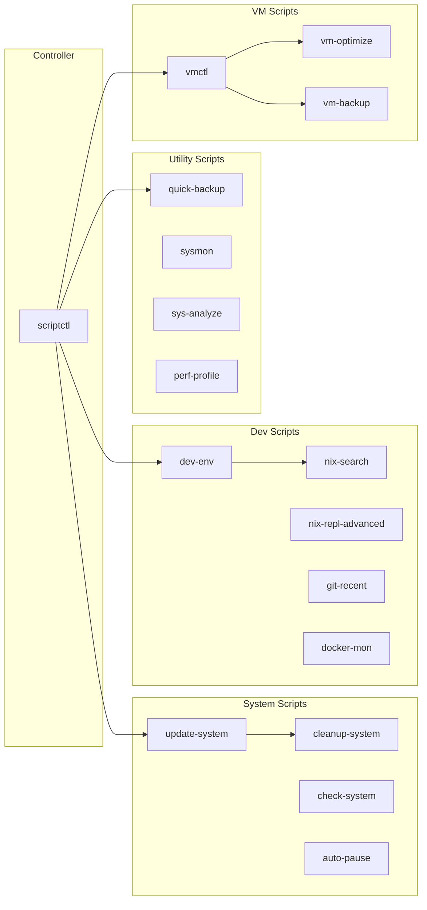

---
tags:
  - scripts
  - operations
  - reference
---

# Scripts Reference

All system scripts are installed system-wide via [[System Modules]] (`modules/system/scripts.nix`) and available in `PATH`. Use `scriptctl` to discover, inspect, and run any script interactively.



---

## scriptctl

**Purpose:** Master controller for discovering, inspecting, and running all system scripts.

**Location:** `scripts/scriptctl`

| Command | Description |
|---|---|
| `scriptctl list [category]` | List all scripts, optionally filtered by category |
| `scriptctl search <query>` | Search scripts by name or description |
| `scriptctl info <script>` | Show detailed info about a script |
| `scriptctl run <script> [args]` | Execute a script with arguments |
| `scriptctl interactive` | Interactive script selector (requires `fzf`) |
| `scriptctl categories` | List all script categories |

```bash
scriptctl list system
scriptctl info update-system
scriptctl interactive
```

---

## update-system

**Purpose:** Update NixOS system and all flake inputs. Runs `nix flake update`, then rebuilds with `nh os switch` and shows the generation diff via `nvd`.

**Location:** `scripts/system/update-system`

| Flag | Effect |
|---|---|
| `--no-rebuild` | Only update `flake.lock`; skip rebuild |

```bash
update-system              # Update and rebuild
update-system --no-rebuild # Only update flake.lock
```

> [!tip] After updating, run `check-system` to verify system health.

---

## cleanup-system

**Purpose:** Remove old NixOS generations, garbage-collect the store, and optimize.

**Location:** `scripts/system/cleanup-system`

| Flag | Effect |
|---|---|
| *(default)* | Keep last 5 generations |
| `--aggressive` | Keep last 3 generations; full GC with `-d` flag |

```bash
cleanup-system             # Standard cleanup
cleanup-system --aggressive # Aggressive cleanup
```

---

## check-system

**Purpose:** Run a full system health check — Nix version, current generation, flake status, disk usage, critical services, failed units, and update status.

**Location:** `scripts/system/check-system`

```bash
check-system
```

Reports:
- Nix version and current generation
- Flake dirty/clean status and remote drift
- `/nix/store` disk usage with warning thresholds (80%/90%)
- Critical service status (NetworkManager, bluetooth, pipewire, docker)
- Failed systemd units
- System uptime, kernel, hostname

---

## auto-pause

**Purpose:** Monitor PipeWire/PulseAudio events and pause all media players when an audio sink is removed (e.g. Bluetooth disconnect, headphone unplug). Requires `pactl` and `playerctl`.

**Location:** `scripts/system/auto-pause`

```bash
auto-pause
```

---

## dev-env

**Purpose:** Scaffold a new project with a Nix flake, `.envrc`, and `.gitignore`. Supports `python`, `node`, `rust`, `go`, `terraform`, and `docker` environment types.

**Location:** `scripts/dev/dev-env`

```bash
dev-env myproject python
dev-env webapp node
dev-env api rust
```

After creation:
1. `cd <project-name>`
2. `direnv allow`
3. Start developing.

---

## nix-search

**Purpose:** Interactive Nix package explorer powered by `fzf`. Searches `nixpkgs`, sorts results by name length, and lets you shell into the selected package.

**Location:** `scripts/dev/nix-search`

```bash
nix-search ripgrep
nix-search          # prompts for query
```

Keybindings in `fzf`:
- **Enter** — `nix shell nixpkgs#<pkg>`
- **Alt-r** — `nix run nixpkgs#<pkg>`
- **Alt-c** — copy package name to clipboard

---

## docker-mon

**Purpose:** Show Docker system status — running containers, disk usage, and recent events. Suggests `lazydocker`, `dive`, and `dc` (docker compose alias).

**Location:** `scripts/dev/docker-mon`

```bash
docker-mon
```

---

## nix-repl-advanced

**Purpose:** Launch a Nix REPL preloaded with `pkgs`, `flake` context, and helper shortcuts (`p` for JSON pretty-print, `l` for file import, `s` for package search, `lib`).

**Location:** `scripts/dev/nix-repl-advanced`

```bash
nix-repl-advanced                  # uses current directory as flake URI
FLAKE_URI=path:/etc/nixos nix-repl-advanced
```

---

## git-recent

**Purpose:** List recent local branches sorted by commit date and switch with `fzf` preview. Requires `fzf`.

**Location:** `scripts/dev/git-recent`

```bash
git-recent
```

---

## quick-backup

**Purpose:** Quick backup of `~/Documents`, `~/Projects`, `~/.config`, `~/.ssh`, and the NixOS configuration to a local drive or cloud (via `rclone`).

**Location:** `scripts/util/quick-backup`

| Flag | Effect |
|---|---|
| *(default)* | Backup to `BACKUP_DEST` (default `/mnt/backup`) using `rsync` |
| `--cloud` | Sync to cloud via `rclone` |

```bash
quick-backup          # local backup
quick-backup --cloud  # cloud backup
BACKUP_DEST=/mnt/usb quick-backup
```

Excludes `.git/`, `node_modules/`, `target/`, `.direnv/`.

---

## sysmon

**Purpose:** Drop-in system monitor. Launches `btm` (bottom), falls back to `btop`, `htop`, or `top`.

**Location:** `scripts/util/sysmon`

```bash
sysmon
```

---

## sys-analyze

**Purpose:** Comprehensive system analysis and diagnostics — hardware info, CPU, memory, disk, I/O stats, top processes, network connections, failed units, journal errors, NixOS version.

**Location:** `scripts/util/sys-analyze`

| Flag | Effect |
|---|---|
| *(default)* | Standard report |
| `--full` | Adds full system logs, hardware list, PCI/USB devices, kernel modules, network interfaces, firewall rules |

```bash
sys-analyze
sys-analyze --full
```

---

## perf-profile

**Purpose:** Profile a command with `perf record` and generate a report. Optionally creates a flamegraph SVG if `flamegraph` is available.

**Location:** `scripts/util/perf-profile`

```bash
perf-profile ls -la
perf-profile python script.py
```

---

## vmctl

**Purpose:** Advanced VM management TUI for libvirt/QEMU. Wraps `virsh` with colored output, monitoring, and interactive modes.

**Location:** `scripts/vms/vmctl`

| Command | Description |
|---|---|
| `vmctl list` | List all VMs with status |
| `vmctl start <vm>` | Start a VM |
| `vmctl stop <vm>` | Gracefully stop a VM |
| `vmctl kill <vm>` | Force stop a VM |
| `vmctl restart <vm>` | Restart a VM |
| `vmctl delete <vm>` | Delete a VM and its storage |
| `vmctl info <vm>` | Show VM information |
| `vmctl console <vm>` | Connect to VM console |
| `vmctl vnc <vm>` | Connect via VNC |
| `vmctl clone <vm> <new>` | Clone a VM |
| `vmctl snapshot <vm>` | Create a snapshot |
| `vmctl snapshots <vm>` | List snapshots |
| `vmctl restore <vm> <snap>` | Restore a snapshot |
| `vmctl edit <vm>` | Edit VM XML |
| `vmctl stats <vm>` | Show VM resource stats |
| `vmctl monitor` | Live VM monitor (TUI) |
| `vmctl network` | List virtual networks |

```bash
vmctl start win11
vmctl snapshot win11
vmctl list
```

> [!note] Requires `libvirtd` running. See [[Virtualization]] for VM setup details.

---

## vm-optimize

**Purpose:** Display a VM optimization guide covering CPU passthrough, hugepages, virtio-scsi, disk discard, virtio networking, multiqueue, and GPU settings. Prints the guide for the named VM.

**Location:** `scripts/vms/vm-optimize`

```bash
vm-optimize win11
```

---

## vm-backup

**Purpose:** Create a tarball backup of a VM's XML definition and disk images.

**Location:** `scripts/vms/vm-backup`

```bash
vm-backup win11
vm-backup win11 ~/alt-backups
```

Default backup directory: `~/Backups/VMs/`. Outputs `<vm>-<timestamp>.tar.gz`.

---

## Dev-Shell Launchers

Installed via [[Home Profiles]] (`home/profiles/development.nix`) into `~/.local/bin/`. Each launcher enters the corresponding Nix flake dev shell.

| Launcher | Flake Output | Stack |
|---|---|---|
| `dev-python` | `#python` | Python 3.12, pip, virtualenv, ipython, ruff, pyright |
| `dev-node` | `#node` | Node.js 22, npm, pnpm, TypeScript, typescript-language-server, prettier |
| `dev-rust` | `#rust` | rustc, cargo, rustfmt, clippy, rust-analyzer |
| `dev-go` | `#go` | Go, gopls, gotools, go-tools |

```bash
dev-python   # enter Python shell
dev-node     # enter Node.js shell
dev-rust     # enter Rust shell
dev-go       # enter Go shell
```

Direnv templates are also provided at `~/.config/direnv/templates/` for per-project activation:

```bash
cp ~/.config/direnv/templates/python.envrc .envrc
direnv allow
```

---

## Script Categories

| Category | Scripts |
|---|---|
| **system** | `update-system`, `cleanup-system`, `check-system`, `auto-pause` |
| **dev** | `dev-env`, `nix-search`, `docker-mon`, `nix-repl-advanced`, `git-recent` |
| **util** | `quick-backup`, `sysmon`, `sys-analyze`, `perf-profile` |
| **vms** | `vmctl`, `vm-optimize`, `vm-backup` |
| **controller** | `scriptctl` |

---

## Related Pages

- [[Virtualization]] — VM configuration and setup
- [[System Modules]] — How scripts are wired into NixOS
- [[Deployment Guide]] — Update and deployment workflows
- [[Home Profiles]] — Development shell launchers and editor config