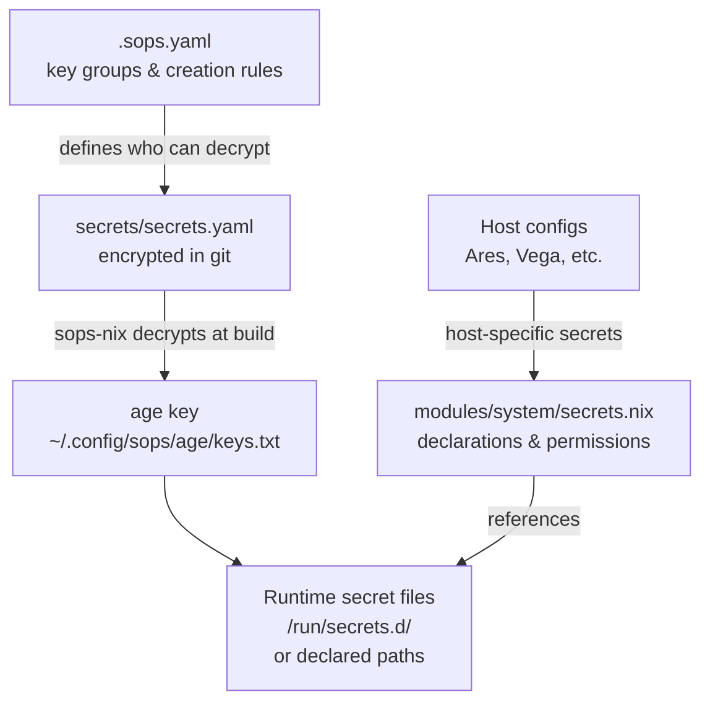
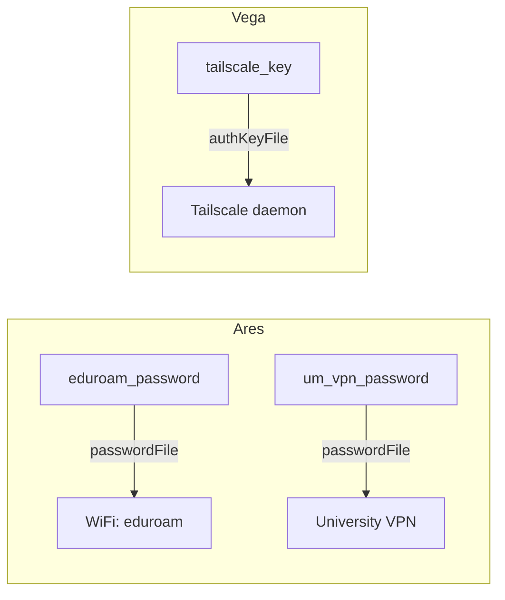

---
tags:
  - security
  - secrets
  - operations
---

# Secrets Management

This repository uses **sops-nix** with **age encryption** to manage secrets declaratively. Secrets are stored encrypted in git and decrypted at activation time — no plaintext secrets ever live in the repository.

## Architecture



- **sops-nix** — NixOS module that decrypts secrets during system activation
- **age** — Modern encryption tool; keys are smaller and faster than GPG
- **`.sops.yaml`** — Repository-root config declaring key groups and creation rules
- **`secrets/secrets.yaml`** — The encrypted secrets file committed to git
- **`modules/system/secrets.nix`** — Central module declaring all secret names, owners, and permissions

## Setup Process

### 1. Generate an age key

```bash
mkdir -p ~/.config/sops/age
age-keygen -o ~/.config/sops/age/keys.txt
```

### 2. Get your public key

```bash
age-keygen -y ~/.config/sops/age/keys.txt
```

### 3. Update `.sops.yaml`

Add your public key as an admin in the key groups:

```yaml
keys:
  - &ares age1p7dmyj24fvjymk2g58cyp4r06jfcekhn05t34s3d5pl9343myvjszay7yp

creation_rules:
  - path_regex: secrets/secrets\.yaml$
    key_groups:
    - age:
      - *ares
```

### 4. Create or edit secrets

```bash
sops secrets/secrets.yaml
```

This opens the encrypted YAML in `$EDITOR`. sops encrypts on save — only the encrypted version is committed.

## Current Secrets

| Secret | Owner | Path | Mode | Notes |
|---|---|---|---|---|
| `ssh_key` | jpolo | `/home/jpolo/.ssh/id_ed25519` | `0600` | SSH private key, placed directly at expected path |
| `id_um` | jpolo | `/home/jpolo/.ssh/id_um` | `0600` | University Michigan SSH key |
| `tailscale_key` | root | default (`/run/secrets.d/…`) | `0400` | Tailscale auth key, root-only read |
| `gemini_api_key` | jpolo | default | `0400` | Google Gemini API key |
| `ollama_cloud_api_key` | jpolo | default | `0400` | Ollama cloud API key, referenced by `ai-tools.nix` |

## Host-Specific Secrets

Some secrets are only declared on hosts that need them:

### Ares

- **`eduroam_password`** — University WiFi password, used by `hosts/ares/eduroam.nix`. Owner `root`, group `networkmanager`, mode `0440` (NetworkManager-readable).
- **`um_vpn_password`** — University VPN password, declared (commented out) in `hosts/ares/university-vpn.nix`. Uncomment when needed.

### Vega

- **`tailscale_key`** — Used by `modules/system/network.nix` for `services.tailscale.authKeyFile`.



## Adding a New Secret

### 1. Add to the encrypted file

```bash
sops secrets/secrets.yaml
```

Add a new key-value entry (e.g., `new_secret: super-secret-value`), then save. sops re-encrypts automatically.

### 2. Declare in NixOS config

In `modules/system/secrets.nix` or the relevant host config:

```nix
sops.secrets.new_secret = {
  owner = "jpolo";
  mode = "0400";
};
```

Or for host-specific secrets, add directly in the host file (e.g., `hosts/ares/default.nix`):

```nix
sops.secrets.new_secret = {
  sopsFile = ../../secrets/secrets.yaml;
  owner = "root";
  mode = "0400";
};
```

### 3. Reference in services

Use `config.sops.secrets.<name>.path` to pass the decrypted file path:

```nix
services.some-service.passwordFile = config.sops.secrets.new_secret.path;
```

> **Important**: `config.sops.secrets.<name>.path` resolves to the runtime location of the decrypted secret. Never hardcode the path — always use the config attribute.

## Adding a New Host to SOPS

### 1. Generate a key on the new host

Option A — Age key (recommended):

```bash
mkdir -p ~/.config/sops/age
age-keygen -o ~/.config/sops/age/keys.txt
age-keygen -y ~/.config/sops/age/keys.txt  # get public key
```

Option B — Convert an existing SSH host key:

```bash
ssh-to-age < /etc/ssh/ssh_host_ed25519_key.pub
```

### 2. Add public key to `.sops.yaml`

```yaml
keys:
  - &ares age1p7dmyj24fvjymk2g58cyp4r06jfcekhn05t34s3d5pl9343myvjszay7yp
  - &newhost age1NEW_PUBLIC_KEY_HERE

creation_rules:
  - path_regex: secrets/secrets\.yaml$
    key_groups:
    - age:
      - *ares
      - *newhost
```

### 3. Re-encrypt secrets with the new key

```bash
sops updatekeys secrets/secrets.yaml
```

This re-encrypts the file so the new host can decrypt it. Commit the updated file.

### 4. Configure the new host

In the host's NixOS config, point sops to the age key:

```nix
sops.age.keyFile = "/home/jpolo/.config/sops/age/keys.txt";
# or use SSH host key:
# sops.age.sshKeyPaths = [ "/etc/ssh/ssh_host_ed25519_key" ];
```

## Security Notes

- **Age private key** lives at `~/.config/sops/age/keys.txt`. Protect it — this is the decryption key for all secrets on that host.
- **`generateKey = true`** is set in `secrets.nix`, which means sops-nix will generate a key if one doesn't exist at the configured path. For production, consider generating keys manually and setting `generateKey = false`.
- **`validateSopsFiles = true`** causes builds to fail if sops files can't be decrypted — this prevents silently deploying broken secret references.
- **File permissions** are enforced by sops-nix at activation time. Secrets with `mode "0400"` are owner-read-only; `mode "0440"` allows group read (used for NetworkManager access to eduroam).
- **Secrets are never in the Nix store** — sops-nix decrypts to `/run/secrets.d/` (tmpfs) and symlinks from there, keeping plaintext out of the world-readable `/nix/store`.

## Related

- [[Network & VPN]] — Tailscale auth key and eduroam password usage
- [[Ares]] — Host with eduroam and university VPN secrets
- [[System Modules]] — `secrets.nix` module overview