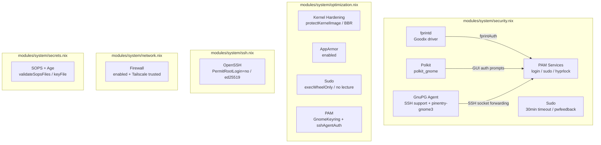

# Security

Security and authentication configuration across the system. The primary module is `modules/system/security.nix`, with hardening additions in `modules/system/optimization.nix` and per-host firewall rules.



## Polkit

- **`security.polkit.enable = true`** — enabled globally
- **`polkit_gnome`** — provides graphical authentication dialogs for desktop sessions
- Used by Hyprland and other Wayland compositors for privilege escalation prompts (mount disks, network changes, etc.)

Source: `modules/system/security.nix`, `modules/desktop/hyprland.nix`

## PAM — Pluggable Authentication Modules

Fingerprint authentication is configured for all three interactive auth paths:

| Service | PAM Option | Effect |
|---------|-----------|--------|
| `login` | `fprintAuth = true` | Fingerprint at TTY/GDM login |
| `sudo` | `fprintAuth = true` | Fingerprint for `sudo` |
| `hyprlock` | `fprintAuth = true` | Fingerprint to unlock screen lock |

Additional PAM settings from `optimization.nix`:

- **`login.enableGnomeKeyring = true`** — unlocks GNOME Keyring at login
- **`sudo.sshAgentAuth = true`** — allows SSH agent auth for sudo

Source: `modules/system/security.nix`, `modules/system/optimization.nix`

## Fingerprint Reader

- **`services.fprintd.enable = true`** — enables the fprintd daemon
- **`services.fprintd.tod.enable = true`** — uses the Thin-Overlay-Driver architecture (newer Goodix sensors)
- **Driver**: `libfprint-2-tod1-goodix` — Goodix TOD driver for ThinkPad integrated fingerprint readers
- **`fprintd`** package installed system-wide for `fprintd-enroll` / `fprintd-verify` commands

### Enrolling a finger

```bash
# List available devices
fprintd-list "$USER"

# Enroll right index finger
fprintd-enroll "$USER"

# Verify enrollment
fprintd-verify "$USER"
```

> **Note**: If the Goodix sensor is not detected, check `ls /dev/bus/usb/` and ensure the `libfprint-2-tod1-goodix` package matches your sensor revision. Some ThinkPad generations use different Goodix models.

Source: `modules/system/security.nix`

## GnuPG Agent

```nix
programs.gnupg.agent = {
  enable = true;
  enableSSHSupport = true;    # GPG agent forwards SSH auth
  pinentryPackage = pkgs.pinentry-gnome3;  # GNOME3 pinentry dialog
};
```

- **SSH support** — GPG subkeys with authentication capability replace `~/.ssh/id_*` files
- **`pinentry-gnome3`** — graphical passphrase prompt (set in `optimization.nix`; the `security.nix` module enables the agent without overriding pinentry)
- SSH socket: `gpgconf --list-dirs agent-ssh-socket`

### Usage

```bash
# Check GPG agent status
gpgconf --kill gpg-agent   # restart agent
gpgconf --launch gpg-agent  # start agent

# List keys with SSH auth capability
gpg --list-keys --with-keygrip

# Test SSH forwarding
ssh-add -l   # should list GPG auth subkey
```

Source: `modules/system/security.nix`, `modules/system/optimization.nix`

## Sudo

Two modules contribute sudo settings:

| Setting | Module | Value |
|---------|--------|-------|
| `enable` | both | `true` |
| `execWheelOnly` | optimization.nix | `true` — only `wheel` group members can run sudo |
| `timestamp_timeout=30` | both | 30-minute session cache |
| `pwfeedback` | both | shows `*` per character typed |
| `lecture = never` | optimization.nix | suppresses the sudo lecture message |

Source: `modules/system/security.nix`, `modules/system/optimization.nix`

## AppArmor

- **`security.apparmor.enable = true`** — enabled in `optimization.nix`
- Provides mandatory access control for confined processes
- No custom profiles defined in this repository; relies on default NixOS profiles
- Status check: `aa-status`

Source: `modules/system/optimization.nix`

## Kernel Hardening

Configured in `modules/system/optimization.nix` via `boot.*` and `security.*`:

| Setting | Value | Purpose |
|---------|-------|---------|
| `security.protectKernelImage` | `true` | Prevents `/dev/mem` and `/dev/kmem` access to kernel image |
| `tcp_bbr` kernel module | loaded | BBR TCP congestion control algorithm |
| `net.core.default_qdisc` | `cake` | Fair queueing discipline |
| `net.ipv4.tcp_congestion_control` | `bbr` | BBR congestion algorithm |
| `net.ipv4.tcp_fastopen` | `3` | TFO enabled (client + server) |
| `vm.swappiness` | `10` | Minimize swap usage |
| `vm.vfs_cache_pressure` | `50` | Reclaim dentry/inode caches less aggressively |
| `vm.dirty_ratio` | `10` | Write back at 10% dirty pages |
| `vm.dirty_background_ratio` | `5` | Background writeback at 5% |
| `fs.file-max` | `2097152` | Maximum open file descriptors |
| `fs.inotify.max_user_watches` | `524288` | File watcher limit (desktop workloads) |
| `fs.inotify.max_user_instances` | `512` | Inotify instances per user |
| `kernel.pid_max` | `4194304` | Expanded PID space |
| `kernel.sysrq` | `1` | Enable SysRq for emergency recovery |
| `nowatchdog` / `nmi_watchdog=0` | kernel params | Disable watchdog for faster boot |
| `nix.settings.sandbox` | `true` | Sandboxed Nix builds |

Source: `modules/system/optimization.nix`

## SSH — OpenSSH

- **`PermitRootLogin = "no"`** — hardcoded default (the Ares comment says `lib.mkDefault "yes"` in the module, but Ares overrides to `no`)
- **`PasswordAuthentication = true`** — enabled by default; suitable for single-user workstations with fingerprint auth
- **`PubkeyAuthentication = true`** — always enabled
- **ed25519 host keys** — NixOS default key type for host keys
- Port 22 opened in firewall by `modules/system/ssh.nix`
- **Tailscale SSH** — enabled via `--ssh` flag in Tailscale extraUpFlags

### Host overrides

| Host | Ports | Notes |
|------|-------|-------|
| Ares | 22 | `PermitRootLogin = "no"` override in host config |
| Janus | (inherited) | No SSH override |
| Vega | 22, 11434 | Ollama port also open |

Source: `modules/system/ssh.nix`, `hosts/*/configuration.nix`

## Firewall

The shared module (`modules/system/network.nix`) provides a baseline firewall:

```nix
networking.firewall = {
  enable = true;
  allowPing = true;
  allowedTCPPorts = [ ];
  allowedUDPPorts = [ config.services.tailscale.port ];
  trustedInterfaces = [ "tailscale0" ];
};
```

Each host adds its own ports on top — see [[Network & VPN]] for the full per-host breakdown.

Source: `modules/system/network.nix`

## SOPS + Age Secrets

- **`sops.defaultSopsFile`** — `../../secrets/secrets.yaml`
- **`sops.validateSopsFiles = true`** — fails the build if a sops file is invalid
- **`sops.age.keyFile`** — `~/.config/sops/age/keys.txt`
- **`sops.age.generateKey = true`** — auto-generates key if missing
- Secrets are decrypted at activation time, never stored in plaintext in the Nix store

For full secret management documentation, see [[Secrets Management]].

Source: `modules/system/secrets.nix`

## Security Recommendations

### Already implemented

- AppArmor is enabled but uses only default profiles — consider adding custom profiles for high-value services
- Fingerprint auth covers all three interactive PAM services
- Sudo is restricted to `wheel` group with no lecture and 30-minute timeout
- Kernel image is protected from direct memory access
- BBR + Cake TCP stack for improved network performance and fairness
- Nix builds run in sandboxes
- Docker uses rootless mode (see [[Virtualization]])

### Potential hardening steps

1. **SSH**: Set `PasswordAuthentication = false` and rely exclusively on public key auth. Current config allows password login, which is convenient for single-user workstations but not ideal for exposed servers.
2. **AppArmor profiles**: Add custom profiles for network-facing services (Traefik on Ares, Ollama on Vega). The `aa-logprof` tool can generate profiles from observed behavior.
3. **Firewall**: The base module opens no TCP ports; verify that per-host additions are minimal. Consider switching `allowedTCPPorts` to range-based rules where possible.
4. **Audit**: Enable `security.audit.enable = true` for kernel audit logging, useful for forensic analysis.
5. **USB guard**: Consider `services.usbguard.enable = true` to whitelist USB devices — relevant for ThinkPad laptops in shared spaces.
6. **Secure Boot**: Consider enabling `boot.loader.systemd-boot` with secure boot keys, or `boot.lanzaboote` for NixOS-native secure boot.
7. **Root account**: Verify `users.users.root.hashedPassword` is set to `!` (locked) or removed entirely. NixOS defaults to locked root, but explicit is better.
8. **`sshAgentAuth` tradeoff**: `security.pam.services.sudo.sshAgentAuth = true` allows SSH key auth for sudo. Convenient, but any compromised SSH agent socket grants sudo. Consider whether fingerprint-only sudo is preferable on laptops.

## Cross-References

- [[Secrets Management]] — full sops-nix and age documentation
- [[Network & VPN]] — per-host firewall rules, Tailscale, eduroam, VPN
- [[System Modules]] — module index and configuration paths
- [[Ares]] — Ares-specific security (Docker firewall rules, SSH overrides)
- [[Vega]] — Vega-specific security (Ollama port exposure)