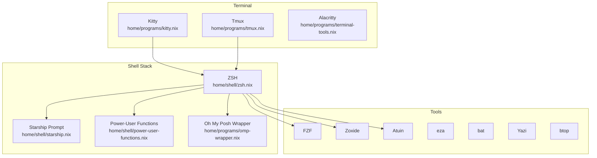

---
tags:
  - shell
  - terminal
  - reference
---

# Shell and Terminal

The shell and terminal stack is built around ZSH + Starship + Kitty, with a rich set of power-user functions, terminal multiplexing via Tmux, and dev-shell launchers for instant Nix development environments.



## ZSH

**Module:** `home/shell/zsh.nix`
**Gate:** `home.profiles.cli.enable` (enabled globally via [[Profile System]] → `profiles.base.enable`)

ZSH is the primary shell for developer users. Key features:

| Feature | Setting |
|---------|---------|
| History size | 100,000 entries, shared across sessions |
| Autosuggestions | Enabled |
| Syntax highlighting | Enabled |
| Vi keybindings | `bindkey -v` with `KEYTIMEOUT=1` |
| Oh My ZSH plugins | git, sudo, docker, docker-compose, kubectl, terraform, rust, golang, python, node, npm, systemd, ssh-agent, gpg-agent, colored-man-pages, command-not-found, history-substring-search |
| Extra plugins | zsh-nix-shell, fast-syntax-highlighting, zsh-autocomplete, zsh-you-should-use |

### Shell Aliases

The ZSH config defines extensive aliases organized by category:

- **Navigation:** `..`, `...`, `....`, `.....`, `cdnix`, `cdconfig`, `cdprojects`, `cddocs`, `cddl`
- **Modern CLI replacements:** `ls`→eza, `cat`→bat, `du`→dust, `df`→duf, `top`→btm, `ps`→procs
- **Git shortcuts:** `g`, `gs`, `gst`, `ga`, `gaa`, `gc`, `gcm`, `gp`, `gpl`, `gco`, `gb`, `gd`, `glo`, `gstash`, `gwip`
- **NixOS management:** `nos` (switch), `nob` (boot), `not` (test), `nd`, `ns`, `nb`, `nf`, `nfu`, `nfc`, `cleanup`, `diff-gen`
- **Docker:** `d`, `dc`, `dcu`, `dcd`, `dps`, `drm`, `dex`, `dlogs`
- **Kubernetes:** `k`, `kgp`, `kgs`, `kl`, `kex`, `kdesc`, `kapp`
- **System:** `vim`/`vi`/`v`→nvim, `ports`, `listening`, `myip`, `weather`
- **Port management:** `pf`, `pk`, `pc`, `prec` (via portctl)
- **Vega remote:** `vqueue`, `vstatus`, `vlog`, `vsync`, `vpull`, `vrun`, `vport`, `vclear`
- **Tmux:** `ts` (sessionizer), `tsa` (ts-tools), `tl`, `ta` (attach), `tk` (killer)

### Keybindings

| Binding | Action |
|---------|--------|
| `Ctrl+F` | tmux-sessionizer |
| `Ctrl+G` | fzf directory widget (insert path into command line) |
| `Ctrl+R` | Incremental history search backward |
| `Ctrl+S` | Incremental history search forward |
| `Ctrl+P` / `Ctrl+N` | History search up/down |
| `Alt+H/J/K/L` | Zellij pane navigation |

### Inline Functions

The ZSH `initContent` block defines several convenience functions:

- **`resolve <alias>`** — Expands aliases and functions to their raw commands (useful for copying to remote servers)
- **`count-dirs`** — Count elements in each subdirectory
- **`count-elements`** — Count elements in current directory
- **`tmux-attach`** / `ta` — fzf-powered tmux session attach
- **`fe`** — fzf-powered file edit (`$EDITOR`)
- **`fcd`** — fzf-powered directory cd
- **`fgl`** — fzf-powered git log browser
- **`fkill`** — fzf-powered process kill
- **`dsh`** — fzf-powered Docker shell attach
- **`note`** — Quick note to `~/Documents/notes/YYYY-MM-DD.md`
- **`gwt-add`** — Git worktree add helper
- **`extract`** — Extract any archive format
- **`mkcd`** — Create directory and cd into it
- **`cleanup-walker`** — Clear Walker/Elephant launcher cache

If the terminal is Kitty, SSH is aliased to `kitten ssh` for remote clipboard and image support.

## Starship Prompt

**Module:** `home/shell/starship.nix`
**Gate:** `home.profiles.cli.enable`

Starship provides a fast, customizable cross-shell prompt. Configuration highlights:

| Module | Behavior |
|--------|----------|
| Directory | Truncation length 2, truncate to repo root, bold cyan |
| Git branch |  symbol, bold purple |
| Git status | Bold red, shows all status + ahead/behind |
| Nix shell |  symbol, bold blue, shows pure/impure |
| Character | ➜ (green on success, red on error) |
| Time | Always shown, format `%T` |
| Cmd duration | Shown for commands >500ms |
| Battery | Warning at 10% (red) and 30% (yellow) |
| Hostname | Shown only on SSH |
| Username | Hidden by default, shown for root or SSH |

Language modules (Python, Rust, Node.js, Docker, Kubernetes, AWS) are also enabled with Nerd Font symbols.

## Power-User Functions

**Module:** `home/shell/power-user-functions.nix`

This module extends ZSH with advanced plugins and convenience shell functions. It adds four extra plugins beyond the Oh My ZSH set:

| Plugin | Purpose |
|--------|---------|
| zsh-nix-shell | Nix shell detection indicator |
| fast-syntax-highlighting | Real-time syntax highlighting |
| zsh-autocomplete | Tab completion as-you-type |
| zsh-you-should-use | Reminds about defined aliases |

### Convenience Functions

The `initContent` block provides a rich set of utility functions:

**Navigation:**
- **z.lua** — Smart directory jumping (initialized with fzf integration)
- **Directory bookmarks** — `~nix`, `~proj`, `~dots`, `~dl` via `hash -d`
- **Directory stack** — `AUTO_PUSHD`, `PUSHD_IGNORE_DUPS`, `1`–`9` number aliases for quick stack access
- **`cd` override** — Lists contents on every cd (via `ls --color=auto -F`)

**File & Search:**
- **`qfind <pattern>`** — Find and bat-print files matching pattern
- **`extract` / `x`** — Extract any archive format
- **`json`** — Pretty-print JSON (file arg or pipe)
- **`count <dir>`** — Count files in directory

**System:**
- **`please`** — Repeat last command with sudo
- **`sysinfo`** — Quick CPU/RAM/disk/uptime summary
- **`memtop`** / **`cputop`** — Top 20 processes by memory/CPU
- **`netstat-listen`** / **`port <n>`** — Network listeners and port lookup
- **`duh`** — Disk usage, sorted
- **`largest <dir>`** — Top 20 largest files
- **`docker-clean`** — Prune all Docker data
- **`watch-cmd`** — Watch with color

**Git & Dev:**
- **`gclone <url>`** — Clone and cd into repo
- **`nix-shell-pure`** — Pure nix-shell
- **`nvl`** — Neovim light mode
- **`bench`** — Hyperfine benchmark wrapper

**Utilities:**
- **`bak <file>`** — Timestamped backup
- **`serve <port>`** — Quick HTTP server (default port 8000)
- **`wttr <city>`** — Weather via wttr.in
- **`cheat <topic>`** — Cheat sheets via cheat.sh
- **`genpass <len>`** — Random password generator (default 32 chars)
- **`calc <expr>`** — bc calculator
- **`man`** — Colored man pages
- **`pstree`** — Process tree via procs
- **`convert-to-mp3`** — FFmpeg audio conversion
- **`optimg`** — Image optimization (png→oxipng, jpg→jpegoptim)

**FZF-powered:**
- **`fh`** — FZF history search
- **`fk`** — FZF process kill
- **`gwt`** — FZF git worktree

**Kubernetes:**
- **`kctx <context>`** — Switch kubectl context

**SSH:**
- **`ssha`** — SSH with agent forwarding
- **`rcp`** — rsync with progress

## Kitty Terminal

**Module:** `home/programs/kitty.nix`
**Gate:** `home.profiles.desktop.enable`

Kitty is the primary terminal emulator on [[Ares]] and [[Janus]].

| Setting | Value |
|---------|-------|
| Font | JetBrains Mono, size 12 |
| Background opacity | 0.9 (translucent) |
| Window padding | 8px |
| Cursor | Beam, no blink |
| Repaint delay | 10ms |
| Input delay | 3ms |
| Sync to monitor | Yes |
| Remote control | Yes (for noctalia theme reload) |
| Theme | Noctalia (matugen-generated, included from `~/.config/kitty/themes/noctalia.conf`) |

Kitty is not available on headless hosts ([[Vega]]); Alacritty serves as an alternative terminal with similar configuration (JetBrains Mono, 0.95 opacity, catppuccin theming via noctalia).

## Tmux

**Module:** `home/programs/tmux.nix`
**Gate:** `home.profiles.cli.enable`

Tmux is the terminal multiplexer of choice, configured with Catppuccin Mocha theme and vi keybindings.

| Setting | Value |
|---------|-------|
| Terminal | tmux-256color |
| History limit | 100,000 |
| Key mode | vi |
| Base index | 1 |
| Mouse | Enabled |
| Prefix | `Ctrl+A` (replaces default `Ctrl+B`) |
| Status position | Top |
| Clipboard | Wayland integration via `wl-paste` (`Ctrl+V` to paste) |

**Key bindings:**

| Binding | Action |
|---------|--------|
| `Ctrl+A` | Prefix |
| `prefix + \|` | Split horizontal |
| `prefix + -` | Split vertical |
| `prefix + h/j/k/l` | Pane navigation (vi-style) |
| `prefix + f` | tmux-sessionizer |

**Plugins:** resurrect, continuum, yank, catppuccin (mocha flavor)

**Helper scripts** installed as packages:

| Command | Purpose |
|---------|---------|
| `tmux-sessionizer` | fzf-powered project/session switcher (searches `~/Projects`, `~/Documents`, `~/.config/nixos`). Marks active sessions with `[ACTIVE]` prefix. |
| `tmux-killer` | fzf-powered session killer (prevents killing current session) |
| `ts-tools` | Bootstraps `ai` and `system` sessions (opens `claude` and `btop` respectively) |

**Window naming:** Automatic renaming is strictly disabled (`allow-rename off`, `automatic-rename off`, `set-titles off`).

## Default Shells

Default shells are assigned per user via the `mkUser` helper in `home/users/lib.nix`:

| User | Shell | Hosts |
|------|-------|-------|
| **jpolo** | ZSH | [[Ares]], [[Janus]], [[Vega]] |
| **elena** | Bash | [[Janus]] |
| **padres** | Bash | [[Janus]] |
| **gaming** | Bash | [[Ares]] |

ZSH is enabled globally through `profiles.base.enable`, which all users inherit. The `home/programs/terminal-tools.nix` module (gate: `profiles.cli.enable`) also configures an interactive Bash shell for auxiliary use, with `bashInteractive`, `shellcheck`, and `shfmt` available.

> **Note:** The gaming user on [[Ares]] uses Bash as a lightweight shell for gaming sessions, while the primary developer user (jpolo) gets the full ZSH + Starship + power-user-functions experience.

## Oh My Posh Wrapper

**Module:** `home/programs/omp-wrapper.nix`

A custom wrapper script (`omp`) that launches the Pi Coding Agent with Docker sandboxing:

- Uses `bunx --bun @oh-my-pi/pi-coding-agent`
- Sandbox: `docker:mom-sandbox`
- Project root enforcement: `--project-root="$(pwd)"`
- Optional `PI_EXTRA_MOUNTS` for additional bind mounts
- Auto-loads `OLLAMA_API_KEY` from a file path if provided

## Terminal Tools

**Module:** `home/programs/terminal-tools.nix`
**Gate:** `home.profiles.cli.enable`

Beyond ZSH and Tmux, the CLI profile installs a full set of modern terminal tools:

| Tool | Purpose |
|------|---------|
| **Zellij** | Modern terminal multiplexer (alternative to tmux), catppuccin-mocha theme, vi keybindings |
| **Atuin** | Shell history sync (fuzzy search, vim-normal keymap, 5min sync) |
| **Zoxide** | Smarter `cd` (zoxide init zsh) |
| **FZF** | Fuzzy finder (catppuccin colors, bat preview for files, tree preview for dirs) |
| **bat** | Better cat (Catppuccin-mocha theme, line numbers + changes + header) |
| **Yazi** | Terminal file manager (Ranger-like, with custom linemode, image/video/PDF openers, `yy` alias) |
| **Fastfetch** | System info on shell startup |
| **eza** | Modern `ls` replacement (icons, headers, group-directories-first) |
| **ripgrep** | Fast grep (smart-case, hidden files, excludes .git/node_modules/target) |
| **btop** | Resource monitor (noctalia theme) |
| **Alacritty** | Alternative terminal emulator (JetBrains Mono, 0.95 opacity, noctalia theme) |

## Dev Shell Launchers

**Module:** `home/profiles/development.nix`
**Gate:** `home.profiles.development.devShells.enableLaunchers` (default: on)

Quick-launch scripts installed to `~/.local/bin/` that enter Nix development shells:

| Command | Flake Output | Stack |
|---------|-------------|-------|
| `dev-python` | `nix develop /etc/nixos#python` | Python 3.12, pip, virtualenv, pyright, black |
| `dev-node` | `nix develop /etc/nixos#node` | Node.js 22, npm, yarn, pnpm, typescript-language-server, prettier |
| `dev-rust` | `nix develop /etc/nixos#rust` | rustc, cargo, rustfmt, clippy, rust-analyzer |
| `dev-go` | `nix develop /etc/nixos#go` | Go, gotools, gopls |

The development profile also provides **direnv templates** at `~/.config/direnv/templates/` for each stack, so you can copy an `.envrc` into a project and get automatic environment loading:

```bash
cp ~/.config/direnv/templates/python.envrc .envrc
direnv allow
```

## How to Customize

To modify the shell experience, edit these files in `/etc/nixos/`:

| Want to change... | Edit this file | Rebuild command |
|-------------------|---------------|-----------------|
| Aliases, keybindings, inline functions, Oh My ZSH plugins | `home/shell/zsh.nix` | `nos` |
| Prompt format, modules, symbols | `home/shell/starship.nix` | `nos` |
| Power-user functions, extra ZSH plugins | `home/shell/power-user-functions.nix` | `nos` |
| Kitty settings (font, opacity, theme) | `home/programs/kitty.nix` | `nos` |
| Tmux config, keybindings, sessionizer | `home/programs/tmux.nix` | `nos` |
| Terminal tools (FZF, bat, eza, etc.) | `home/programs/terminal-tools.nix` | `nos` |
| Dev shell launchers | `home/profiles/development.nix` | `nos` |
| Oh My Posh wrapper | `home/programs/omp-wrapper.nix` | `nos` |

After editing, run `nos` (alias for `sudo nixos-rebuild switch --flake .#ares`) or the equivalent rebuild command for your host.

## Related Pages

- [[Home Programs]] — Full list of home-manager program configurations
- [[Home Profiles]] — Profile system that gates shell/terminal features
- [[Ares]] — Primary Hyprland workstation (full terminal stack)
- [[Janus]] — KDE Plasma family machine (terminal stack + gaming user)
- [[Scripts Reference]] — System-level scripts that complement shell functions