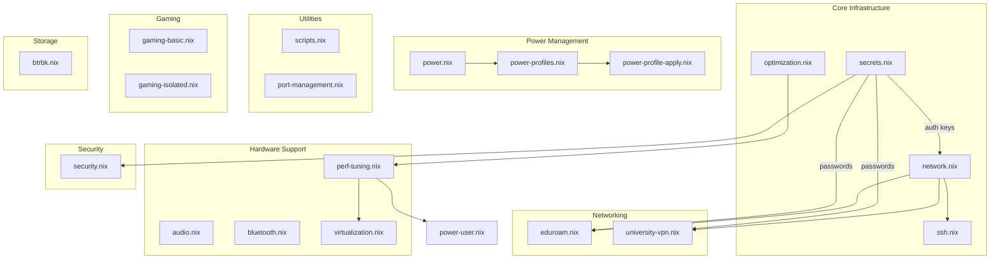
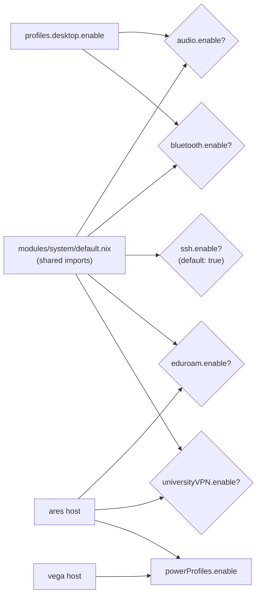

---
tags:
  - modules
  - system
  - reference
---

# System Modules

Comprehensive reference for all system-level modules in `/etc/nixos/modules/system/`. These modules are imported via `modules/system/default.nix` as shared modules for all hosts (with some exceptions noted per-module).

> See also: [[Module System]], [[Architecture Overview]], [[Network & VPN]], [[Security]], [[Power Management]]

---

## Module Dependency Map



---

## Module Reference

### audio.nix

**Option:** `modules.system.audio.enable` (bool)  
**Path:** `modules/system/audio.nix`  
**Enabled by:** [[Profile System|desktop profile]] (`profiles.desktop.enable = true`) → sets `modules.system.audio.enable = true`  
**Hosts:** ares, janus

Configures the PipeWire audio stack replacing PulseAudio.

| Setting | Value |
|---|---|
| PipeWire | enabled (ALSA, PulseAudio, JACK compat) |
| WirePlumber | enabled |
| RTKit | enabled (real-time scheduling) |
| PulseAudio | explicitly disabled |

**Packages:** pavucontrol, pulseaudio (for pactl/pacmd CLI), pamixer, playerctl, easyeffects

---

### bluetooth.nix

**Option:** `modules.system.bluetooth.enable` (bool)  
**Path:** `modules/system/bluetooth.nix`  
**Enabled by:** desktop profile (`profiles.desktop.enable = true`)  
**Hosts:** ares, janus

BlueZ Bluetooth stack with experimental features enabled.

| Setting | Value |
|---|---|
| BlueZ | enabled, power on boot |
| Experimental features | enabled (Source, Sink, Media, Socket) |
| Blueman | enabled (GUI manager) |

**Packages:** bluez, bluez-tools, blueman

---

### network.nix

**Option:** Always on (imported unconditionally)  
**Path:** `modules/system/network.nix`  
**Hosts:** ares, janus, vega

Core networking: DNS resolution, WiFi management, Tailscale mesh VPN, firewall.

| Setting | Value |
|---|---|
| systemd-resolved | enabled |
| NetworkManager | enabled, DNS via systemd-resolved, WiFi powersave on |
| NM plugins | networkmanager-openconnect |
| Tailscale | enabled, client routing, auth key from sops |
| Firewall | enabled, ping allowed, Tailscale UDP port, trusted `tailscale0` interface |

**Tailscale extras:** `--operator=jpolo`, `--ssh` (Tailscale SSH enabled)

**Packages:** networkmanager, networkmanagerapplet, wireguard-tools, openresolv, tailscale

> Cross-ref: [[Network & VPN]]

---

### eduroam.nix

**Option:** `networking.eduroam.enable` (bool)  
**Path:** `modules/system/eduroam.nix`  
**Hosts:** ares (only host with eduroam configured)

Custom WPA-Enterprise (PEAP/MSCHAPv2) WiFi module for eduroam networks.

**Sub-options** (`networking.eduroam.networks.<name>`):

| Option | Type | Default | Description |
|---|---|---|---|
| `ssid` | str | `"eduroam"` | Network SSID |
| `identity` | str | *(required)* | Username@institution.domain |
| `passwordFile` | path | *(required)* | SOPS-managed password file |
| `domain` | nullOr str | null | RADIUS domain suffix match |
| `caCertificate` | nullOr path | null | CA cert for server validation |
| `phase2Auth` | str | `"MSCHAPV2"` | Phase 2 auth method |
| `anonymousIdentity` | str | `"anonymous"` | Outer auth identity |

**Services:** `eduroam-password-injector` systemd oneshot — waits for NM, injects sops password, auto-connects.

> Cross-ref: [[Network & VPN]], [[Secrets Management]]

---

### university-vpn.nix

**Option:** `networking.universityVPN.enable` (bool)  
**Path:** `modules/system/university-vpn.nix`  
**Hosts:** ares (only host with VPN configured)

IKEv2 (strongSwan) VPN module via NetworkManager for university networks.

**Sub-options** (`networking.universityVPN.connections.<name>`):

| Option | Type | Default | Description |
|---|---|---|---|
| `gateway` | str | *(required)* | VPN gateway address |
| `username` | str | *(required)* | University email |
| `passwordFile` | nullOr path | null | SOPS password file (null = prompt) |
| `autoConnect` | bool | false | Auto-connect on boot |
| `certificate` | nullOr path | null | CA cert for server validation |
| `proposal` | str | `"aes256-sha256-modp1024"` | IKE encryption proposal |
| `esp` | str | `"aes256-sha256"` | ESP encryption proposal |
| `splitTunnelRoutes` | listOf str | `[]` | CIDR routes through VPN (empty = full tunnel) |
| `searchDomains` | listOf str | `[]` | DNS search domains (auto-prefixed with `~`) |

**Additional:** HARICA TLS Root CA 2021 cert installed system-wide from `certs/harica-tls-root-2021.pem`

**Services:** `university-vpn-password-injector` systemd oneshot — NM-ready password injection.

> Cross-ref: [[Network & VPN]]

---

### power.nix

**Option:** Always on (imported unconditionally)  
**Path:** `modules/system/power.nix`  
**Hosts:** ares, janus (vega uses performance governor directly)

Laptop power management with TLP, UPower, thermald, and powertop.

| Setting | Value |
|---|---|
| TLP | enabled |
| Charge thresholds | 20%–80% (battery care) |
| AC governor | performance |
| Battery governor | powersave |
| AC energy policy | performance |
| Battery energy policy | power |
| Battery max perf | 50% |
| Platform profile AC | performance |
| Platform profile BAT | low-power |
| UPower | enabled, hibernate at 5% |
| Thermald | enabled |
| Powertop | enabled (auto-tune) |
| power-profiles-daemon | disabled (conflicts with TLP) |

**Packages:** powertop, acpi, tlp

> Cross-ref: [[Power Management]]

---

### power-profiles.nix

**Option:** `system.powerProfiles.enable` (bool)  
**Path:** `modules/system/power-profiles.nix`  
**Hosts:** ares, vega

Manages named power profiles with thinkfan integration. Provides five profile scripts:

| Profile | Script | Description |
|---|---|---|
| eco | `power-eco` | Maximum power saving |
| balanced | `power-balanced` | Balanced (default) |
| balanced-eco | `power-balanced-eco` | Balanced with eco lean |
| performance | `power-performance` | High performance |
| performance-plus | `power-performance-plus` | Maximum performance |

Each script wraps a shell script from `scripts/power/` with TLP and systemd in PATH.

**Thinkfan integration:** Overrides thinkfan service to use a writable config at `/var/lib/thinkfan/active.yaml`, initialized from `/etc/power-profiles/thinkfan-*.yaml` on first boot.

**Packages:** tlp, thinkfan, powerScripts (custom derivation)

> Cross-ref: [[Power Management]]

---

### power-profile-apply.nix

**Option:** Always on (imported unconditionally)  
**Path:** `modules/system/power-profile-apply.nix`  
**Hosts:** ares, janus, vega

Auto-applies the current power profile on AC plug/unplug events.

**Mechanism:**
1. Udev rule watches `power_supply` subsystem — on AC change, restarts `power-profile-apply.service`
2. `power-profile-apply.service` runs `power-apply-current`
3. `power-apply-current` reads `/var/lib/power-profiles/current` (defaults to `eco`), then execs `power-$PROFILE`
4. `power-status` provides a human-readable dashboard of current profile, AC state, CPU governor, frequencies, and available profiles

**Services:** `power-profile-apply.service` (oneshot, wanted by multi-user.target)

> Cross-ref: [[Power Management]]

---

### security.nix

**Option:** Always on (imported unconditionally)  
**Path:** `modules/system/security.nix`  
**Hosts:** ares, janus, vega

Authentication, authorization, and fingerprint reader configuration.

| Setting | Value |
|---|---|
| Polkit | enabled |
| fprintd | enabled with Goodix TOD driver (`libfprint-2-tod1-goodix`) |
| PAM — login | fingerprint auth enabled |
| PAM — sudo | fingerprint auth enabled |
| PAM — hyprlock | fingerprint auth enabled |
| sudo | 30-min timeout, pwfeedback |
| GPG agent | enabled with SSH support |

**Packages:** fprintd, polkit_gnome

> Cross-ref: [[Security]]

---

### ssh.nix

**Option:** `modules.system.ssh.enable` (bool, default: true)  
**Path:** `modules/system/ssh.nix`  
**Hosts:** ares, janus, vega

Hardened OpenSSH server configuration.

| Setting | Default Value |
|---|---|
| PermitRootLogin | `"yes"` (mkDefault — override per-host) |
| PasswordAuthentication | true |
| PubkeyAuthentication | true |
| Firewall | TCP port 22 allowed |

**Packages:** openssh, sshfs

> **Note:** The default `PermitRootLogin = "yes"` is a base default meant to be overridden via `lib.mkForce` per-host. Production hosts should restrict this.

> Cross-ref: [[Security]]

---

### secrets.nix

**Option:** Always on (imported unconditionally)  
**Path:** `modules/system/secrets.nix`  
**Hosts:** ares, janus, vega

SOPS-nix encrypted secrets management with age backend.

| Setting | Value |
|---|---|
| Default sops file | `secrets/secrets.yaml` |
| Validate sops files | true |
| Age key path | `~/.config/sops/age/keys.txt` |
| Auto-generate key | true |

**Managed secrets:**

| Secret | Owner | Path | Mode |
|---|---|---|---|
| `ssh_key` | jpolo | `/home/jpolo/.ssh/id_ed25519` | 0600 |
| `id_um` | jpolo | `/home/jpolo/.ssh/id_um` | 0600 |
| `tailscale_key` | root | *(sops default path)* | 0400 |
| `gemini_api_key` | jpolo | *(sops default path)* | 0400 |
| `ollama_cloud_api_key` | jpolo | *(sops default path)* | 0400 |

**Packages:** sops, age, ssh-to-age

> Cross-ref: [[Secrets Management]]

---

### scripts.nix

**Option:** Always on (imported unconditionally)  
**Path:** `modules/system/scripts.nix`  
**Hosts:** ares, janus, vega

System-wide utility scripts installed via `writeShellScriptBin`. Also creates `~/.local/bin` for all normal users via tmpfiles rules.

| Category | Script | Source |
|---|---|---|
| Management | `scriptctl` | `scripts/scriptctl` |
| System | `update-system` | `scripts/system/update-system` |
| System | `cleanup-system` | `scripts/system/cleanup-system` |
| System | `check-system` | `scripts/system/check-system` |
| System | `auto-pause` | `scripts/system/auto-pause` |
| Development | `dev-env` | `scripts/dev/dev-env` |
| Development | `nix-search` | `scripts/dev/nix-search` |
| Development | `docker-mon` | `scripts/dev/docker-mon` |
| Development | `nix-repl-advanced` | `scripts/dev/nix-repl-advanced` |
| Development | `git-recent` | `scripts/dev/git-recent` |
| Utility | `quick-backup` | `scripts/util/quick-backup` |
| Utility | `sysmon` | `scripts/util/sysmon` |
| Utility | `sys-analyze` | `scripts/util/sys-analyze` |
| Utility | `perf-profile` | `scripts/util/perf-profile` |
| VM | `vmctl` | `scripts/vms/vmctl` |
| VM | `vm-optimize` | `scripts/vms/vm-optimize` |
| VM | `vm-backup` | `scripts/vms/vm-backup` |

---

### optimization.nix

**Option:** Always on (imported unconditionally)  
**Path:** `modules/system/optimization.nix`  
**Hosts:** ares, janus, vega

System-wide performance, caching, and hardening optimizations.

**Nix daemon settings:**

| Setting | Value |
|---|---|
| auto-optimise-store | true |
| max-jobs | auto |
| cores | 0 (all) |
| sandbox | true |
| experimental-features | nix-command, flakes |
| trusted-users | root, @wheel |
| keep-outputs / keep-derivations | true |
| http-connections | 50 |
| substituters | cache.nixos.org, hyprland.cachix.org, nix-community.cachix.org |
| store optimization | weekly automatic |

**Kernel & sysctl:**

| Parameter | Value |
|---|---|
| vm.swappiness | 10 |
| vm.vfs_cache_pressure | 50 |
| vm.dirty_ratio | 10 |
| vm.dirty_background_ratio | 5 |
| net.core.default_qdisc | cake |
| net.ipv4.tcp_congestion_control | bbr |
| net.ipv4.tcp_fastopen | 3 |
| fs.inotify.max_user_watches | 524288 |
| fs.inotify.max_user_instances | 512 |
| fs.file-max | 2097152 |
| kernel.pid_max | 4194304 |
| kernel.sysrq | 1 |
| tcp_bbr | kernel module loaded |

**ZRAM:** zstd algorithm, 50% of RAM

**Security:** protectKernelImage, apparmor, sudo (execWheelOnly, 30min timeout, pwfeedback), PAM (gnome-keyring on login, ssh-agent auth for sudo)

**Programs:** dconf, mtr, gnupg agent (SSH support, pinentry-gnome3), nh (clean: keep 5, keep-since 14d)

**Packages:** nix-output-monitor, nvd

**Boot:** tmp clean on boot, loader timeout 3s, quiet splash, nowatchdog, nmi_watchdog=0

**Filesystem:** root mounted with `noatime,nodiratime`

---

### perf-tuning.nix

**Option:** Always on (imported unconditionally)  
**Path:** `modules/system/perf-tuning.nix`  
**Hosts:** ares, janus, vega

Hardware performance monitoring and I/O scheduler tuning.

| Setting | Value |
|---|---|
| sysstat | enabled |
| fwupd | enabled (firmware updates) |
| smartd | enabled, autodetect |
| plocate | enabled, hourly updates |
| AMD microcode | updates enabled |
| All firmware | enabled |
| THP | madvise |
| Lockdown | confidentiality |
| Mitigations | auto |
| v4l2loopback | 1 device, video_nr=10, "OBS Cam", exclusive_caps |

**I/O scheduler udev rules:**

| Device Type | Scheduler |
|---|---|
| NVMe | none |
| SSD / eMMC | mq-deadline |
| HDD (rotational) | bfq |

---

### port-management.nix

**Option:** Always on (imported unconditionally)  
**Path:** `modules/system/port-management.nix`  
**Hosts:** ares, janus, vega

Standardized port allocation registry for development services.

| Range | Category | Key Ports |
|---|---|---|
| 3000–3999 | Frontend | 3000 React/Next.js, 3100 Vite, 3500 Storybook |
| 4000–4999 | Backend | 4000 GraphQL, 4400 FastAPI, 4500 Spring Boot |
| 5000–5999 | Databases | 5432 PostgreSQL, 5200 Redis, 5800 Elasticsearch |
| 6000–6999 | Messaging | 6000 RabbitMQ, 6100 Kafka |
| 7000–7999 | DevOps | 7200 Prometheus, 7300 Grafana |
| 8000–8999 | Containers | 8080 K8s Dashboard, 8200 Traefik Dashboard |
| 9000–9999 | Testing | 9229 Node.js Debugger |

Full registry written to `/etc/port-registry.yaml`.

**Packages:** iproute2 (ss), nmap

---

### virtualization.nix

**Option:** Always on when imported (not in default.nix — imported via `modules/vms/`)  
**Path:** `modules/system/virtualization.nix`  
**Hosts:** ares (imported separately)

Full virtualization stack: libvirt/KVM, Docker, Podman, Waydroid.

| Setting | Value |
|---|---|
| libvirtd | enabled, QEMU/KVM, swtpm, onBoot=ignore, onShutdown=shutdown |
| Docker | enabled, rootless mode, auto-prune weekly |
| Podman | enabled, dockerCompat=false, DNS enabled |
| Waydroid | enabled |
| Nested virtualization | KVM Intel + AMD enabled |
| Cockpit | enabled, port 8006 |
| Hugepages | 8×1G |
| IP forwarding | enabled (IPv4 + IPv6) |
| Firewall trusted | virbr0, br0 |
| Firewall TCP | 5900–5902 (VNC), 8006 (Cockpit) |

**Packages:** qemu_kvm, qemu-utils, libvirt, virt-viewer, virtiofsd, libguestfs, guestfs-tools, quickemu, quickgui, looking-glass-client, cloud-utils, bridge-utils, dnsmasq, packer, vagrant, virtio-win, virt-top, snapper

---

### gaming-basic.nix

**Option:** `profiles.gaming.enable` (bool)  
**Path:** `modules/system/gaming-basic.nix`  
**Hosts:** ares (currently disabled: `profiles.gaming.enable = false`)

Basic gaming infrastructure — GPU drivers, GameMode, controller support, gaming user account.

| Setting | Value |
|---|---|
| Gaming user | uid 2000, groups: audio, video, input, networkmanager, initialPassword: "gaming" |
| Graphics | OpenGL + Vulkan (32-bit compat), VAAPI/VDPAU |
| GameMode | renice=10, AMD high performance level |
| Controllers | game-devices-udev-rules, xone (Xbox) |
| Steam hardware | udev rules only (no system-wide Steam package) |

---

### gaming-isolated.nix

**Option:** `profiles.gaming.enable` (bool) — **commented out of default.nix**  
**Path:** `modules/system/gaming-isolated.nix`  
**Hosts:** not currently active

Enhanced gaming isolation with resource limits and firejail.

| Setting | Value |
|---|---|
| Gaming user | uid 2000, **no wheel** (no sudo), groups: audio, video, input, networkmanager |
| Systemd limits | MemoryMax: 12G, CPUQuota: 600% |
| Firejail | enabled |
| Home dirs | Created via tmpfiles rules with restricted permissions |

**Difference from gaming-basic:** No sudo for gaming user, systemd resource cgroup limits, firejail sandboxing, restricted home directory permissions.

---

### btrbk.nix

**Option:** Always on when imported — **commented out of default.nix**  
**Path:** `modules/system/btrbk.nix`  
**Hosts:** not currently active (designed for vega's BTRFS layout)

Btrfs snapshot management via btrbk.

| Setting | Value |
|---|---|
| Schedule | Daily at 02:00 |
| Retention | 2d minimum, 14d + 4w |
| Snapshot dir | `btrbk_snapshots` |
| Subvolumes | `@` (root), `@home` (user data) |
| BTRFS root mount | `/mnt/btrfs-root` (subvolid=5, zstd compression) |

**Packages:** btrbk, compsize, snapper

---

### power-user.nix

**Option:** Always on when imported — **not in default.nix**  
**Path:** `modules/system/power-user.nix`  
**Hosts:** imported via profile system

Advanced system tools, kernel tuning, and shell enhancements for power users.

**Key settings:**

| Setting | Value |
|---|---|
| Filesystems | btrfs, ntfs support |
| sysstat | enabled |
| fwupd | enabled |
| smartd | enabled, autodetect |
| plocate | enabled, hourly |
| AMD microcode | updates enabled |
| THP | madvise |
| Lockdown | confidentiality |
| I/O schedulers | NVMe=none, SSD=mq-deadline, HDD=bfq |
| v4l2loopback | 1 device, video_nr=10, "OBS Cam" |
| LESS | `-R --mouse --wheel-lines=3` |

**Shell aliases:** `sysinfo`, `ff`, `pgrep -a`, `ports`, `dus`, `watch --color`

**Packages (~60):** strace, ltrace, lsof, iotop, iftop, nethogs, tcpdump, perf-tools, flamegraph, sysstat, parallel, watchexec, entr, duf, dust, gdu, compsize, socat, mtr, dog, bandwhich, gping, jq, yq-go, miller, fx, wl-clipboard, zellij, lf, p7zip, unrar, unzip, zip, plocate, inxi, hwinfo, kmod, lynis, hyperfine, tealdeer, git-absorb, git-town, gita, imagemagick, oxipng, jpegoptim, ffmpeg, expect, hexyl, direnv, any-nix-shell, libqalculate

---

## Module Import Summary

### default.nix (shared — all hosts)

```
audio.nix          (conditional: modules.system.audio.enable)
bluetooth.nix      (conditional: modules.system.bluetooth.enable)
network.nix        (always on)
eduroam.nix        (conditional: networking.eduroam.enable)
university-vpn.nix (conditional: networking.universityVPN.enable)
power.nix          (always on)
power-profile-apply.nix (always on)
security.nix       (always on)
ssh.nix            (conditional: modules.system.ssh.enable, default true)
optimization.nix   (always on)
secrets.nix        (always on)
scripts.nix        (always on)
perf-tuning.nix    (always on)
port-management.nix(always on)
```

### Commented out / not in default.nix

```
# btrbk.nix          — Btrfs snapshots (disabled)
# gaming-isolated.nix — Isolated gaming user (disabled)
# virtualization.nix  — Moved to modules/vms/
# power-user.nix     — Imported via profile system
# gaming-basic.nix   — Imported via profile system
# power-profiles.nix — Imported directly per-host (ares, vega)
```

### Host-specific imports

| Host | Extra imports |
|---|---|
| ares | power-profiles.nix, eduroam.nix (host), university-vpn.nix (host) |
| janus | *(shared modules only)* |
| vega | power-profiles.nix, security.nix, ssh.nix, network.nix, optimization.nix (explicit, redundant with shared) |

---

## Conditional Module Activation Flow

