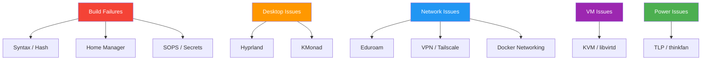

---
tags:
  - operations
  - troubleshooting
  - reference
---

# Troubleshooting

Solutions to common problems across the NixOS configuration. Each section covers a specific subsystem with diagnostic commands and fixes.



---

## 1. Build Failures

### Syntax errors

```bash
# Validate the flake — reports parse errors with file and line
nix flake check

# Build without switching to see full error trace
nh os build -- .
```

Look for the `error:` line in the output. Common causes:
- Missing semicolons, unmatched braces, or wrong option paths
- Using `=` instead of `:` in let bindings
- Referencing an option that does not exist in the module system

### Hash mismatches

```bash
# Bump all flake inputs to resolve stale hashes
nix flake update

# Bump a single input
nix flake lock --update-input nixpkgs
```

After updating, rebuild. If the hash still mismatches, the upstream package may have been republished — verify in `flake.lock` that the `narHash` matches the fetched store path.

### Missing inputs

Check `flake.nix` inputs for typos or missing entries. Each input must be declared and then passed into `outputs`:

```bash
# List current inputs and their revisions
nix flake metadata
```

### Profile conflicts — mkForce overrides

If a profile setting does not take effect, another module may override it with `mkForce` or `mkDefault`. Trace the winning definition:

```bash
# Find which module sets an option
nix repl '<nixpkgs/nixos>'
nix-repl> :p config.services.tlp.enable
```

Or search the config directly:

```bash
grep -r "mkForce" modules/ hosts/
grep -r "mkDefault" modules/ hosts/
```

See [[Profile System]] for profile priority rules.

---

## 2. Home Manager Issues

### hm-backup files

Home Manager creates `.backup` files when an existing file conflicts with a managed one:

```
Existing file '/home/jpolo/.bashrc' is in the way of '/home/jpolo/.bashrc'
```

**Fix**: Remove the backup file after verifying the managed version is correct:

```bash
rm ~/.bashrc.backup
# Or remove all hm backups at once
find ~ -name '*.backup' -list
find ~ -name '*.backup' -delete
```

### Activation script failures

```bash
# List recent Home Manager generations
home-manager generations

# Check activation errors
home-manager build
# Or view the activation script output
home-manager switch --show-trace
```

### Profile not applying

Verify that the home profile is enabled in the user's host config:

```nix
home.users.jpolo.profiles.desktop.enable = true;
```

Check [[Home Profiles]] for the full profile list and composition.

---

## 3. SOPS / Secrets Issues

### Key not found

```bash
# Verify the age key exists and is readable
ls -la ~/.config/sops/age/keys.txt

# Show the public key fingerprint
age-keygen -y ~/.config/sops/age/keys.txt
```

If the file is missing, regenerate:

```bash
mkdir -p ~/.config/sops/age
age-keygen -o ~/.config/sops/age/keys.txt
```

Then add the new public key to `.sops.yaml` and re-encrypt (see below).

### Secret decryption fails

Check that `.sops.yaml` references the correct age public key:

```bash
# Show the keys that can decrypt
sops --output-type yaml -d secrets/secrets.yaml
```

If keys have rotated, re-encrypt the secrets file:

```bash
sops updatekeys secrets/secrets.yaml
```

Commit the updated file. See [[Secrets Management]] for the full setup workflow.

### Permission denied

SOPS secrets have explicit `owner` and `mode` declarations. If a service cannot read its secret, check the module config:

```nix
sops.secrets.eduroam_password = {
  owner = "root";
  group = "networkmanager";
  mode = "0440";
};
```

Common issues:
- `mode "0400"` with wrong `owner` — the service user cannot read the file
- Missing `group` — prevents group-based access (e.g., NetworkManager needs `networkmanager` group)

---

## 4. Hyprland Issues

### NIXOS_OZONE_WL not set

Some Electron apps (VS Code, Chromium) default to XWayland if this variable is unset. Verify:

```bash
echo $NIXOS_OZONE_WL
# Should output "1"
```

Check the NixOS config in `environment.sessionVariables`:

```nix
environment.sessionVariables = {
  NIXOS_OZONE_WL = "1";
};
```

After changing, rebuild with [[Deployment Guide]] steps.

### XDG portal problems

Hyprland requires `xdg-desktop-portal-hyprland`. Verify it is installed and the portal service is running:

```bash
# Check which portal is active
echo $XDG_CURRENT_DESKTOP
# Should include "Hyprland"

# Verify portal packages
nix-store -qR /run/current-system/sw | grep portal
```

If portals conflict (e.g., both KDE and Hyprland portals installed), ensure only `xdg-desktop-portal-hyprland` is in the environment. Check `modules/desktop/xdg.nix`.

### Screen tearing

Edit Hyprland config to enable VRR or adjust the tear-free setting:

```nix
# In home/hyprland/hyprland-config.nix
misc = {
  vrr = 2;        # 0=off, 1=monitors only, 2=fullscreen only
};
```

For immediate tearing reduction, set `decoration.blur.enabled = false` and reduce animation complexity.

See [[Hyprland]] for full configuration details.

---

## 5. KMonad Issues

### Device path not found

KMonad needs the exact `/dev/input/` path to the keyboard device. List available devices:

```bash
ls /dev/input/by-id/
ls /dev/input/by-path/
```

Find the device that matches your keyboard, then verify it in the KMonad config:

```nix
# In home/programs/kmonad.nix or host config
services.kmonad.keyboards.internal.device = "/dev/input/by-id/usb-...-event-kbd";
```

### Permission denied

The user must be in the `input` group or use `uinput`:

```bash
# Check group membership
groups jpolo

# Add to input group (then log out and back in)
sudo usermod -aG input jpolo
```

Alternatively, ensure `services.kmonad.keyboards.internal.device = "/dev/input/by-id/..."` points to a device readable by the configured group.

---

## 6. Network Issues

### Eduroam won't connect

The [[Network & VPN]] eduroam module uses WPA2-Enterprise with MSCHAPv2. If it fails:

1. **Verify identity and password** — check that `networking.eduroam.networks.<name>.identity` matches your university username and that the sops secret `eduroam_password` decrypts correctly.
2. **Check CA certificate** — if `caCertificate` is set, ensure the cert path exists on disk.
3. **Check the injector service**:

```bash
systemctl status eduroam-password-injector
journalctl -u eduroam-password-injector
```

4. **Manual test**:

```bash
nmcli connection up university-eduroam
```

### VPN won't connect

For the university VPN (IKEv2/strongSwan):

1. **Check gateway** — verify `vpn.um.es` resolves and is reachable:

```bash
ping vpn.um.es
```

2. **Certificate** — ensure `certs/harica-tls-root-2021.pem` exists.
3. **Split tunneling** — check that `splitTunnelRoutes` only includes the university CIDR (`155.54.0.0/16`). If all traffic routes through VPN, `never-default` may be unset.

```bash
nmcli connection show um-vpn | grep ipv4.never-default
```

### Tailscale issues

```bash
# Check status
tailscale status

# Check auth key
# Verify the sops secret 'tailscale_key' decrypts correctly
sops -d secrets/secrets.yaml | grep tailscale

# Re-authenticate
sudo tailscale up --authkey=$(cat /run/secrets.d/tailscale_key)
```

See [[Network & VPN]] for Tailscale configuration details.

---

## 7. Docker Networking

### Container port not accessible from host

Check that iptables rules allow Docker bridges and that IP forwarding is enabled:

```bash
# Verify ip_forward
sysctl net.ipv4.ip_forward
# Should be 1

# Check iptables for Docker rules
sudo iptables -L DOCKER -n
sudo iptables -t nat -L -n | grep 12000
```

On Ares, the firewall uses `extraCommands` to allow traffic on Docker bridges since `trustedInterfaces` does not support wildcards. Check `modules/system/network.nix` for the `networking.firewall` block.

### DNS resolution in containers

If containers cannot resolve hostnames:

```bash
# Verify systemd-resolved is running
systemctl status systemd-resolved

# Check container DNS
docker run --rm alpine cat /etc/resolv.conf
```

Common fix: add `--dns 127.0.0.53` to the Docker run command or set `dns` in `docker-compose.yml`.

---

## 8. VM Issues

### VM won't start

```bash
# Check that KVM modules are loaded
lsmod | grep kvm

# Verify libvirtd is running
sudo systemctl status libvirtd

# Check VM status
virsh list --all

# View VM logs
virsh console win11
# Or
journalctl -u libvirtd
```

If KVM modules are missing:

```bash
sudo modprobe kvm_amd
```

### Performance

Enable nested virtualization and use the optimization script:

```bash
# Run the vm-optimize script from scripts/
scripts/vm-optimize

# Verify nested virtualization
cat /sys/module/kvm_amd/parameters/nested
# Should output "1"
```

The Windows 11 VM is configured with 8 GB RAM, 4 vCPUs, and an 80 GB disk using virtio-win drivers and OVMF (UEFI). See [[Virtualization]] for the full module reference.

---

## 9. Power / Battery Issues

### Battery drains fast

```bash
# Verify TLP is active
sudo tlp-stat -s

# Check current power draw
sudo tlp-stat -b

# See which devices consume power
sudo powertop
```

Common fixes:
- Check TLP battery thresholds (configured in `modules/system/power.nix`)
- Verify `power-profiles-daemon` is disabled where TLP is active (conflicts cause both to fight for governor control)
- On Ares, `thinkfan` manages thermals — verify it is running:

```bash
systemctl status thinkfan
```

### Fan too loud

Adjust thinkfan levels in the host config. On Ares, fan curves are in `hosts/ares/default.nix`:

```bash
# View current fan level and temperature
cat /proc/acpi/ibm/fan
cat /proc/acpi/ibm/thermal

# Thinkfan config location
cat /etc/thinkfan.conf
```

See [[Power Management]] for TLP and thinkfan configuration details.

---

## 10. General Recovery

### Rollback

```bash
# Rollback to previous generation
sudo nixos-rebuild switch --rollback

# Or select a generation at boot
# Press Space at GRUB to show the boot menu
```

### Clean up

```bash
# Remove old generations (keep 5, older than 14 days)
nh clean all --keep 5 --keep-since 14d

# System-level garbage collection
sudo nix-collect-garbage -d

# User-level
nix-collect-garbage -d
```

### Check generations

```bash
# List system generations
nix-env --list-generations --profile /nix/var/nix/profiles/system

# List Home Manager generations
home-manager generations

# Show current generation
nixos-version
```

### Build without switching

```bash
# Dry-run to verify the config compiles
nh os build -- .

# Test (applies but reverts on reboot)
sudo nixos-rebuild test --flake .#ares
```

See [[Deployment Guide]] for the full deployment workflow.

---

## Related Pages

- [[Deployment Guide]] — Rebuilding, rolling back, and deploying
- [[Secrets Management]] — SOPS/age key setup and secret rotation
- [[Network & VPN]] — Eduroam, VPN, Tailscale, Docker networking
- [[Virtualization]] — QEMU/KVM, Windows 11 VM module
- [[Power Management]] — TLP, thinkfan, power profiles
- [[Hyprland]] — Compositor config, XDG portals, keybindings