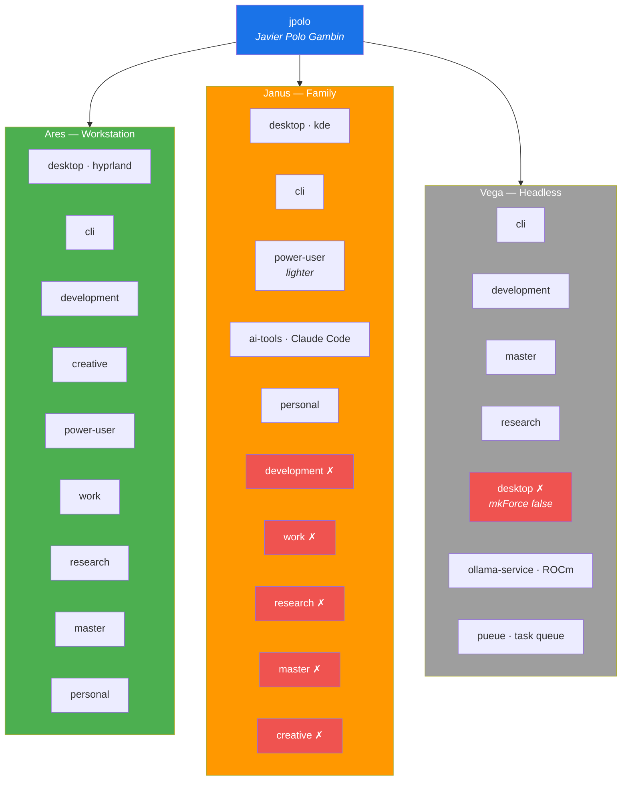

# User jpolo

> Javier Polo Gambin — primary developer and system administrator across all three hosts.

## Overview

`jpolo` is the administrative and development user in the fleet. The account holds `wheel` (sudo) access on every host and carries the broadest profile stack. Configuration is defined centrally in `home/users/jpolo.nix` with host-specific overrides applied in each host's `configuration.nix`.



---

## Profile Composition per Host

### [[Ares]] — Full Stack

All profiles enabled. This is the primary development machine.

| Profile | Sub-options |
|---------|-------------|
| `desktop` | `environment = "hyprland"`, `browsers.firefox = true`, `browsers.chromium = false` |
| `cli` | — |
| `development` | `editors.vscode = false`, `ai.tools.claude-code = true` |
| `creative` | `video.enable = true` |
| `power-user` | `productivity`, `cli-utils`, `torrenting`, `upscayl` — all enabled |
| `work` | `communication` (Slack, Teams, Zoom), `vpn.enable` |
| `research` | `latex`, `tools`, `diagrams` |
| `master` | — |
| `personal` | `media.spotify = false`, `media.plexamp`, `media.plex`, `media.vlc`, `media.mpv`, `office.libreoffice`, `office.okular`, `productivity.bitwarden`, `productivity.syncthing`, `tools.image-editing`, `tools.screenshot`, `tools.video-tools`, `communication` |

### [[Janus]] — Admin / Light Desktop

Desktop environment overridden to KDE. Development-heavy and creative profiles disabled; power-user kept lighter.

| Profile | State | Notes |
|---------|-------|-------|
| `desktop` | `environment = lib.mkForce "kde"` | KDE override |
| `cli` | enabled | — |
| `power-user` | enabled, lighter | `upscayl.enable = false`, `torrenting.enable = false` |
| `personal` | enabled | Default options |
| `development` | **disabled** (`mkForce false`) | — |
| `work` | **disabled** (`mkForce false`) | — |
| `research` | **disabled** (`mkForce false`) | — |
| `master` | **disabled** (`mkForce false`) | — |
| `creative` | **disabled** (`mkForce false`) | — |
| `ai-tools` | Claude Code enabled | Independent of development profile |

### [[Vega]] — Headless Compute

No desktop at all. Inherits the same `jpolo.nix` user definition; host overrides disable GUI and add server services.

| Profile | State | Notes |
|---------|-------|-------|
| `desktop` | **disabled** (`mkForce false`) | Headless — no GUI packages |
| `cli` | enabled | — |
| `development` | enabled | Language toolchains for remote compute |
| `research` | enabled | — |
| `master` | enabled | — |
| `personal` | enabled | Syncthing, productivity tools |

Additional services on Vega:
- **Ollama** — `services.ollama-service` with ROCm acceleration (`HSA_OVERRIDE_GFX_VERSION=9.0.0`), bound to `0.0.0.0:11434`
- **Pueue** — sequential task queue with SSH callback to Ares

---

## SSH Keys

Managed via [[Secrets Management|SOPS]] and declared in `home/users/jpolo.nix` under `programs.ssh.matchBlocks`:

| Host alias | Hostname | Port | User | Identity file | Notes |
|------------|----------|------|------|---------------|-------|
| `dgx-spark` | `155.54.180.23` | 25004 | `javierpg` | `~/.ssh/id_um` | X11 forwarding enabled |
| `um-machine` | `155.54.180.23` | 25002 | `javierpg` | `~/.ssh/id_um` | — |
| `apollo` | *(local)* | — | `jpolo` | default | — |
| `jureca` | `jureca.fz-juelich.de` | — | `pologambn1` | `~/.ssh/cispa` | Jülich supercomputer |
| `aws-public` | `44.203.176.111` | — | `ec2-user` | `~/.ssh/WebserverKey-PUBLIC-Prac2.pem` | AWS EC2 |

Secrets placed by SOPS:
- `ssh_key` → `~/.ssh/id_ed25519` (mode `0600`)
- `id_um` → `~/.ssh/id_um` (mode `0600`)

---

## Syncthing

Enabled on all three hosts via `services.syncthing-jpolo.enable = true`. Configuration:

| Setting | Value |
|---------|-------|
| User | `jpolo` |
| Data dir | `/home/jpolo` |
| Config dir | `~/.config/syncthing` |

### Synced folder

| Folder ID | Label | Path | Notes |
|-----------|-------|------|-------|
| `knowledge-base-vault` | Knowledge Base | `/home/jpolo/Vault` | `ignorePerms = false`, `watch = true` |

---

## KMonad — Dual-Role Keyboard

Enabled on [[Ares]] only. Three input devices are remapped:

1. Laptop keyboard (`platform-i8042-serio-0-event-kbd`)
2. USB wireless keyboard (`usb-CX_2.4G_Receiver-event-kbd`)
3. Logitech K850 (`usb-Logitech_USB_Receiver-if02-event-kbd`)

### Dual-role keys

| Key | Tap | Hold (200–300 ms) | Timeout |
|-----|-----|--------------------|---------|
| `Caps Lock` | `Esc` | **Control layer** | 200 ms |
| `a` | `a` | `Left Ctrl` | 300 ms |
| `s` | `s` | `Left Alt` | 300 ms |
| `d` | `d` | **Symbols layer** | 300 ms |
| `k` | `k` | **Numpad layer** | 300 ms |
| `l` | `l` | `Left Alt` | 300 ms |
| `;` | `;` | `Left Ctrl` | 200 ms |

See [[Ares]] for the full layer maps.

---

## Ollama

| Host | Status | Acceleration | Port | Binding |
|------|--------|-------------|------|---------|
| [[Ares]] | enabled | ROCm (`HSA_OVERRIDE_GFX_VERSION=11.0.0`) | 11434 | — |
| [[Vega]] | enabled | ROCm (`HSA_OVERRIDE_GFX_VERSION=9.0.0`) | 11434 | `0.0.0.0` |
| [[Janus]] | **disabled** (`mkForce false`) | — | — | — |

Shell aliases on Ares for remote access:

| Alias | Command |
|-------|---------|
| `vport 11434` | `ssh -L 11434:localhost:11434 vega.local -N` |

---

## Desktop Customizations

### Hyprland (Ares)

- **Shell**: Noctalia v3 (QuickShell-based), M3-Rainbow theme with matugen color generation
- **Bar**: Top, 42 px — workspaces, media, clock, updates, VPN, network, volume, brightness, battery, quicksettings
- **Control center**: Right panel, 400 px
- **Cursor**: Bibata-Modern-Classic, 24 px
- **Font**: JetBrains Mono, 12 pt
- **Wallpaper**: `/home/jpolo/Pictures/Wallpapers/0-black-moon.jpg`
- **Firefox**: vim navigation enabled (`home.firefox.vimNavigation.enable = true`)

### KDE (Janus)

- **Color scheme**: Krita Dark Orange — hand-crafted dark theme with warm orange (`#FFA200`) accent
- **Dolphin**: Status bar visible, global view properties, alternating rows disabled, places icon size 22 px

---

## Directory Structure

Auto-created by the desktop profile (`home.file` and XDG):

```
/home/jpolo/
├── Projects/
│   ├── Work/
│   ├── Personal/
│   ├── Master/
│   └── Playground/
├── Vault/                          # Syncthing sync target
├── VMs/
│   ├── ISOs/
│   └── Disks/
├── Pictures/
│   ├── Wallpapers/
│   └── Screenshots/
├── Downloads/
│   └── Torrents/
├── Documents/
│   ├── important/
│   ├── books/
│   ├── scans/
│   └── work/
└── .ssh/                           # SOPS-managed keys
```

---

## Cross-Links

- [[Ares]] — primary workstation (full profile stack, Hyprland)
- [[Janus]] — family machine (KDE, lighter profiles)
- [[Vega]] — headless compute (no desktop, Ollama + Pueue)
- [[Home Profiles]] — profile definitions and per-user composition
- [[Hyprland]] — compositor and shell configuration
- [[KDE Plasma]] — KDE desktop environment details
- [[Secrets Management]] — SOPS-managed SSH keys and credentials
- [[Network & VPN]] — Tailscale, eduroam, VPN configuration