---
tags:
  - host
  - server
  - vega
---

# Vega

**Headless GPU compute node** — AMD Vega 56 (GFX900) with ROCm acceleration, running Ollama and Pueue for distributed AI workloads.

## Overview

Vega is a dedicated headless server optimized for GPU compute workloads. It has no desktop environment and is accessed exclusively via SSH. Its primary role is running [[#Ollama Service|Ollama]] with ROCm acceleration and executing queued jobs via [[#Pueue Task Queue|Pueue]] with result callbacks to [[Ares]].

| Field | Value |
|-------|-------|
| Hostname | `vega` |
| State version | 25.11 |
| Access | SSH (`vega.local` via Avahi mDNS) |
| Primary role | GPU inference + compute queue |
| GPU | AMD Vega 56 (GFX900) |

## Hardware

- **GPU**: AMD Vega 56 — GFX900 architecture, ROCm-compatible
- **CPU**: AMD (kvm-amd enabled)
- **Boot**: systemd-boot with UEFI
- **Kernel modules**: `kvm-amd`, `amdgpu`
- **Initrd modules**: `nvme`, `xhci_pci`, `ahci`, `usbhid`, `usb_storage`, `sd_mod`
- **Networking**: DHCP (default), NetworkManager

> [!note]
> The `hardware-configuration.nix` currently has a **placeholder ext4 root** on `/dev/disk/by-label/nixos`. The task description specifies BTRFS with subvolumes (`@`, `@home`, `@nix`) and LUKS encryption — update `hardware-configuration.nix` after running `nixos-generate-config` on the actual hardware.

## Enabled Profiles & Modules

```mermaid
graph TD
    VEGA["hosts/vega/configuration.nix<br/><i>Headless GPU Compute</i>"]

    subgraph "System Profiles"
        BASE["profiles.base<br/><i>✓ Enabled</i>"]
        DEV["profiles.development<br/><i>✓ Enabled</i>"]
        DESK["profiles.desktop<br/><i>✗ Disabled (no GUI)</i>"]
    end

    subgraph "Imported System Modules"
        PPROF["modules/system/power-profiles"]
        SEC["modules/system/security"]
        SSH["modules/system/ssh"]
        NET["modules/system/network"]
        OPT["modules/system/optimization"]
    end

    subgraph "Development Languages"
        PY["python<br/><i>AI/ML jobs</i>"]
        RUST["rust"]
        GO["go"]
        CPP["cpp"]
    end

    subgraph "Development Tools"
        DOCKER["docker"]
        AI["ai"]
    end

    subgraph "Home Manager Overrides"
        HM_DESK["home.profiles.desktop<br/><i>✗ mkForce false</i>"]
        OLLAMA_SVC["services.ollama-service<br/><i>✓ rocm</i>"]
        PUEUE_SVC["services.pueue<br/><i>✓ sequential queue</i>"]
    end

    VEGA --> BASE
    VEGA --> DEV
    VEGA --> DESK
    VEGA --> PPROF
    VEGA --> SEC
    VEGA --> SSH
    VEGA --> NET
    VEGA --> OPT

    DEV --> PY
    DEV --> RUST
    DEV --> GO
    DEV --> CPP
    DEV --> DOCKER
    DEV --> AI

    VEGA --> HM_DESK
    VEGA --> OLLAMA_SVC
    VEGA --> PUEUE_SVC

    style VEGA fill:#e53935,color:#fff
    style BASE fill:#4caf50,color:#fff
    style DEV fill:#4caf50,color:#fff
    style DESK fill:#9e9e9e,color:#fff
    style HM_DESK fill:#9e9e9e,color:#fff
    style OLLAMA_SVC fill:#1a73e8,color:#fff
    style PUEUE_SVC fill:#1a73e8,color:#fff
    style PPROF fill:#555,color:#fff
    style SEC fill:#555,color:#fff
    style SSH fill:#555,color:#fff
    style NET fill:#555,color:#fff
    style OPT fill:#555,color:#fff
```



## Boot Configuration

- **Bootloader**: systemd-boot with UEFI
- **Kernel**: default (`linuxPackages` from nixpkgs) — no special kernel parameters beyond those inherited from the [[Module System|optimization module]] (vm.swappiness, BBR congestion control, etc.)
- **Kernel modules**: `kvm-amd`, `amdgpu` loaded at boot
- **EFI**: `canTouchEfiVariables = true`

## GPU & ROCm

Vega 56 uses the GFX900 architecture, which requires environment variable overrides for ROCm compatibility.

### Graphics stack

```nix
hardware.graphics = {
  enable = true;
  extraPackages = with pkgs; [
    rocmPackages.clr.icd    # OpenCL ICD for ROCm
    amdvlk                  # Alternative Vulkan driver
    libva                   # Video acceleration
  ];
};
```

### Environment variables

| Variable | Value | Purpose |
|----------|-------|---------|
| `HSA_OVERRIDE_GFX_VERSION` | `9.0.0` | Makes ROCm recognize Vega 56 (GFX900) correctly |
| `ROC_ENABLE_PRE_VEGA` | `0` | Disables pre-Vega GPU fallback — forces Vega path |

> [!warning]
> The Ollama service module (`home/services/ollama.nix`) sets `HSA_OVERRIDE_GFX_VERSION=11.0.0` when `acceleration = "rocm"`. The system-level `environment.sessionVariables` overrides this to `9.0.0`. If Ollama fails to detect the GPU, verify the effective value inside the service's environment.

### Supported APIs

- **OpenCL**: via `rocmPackages.clr.icd`
- **Vulkan**: via `amdvlk`
- **VA-API**: via `libva`

## Networking

- **NetworkManager**: enabled with systemd-resolved DNS backend
- **SSH**: enabled (system module with pubkey + password auth)
- **Avahi**: enabled with mDNS publishing — reachable as `vega.local`
- **Tailscale**: enabled via the [[Network & VPN|network module]] with SSH support
- **Firewall**: ports 22 (SSH) and 11434 (Ollama) open

```nix
networking.firewall.allowedTCPPorts = [ 22 11434 ];
```

## Performance Tuning

| Setting | Value | Rationale |
|---------|-------|-----------|
| CPU governor | `performance` (mkForce) | Sustained compute throughput over power savings |
| ZRAM swap | 50% of RAM, zstd | Compressed in-memory swap for bursty large jobs |
| GC | weekly, delete older than 7d | Aggressive cleanup on limited SSD |
| Store optimization | automatic, weekly | Deduplicate store paths to save disk space |
| `auto-optimise-store` | true | Optimize on each build as well |

## Ollama Service

Ollama runs as a **systemd user service** under `jpolo`, binding to `0.0.0.0:11434` so Docker containers on other hosts can reach it via the host network.

```nix
services.ollama-service = {
  enable = true;
  acceleration = "rocm";
};
```

- **Port**: 11434 (open in firewall)
- **Binding**: `0.0.0.0:11434` — accessible from LAN and Docker bridge
- **Acceleration**: ROCm (AMD GPU)
- **Restart**: always, 3s delay

### Remote usage from Ares

Shell aliases on [[Ares]] for remote Ollama access:

```bash
# Direct API call
curl vega.local:11434/api/generate -d '{"model":"llama3","prompt":"hello"}'

# Port-forward for local tools
vport 11434   # ssh -L 11434:localhost:11434 vega.local -N
```

## Pueue Task Queue

Pueue provides a sequential job queue for compute tasks, with SSH callbacks to notify [[Ares]] on completion.

```nix
services.pueue = {
  enable = true;
  settings = {
    shared.use_unix_socket = true;
    daemon = {
      default_parallel_tasks = 1;  # Sequential by default
      callback = ''
        ssh jpolo@ares.local "source ~/.zshrc && vega-notify 'Task {{ id }}: {{ command }}' '{{ result }}'"
      '';
    };
  };
};
```

### Shell aliases (on Ares)

| Alias | Command | Purpose |
|-------|---------|---------|
| `vqueue` | `ssh vega.local 'pueue add "$@"'` | Queue a remote command |
| `vstatus` | `ssh vega.local 'pueue status'` | Check queue status |
| `vlog` | `ssh vega.local 'pueue log'` | View task output |
| `vsync` | rsync to `vega.local:~/jobs/` | Sync local project to Vega |
| `vrun` | `vsync && ssh vega.local "cd ~/jobs/... && pueue add '...'"` | Sync + queue in one step |

## Users

### jpolo

| Property | Value |
|----------|-------|
| Description | Javier Polo Gambin (Headless) |
| Shell | zsh |
| Groups | `wheel`, `video`, `render`, `docker`, `networkmanager` |

The `video` and `render` groups are required for GPU access without X11/Wayland. `docker` enables container management. `networkmanager` allows network configuration.

## Home Manager

```nix
home-manager.users.jpolo = { ... }: {
  imports = [ ../../home/users/jpolo.nix ];

  # Force headless — no desktop environment
  home.profiles.desktop.enable = lib.mkForce false;

  # GPU-accelerated inference
  services.ollama-service = {
    enable = true;
    acceleration = "rocm";
  };

  # Task queue with callback to ares
  services.pueue = {
    enable = true;
    settings = { ... };
  };
};
```

Key overrides:
- **Desktop profile**: `mkForce false` — ensures no GUI packages or services are installed
- **Ollama**: enabled with ROCm acceleration
- **Pueue**: enabled with sequential execution and SSH callback

## Development Stack

Enabled language toolchains and tools via the development profile:

| Category | Item | Enabled |
|----------|------|---------|
| Languages | Python | ✓ (AI/ML jobs) |
| Languages | Rust | ✓ |
| Languages | Go | ✓ |
| Languages | C++ | ✓ |
| Tools | Docker | ✓ |
| Tools | AI tools | ✓ |

No desktop environment — all development is headless/remote.

## Documentation & Storage

- **Documentation**: disabled (`documentation.enable = false`) — saves ~200MB on the 120GB SSD
- **NixOS docs**: disabled
- **Man pages**: disabled
- **Store optimization**: auto-optimise on every build + weekly `nix.optimise`

## Cross-Links

- [[Home]] — Home Manager structure and shared modules
- [[Architecture Overview]] — how profiles, modules, and hosts compose
- [[Module System]] — system module details (security, network, ssh, optimization, power-profiles)
- [[Profile System]] — profile enable/disable toggles
- [[Ares]] — primary workstation that sends jobs to Vega
- [[Network & VPN]] — Tailscale mesh, SSH, Avahi mDNS
- [[System Modules]] — per-module configuration reference
- [[AI Agent Reference]] — Ollama models and AI tooling