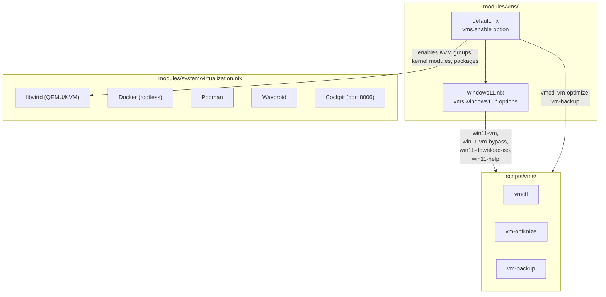

---
tags:
  - virtualization
  - vm
  - reference
---

# Virtualization

Virtualization infrastructure for running VMs with QEMU/KVM on NixOS. The system provides a declarative VM module, a preconfigured Windows 11 VM, and a suite of management scripts.

> See also: [[Ares]], [[System Modules]], [[Scripts Reference]]

---

## Module Architecture



---

## VM Module — `modules/vms/default.nix`

**Option:** `vms.enable` (bool)

When enabled, this module:

1. Creates `libvirtd` and `kvm` groups
2. Loads `kvm-amd` and `kvm-intel` kernel modules with **nested virtualization** enabled
3. Installs VM management packages
4. Adds `virbr0` to trusted firewall interfaces
5. Creates VM directories via systemd tmpfiles (when Windows 11 VM is also enabled)

### Kernel Modules

```
boot.kernelModules = [ "kvm-amd" "kvm-intel" ];

boot.extraModprobeConfig = ''
  options kvm_intel nested=1
  options kvm_amd nested=1
'';
```

Both AMD and Intel KVM modules are loaded so the configuration is portable across hardware. Nested virtualization lets VMs run their own KVM guests — required for Docker-in-VM, Android emulators, and WSL2-style workloads inside the guest.

### System Packages

| Package | Purpose |
|---|---|
| `virt-viewer` | SPICE/VNC graphical console client |
| `libvirt` | libvirt CLI (`virsh`) and client libraries |
| `libguestfs` | Programmatic guest disk access |
| `guestfs-tools` | `virt-filesystems`, `virt-df`, `virt-ls`, etc. |
| `virtio-win` | VirtIO drivers ISO for Windows guests |
| `OVMF` | UEFI firmware for Secure Boot VMs |
| `swtpm` | TPM 2.0 emulator for VMs |

### Network — Trusted Interface

```
networking.firewall.trustedInterfaces = [ "virbr0" ];
```

`virbr0` is the default libvirt NAT bridge. Marking it trusted allows VMs full outbound access without per-port firewall rules.

### Systemd Tmpfiles (when `vms.windows11.enable = true`)

| Rule | Path | Mode | Owner |
|---|---|---|---|
| `d` | `${vms.windows11.vmDir}` | 0755 | `${vms.windows11.user}:users` |
| `d` | `${vms.windows11.vmDir}/tpm` | 0755 | `${vms.windows11.user}:users` |
| `d` | `/var/lib/libvirt/images` | 0755 | `root:root` |

---

## Windows 11 VM — `modules/vms/windows11.nix`

**Gate:** `vms.enable && vms.windows11.enable`

### Options

| Option | Type | Default | Description |
|---|---|---|---|
| `vms.windows11.enable` | bool | — | Enable Windows 11 VM configuration |
| `vms.windows11.user` | str | `"jpolo"` | User who owns the VM files |
| `vms.windows11.memory` | int | `8192` | RAM in MB |
| `vms.windows11.cpus` | int | `4` | Number of vCPUs |
| `vms.windows11.diskSize` | str | `"80G"` | Disk image size |
| `vms.windows11.vmDir` | str | `"/home/${user}/VMs/windows11"` | VM file directory |

### Installed Commands

When the Windows 11 VM is enabled, four commands become available:

| Command | Purpose |
|---|---|
| `win11-vm` | Launch Windows 11 with full TPM 2.0 + Secure Boot + UEFI |
| `win11-vm-bypass` | Launch without TPM/Secure Boot (registry bypass mode) |
| `win11-download-iso` | Download Windows 11 ISO via `quickget` |
| `win11-help` | Print troubleshooting guide to terminal |

### VM Configuration Details

The `win11-vm` command launches QEMU with:

- **Machine:** `q35` with KVM acceleration, SMM enabled (Secure Boot)
- **CPU:** Host passthrough with Hyper-V enlightenments (`hv_relaxed`, `hv_spinlocks`, `hv_vapic`, `hv_time`, `hv_vendor_id`)
- **Memory:** Configurable (default 8 GB)
- **Disk:** VirtIO-blk with iothread, `cache=none`, native AIO, qcow2 format
- **Firmware:** OVMF UEFI with separate `OVMF_VARS.fd` for Secure Boot state persistence
- **TPM:** swtpm 2.0 emulator via Unix socket
- **Network:** VirtIO-net with user-mode networking; RDP port `3389` forwarded to host
- **Graphics:** QXL with SPICE on `127.0.0.1:5930`; `remote-viewer` launched automatically
- **USB:** XHCI controller + tablet + USB redirection (2 channels via SPICE)
- **VirtIO serial:** SPICE vdagent channel for clipboard/resize/auto-resize

The bypass mode (`win11-vm-bypass`) uses simpler settings: no TPM, no Secure Boot, BIOS boot, plain VirtIO disk — suitable for when the full TPM stack causes issues during installation.

---

## Setting Up Windows 11 from Scratch

### Prerequisites

- `vms.enable = true` and `vms.windows11.enable = true` in your host config
- Rebuild and switch: `nh os switch .`
- Verify KVM: `lsmod | grep kvm`

### Step 1 — Download the ISO

```bash
win11-download-iso
```

This uses `quickget` to download the official Windows 11 ISO to `~/VMs/windows11/windows11.iso`.

### Step 2 — Launch the VM

```bash
win11-vm
```

On first launch this will:
1. Create the qcow2 disk image (`windows11.qcow2`)
2. Copy `OVMF_VARS.fd` for Secure Boot
3. Download the VirtIO drivers ISO if missing
4. Start the swtpm emulator
5. Launch QEMU and open `remote-viewer`

### Step 3 — Windows Installation

During Windows Setup:
1. When prompted for disk, click **Load driver** and browse the VirtIO ISO (`E:\vioscsis\x86_64` for SCSI, `E:\viostor\x86_64` for disk)
2. Complete installation normally

### Troubleshooting: "This PC doesn't meet requirements"

If Windows refuses to install due to TPM/Secure Boot checks:

**Option A** — Use the bypass launcher:
```bash
win11-vm-bypass
```

**Option B** — Registry bypass during installation:
1. At the error screen, press `Shift+F10`
2. In Command Prompt:
   ```
   reg add HKLM\SYSTEM\Setup\LabConfig /v BypassTPMCheck /t REG_DWORD /d 1 /f
   reg add HKLM\SYSTEM\Setup\LabConfig /v BypassSecureBootCheck /t REG_DWORD /d 1 /f
   reg add HKLM\SYSTEM\Setup\LabConfig /v BypassRAMCheck /t REG_DWORD /d 1 /f
   exit
   ```
3. Close Command Prompt and continue

### Step 4 — Post-Install

- Install VirtIO drivers from the secondary CDROM
- Verify TPM: press `Win+R`, type `tpm.msc` — should show "TPM is ready for use" with version 2.0
- Enable Remote Desktop in Windows for RDP access via `localhost:3389`

### File Locations

| File | Path |
|---|---|
| Disk image | `~/VMs/windows11/windows11.qcow2` |
| Windows ISO | `~/VMs/windows11/windows11.iso` |
| VirtIO ISO | `~/VMs/windows11/virtio-win.iso` |
| UEFI variables | `~/VMs/windows11/OVMF_VARS.fd` |
| TPM state | `~/VMs/windows11/tpm/` |

---

## Managing VMs with virt-manager / virsh

### virsh Quick Reference

| Command | Description |
|---|---|
| `virsh list --all` | List all VMs and their states |
| `virsh start <vm>` | Start a VM |
| `virsh shutdown <vm>` | Graceful ACPI shutdown |
| `virsh destroy <vm>` | Force power-off |
| `virsh reboot <vm>` | Reboot a VM |
| `virsh dominfo <vm>` | Show VM details |
| `virsh dumpxml <vm>` | Full XML configuration |
| `virsh snapshot-create-as <vm> <name>` | Create named snapshot |
| `virsh snapshot-list <vm>` | List snapshots |
| `virsh snapshot-revert <vm> <snap>` | Revert to snapshot |
| `virsh edit <vm>` | Edit VM XML in `$EDITOR` |
| `virsh net-list --all` | List virtual networks |

### virt-manager GUI

```bash
virt-manager
```

Provides a graphical interface for creating, configuring, and managing VMs. Useful for tasks like:
- Adjusting resource allocation (CPU, memory)
- Adding/removing disks and network interfaces
- Viewing VM console and performance graphs
- Creating snapshots with descriptions

### Connecting to the Windows 11 VM

The `win11-vm` command handles QEMU launch and SPICE viewer automatically. For manual connection:

```bash
remote-viewer spice://127.0.0.1:5930
```

For RDP (requires RDP enabled in the Windows guest):

```bash
xfreerdp /v:localhost:3389
```

---

## VM Management Scripts

### vmctl — VM Control

Full CLI for libvirt/QEMU VM management.

```bash
vmctl list                        # List all VMs with status
vmctl start <vm>                  # Start VM
vmctl stop <vm>                   # Graceful shutdown
vmctl kill <vm>                   # Force stop
vmctl restart <vm>                # Reboot VM
vmctl delete <vm>                 # Delete VM and storage
vmctl info <vm>                   # Show VM details
vmctl console <vm>                # Serial console
vmctl vnc <vm>                    # Open VNC/SPICE viewer
vmctl clone <vm> <new-name>       # Clone a VM
vmctl snapshot <vm>               # Create timestamped snapshot
vmctl snapshots <vm>              # List snapshots
vmctl restore <vm> <snapshot>     # Revert to snapshot
vmctl edit <vm>                   # Edit VM XML
vmctl stats <vm>                  # Real-time VM stats (virt-top)
vmctl monitor                     # Live VM status TUI (Ctrl+C to exit)
vmctl network                     # List virtual networks
vmctl interactive                  # FZF-powered interactive mode
```

### vm-optimize — Performance Guide

```bash
vm-optimize <vm-name>
```

Prints an optimization reference covering:
1. CPU — host-passthrough, vCPU pinning
2. Memory — hugepages, memory backing
3. Disk — virtio-scsi, discard/trim, native AIO
4. Network — virtio-net, multiqueue
5. Graphics — virtio-gpu (Linux), QXL (SPICE)

Edit the VM configuration with: `virsh edit <vm-name>`

### vm-backup — VM Backup

```bash
vm-backup <vm-name> [backup-dir]
```

Creates a timestamped tar.gz archive of the VM XML definition and disk images. Default backup directory: `~/Backups/VMs/`.

Example:
```bash
vm-backup windows11 ~/Backups/VMs
# Creates: ~/Backups/VMs/windows11-20250502-143000.tar.gz
```

> See also: [[Scripts Reference]]

---

## Performance Tips

### Nested Virtualization

Already enabled via kernel module options:

```
options kvm_intel nested=1
options kvm_amd nested=1
```

This allows VMs to run their own KVM guests. Verify:
```bash
cat /sys/module/kvm_intel/parameters/nested  # Intel
cat /sys/module/kvm_amd/parameters/nested     # AMD
```

### Hugepages

The host [[System Modules|virtualization.nix]] configures 8×1G hugepages. For VMs that need large contiguous memory, pin hugepages in the VM XML:

```xml
<memoryBacking>
  <hugepages>
    <page size='1048576' unit='KiB'/>
  </hugepages>
</memoryBacking>
```

Check available hugepages:
```bash
cat /proc/meminfo | grep Hugepages
```

### CPU Pinning

For latency-sensitive VMs (gaming, real-time workloads), pin vCPUs to physical cores to prevent scheduler migration:

```xml
<vcpu placement='static'>4</vcpu>
<cputune>
  <vcpupin vcpu='0' cpuset='0'/>
  <vcpupin vcpu='1' cpuset='2'/>
  <vcpupin vcpu='2' cpuset='4'/>
  <vcpupin vcpu='3' cpuset='6'/>
</cputune>
```

Check CPU topology:
```bash
lscpu -p=CPU,CORE,SOCKET
```

### Disk I/O

The Windows 11 VM already uses optimized disk settings:
- `cache=none` — no host page cache bypass
- `aio=native` — kernel async I/O
- `iothread` — dedicated I/O thread

For libvirt-managed VMs, prefer `virtio-scsi` over IDE and enable discard:
```xml
<driver name='qemu' type='raw' cache='none' io='native' discard='unmap'/>
```

### Network

The Windows 11 VM uses virtio-net with user-mode NAT and RDP forwarding (`hostfwd=tcp::3389-:3389`). For lower latency, consider:
- Macvtap for direct host NIC access
- Multiqueue virtio-net: `<driver queues='4'/>`

---

## VFIO GPU Passthrough (Dionysus)

For hardware-level GPU passthrough using IOMMU/VFIO, see [[Dionysus]]. Dionysus takes a fundamentally different approach from the QEMU-based VMs on [[Ares]]:

| Aspect | Ares (QEMU scripts) | Dionysus (VFIO appliance) |
|--------|---------------------|---------------------------|
| GPU | Emulated (QXL via SPICE) | Full hardware passthrough (native performance) |
| Display | SPICE viewer window | Physical monitor via GPU |
| VM management | Manual `win11-vm` script | Automatic: boot -> VM -> poweroff |
| Network | NAT with port forwarding | Air-gapped (zero NICs) |
| Use case | Productivity, Office, testing | Gaming with untrusted software |
| Threat model | Trusted guest | Untrusted guest (malware isolation) |
| VM definition | Raw QEMU CLI flags | Declarative libvirt XML defined in Nix |

### Key differences

- **VFIO**: The GPU, GPU audio, and NVMe controller are claimed by `vfio-pci` at initrd before any driver loads. The host has no framebuffer.
- **Hypervisor cloaking**: KVM is hidden from the guest (`kvm.hidden`, fake vendor ID, disabled hypervisor CPUID) to bypass anti-VM checks in game cracks.
- **Appliance lifecycle**: The host automatically powers off when the VM shuts down — no lingering attack surface.
- **Declarative VM**: The VM is defined from a Nix-generated libvirt XML and `virsh define`d on every boot, ensuring the VM definition stays in sync with the Nix configuration.

See [[Dionysus]] for full setup instructions, VFIO device configuration, and troubleshooting.

---

## Related

- [[Ares]] — the host that runs VMs (`virtualization.nix` is imported on ares)
- [[Dionysus]] — headless VFIO gaming appliance with GPU passthrough
- [[System Modules]] — full module reference including `virtualization.nix`
- [[Scripts Reference]] — complete scripts catalog with `vmctl`, `vm-optimize`, `vm-backup`