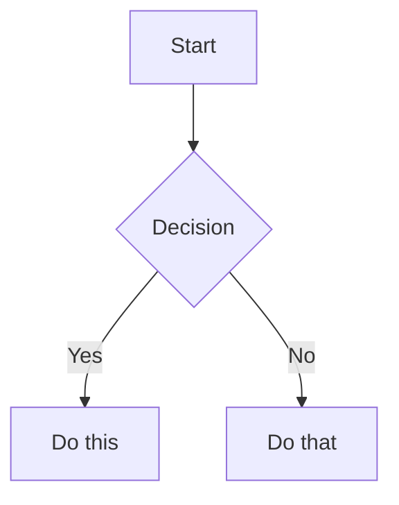

# Obsidian Flavored Markdown Reference

Obsidian extends CommonMark and GFM with wikilinks, embeds, callouts, properties, comments, and other syntax. This reference covers Obsidian-specific extensions only — standard Markdown (headings, bold, italic, lists, quotes, code blocks, tables) is assumed knowledge.

## Internal Links (Wikilinks)

```markdown
[[Note Name]]                      Link to note
[[Note Name|Display Text]]          Custom display text
[[Note Name#Heading]]               Link to heading
[[Note Name#^block-id]]            Link to block
[[#Heading in same note]]          Same-note heading link
```

Define a block ID by appending `^block-id` to any paragraph:

```markdown
This paragraph can be linked to. ^my-block-id
```

For lists and quotes, place the block ID on a separate line after the block.

**Rule**: Use `[[wikilinks]]` for all internal vault links. Never use `[text](path.md)` markdown links for internal notes. Markdown links are only for external URLs.

## Embeds

Prefix any wikilink with `!` to embed content inline:

```markdown
![[Note Name]]                     Embed full note
![[Note Name#Heading]]             Embed section
![[image.png]]                     Embed image
![[image.png|300]]                 Embed image with width
![[document.pdf#page=3]]           Embed PDF page
![[audio.mp3]]                     Embed audio
![[video.mp4]]                     Embed video
```

## Callouts

```markdown
> [!note]
> Basic callout.

> [!warning] Custom Title
> Callout with a custom title.

> [!faq]- Collapsed by default
> Foldable callout (- collapsed, + expanded).
```

### Callout Types

| Type | Aliases | Purpose |
|---|---|---|
| `note` | — | General information |
| `tip` | `hint`, `important` | Helpful advice |
| `warning` | `caution`, `attention` | Cautionary notes |
| `info` | — | Important information |
| `example` | — | Code examples |
| `quote` | `cite` | Quotations |
| `bug` | — | Bug reports |
| `danger` | `error` | Critical warnings |
| `success` | `check`, `done` | Completion/success |
| `failure` | `fail`, `missing` | Failure states |
| `question` | `help`, `faq` | Questions |
| `abstract` | `summary`, `tldr` | Summaries |
| `todo` | — | Task items |

### Nesting Callouts

Callouts can be nested by indenting:

```markdown
> [!question] Can callouts be nested?
> > [!answer] Yes, they can.
```

## Properties (Frontmatter)

YAML between `---` delimiters at the top of the file:

```yaml
---
title: My Note
date: 2024-01-15
tags:
  - project
  - active
aliases:
  - Alternative Name
cssclasses:
  - custom-class
---
```

Default properties:
- `tags` — Searchable labels (also inline with `#tag`)
- `aliases` — Alternative note names for link suggestions
- `cssclasses` — CSS classes for styling

See the frontmatter-schemas reference for all note-type-specific properties.

## Tags

```markdown
#tag                    Inline tag
#nested/tag             Nested tag with hierarchy
```

Tags can contain letters, numbers (not first character), underscores, hyphens, and forward slashes. Tags can also be defined in frontmatter under the `tags` property.

**Convention in these vaults**: Use lowercase, hierarchical tags: `concept`, `idea`, `project`, `experiment`, `literature`, `network/person`, `meeting`, `log/daily`, `book_notes`.

## Comments

```markdown
This is visible %%but this is hidden%% text.

%%
This entire block is hidden in reading view.
%%
```

## Highlights

```markdown
==Highlighted text==     Obsidian highlight syntax
```

## Math (LaTeX)

```markdown
Inline: $e^{i\pi} + 1 = 0$

Block:
$$
\frac{a}{b} = c
$$
```

## Diagrams (Mermaid)

````markdown

````

To link Mermaid nodes to Obsidian notes, add `class NodeName internal-link;`.

## Footnotes

```markdown
Text with a footnote[^1].

[^1]: Footnote content.

Inline footnote.^[This is inline.]
```

## Dataview Queries

Dataview is an Obsidian plugin that provides a query language for vault data. Queries appear in code blocks:

````markdown
```dataview
TABLE authors, year, relevance, status
FROM "20_Literature"
WHERE contains(related_projects, this.file.link)
SORT relevance DESC
```
````

The agent should NOT try to execute dataview queries — they are rendered by the Obsidian plugin. Instead, use filesystem search tools to achieve similar results. See the search skill for strategies.

## Complete Example Note

````markdown
---
type: concept
aliases: [AIS]
tags:
  - concept
  - education
  - ai
date_created: 2026-02-23
---

# Adaptive Instructional System

## Formal Definition

An **Adaptive Instructional System (AIS)** is an AI-powered system that guides learning experiences by continuously tailoring instruction to individual learner needs.

#### How an AIS Works

1. **Observe** — Monitor learner behavior and performance in real time
2. **Assess** — Evaluate the learner's current progress toward defined learning objectives
3. **Adapt** — Modify the instructional content, difficulty, or pacing to optimize learning outcomes

The key distinguishing feature is _personalization_: delivering "the right lesson to the right student at the right time".

## Intuition

AIS moves beyond one-size-fits-all curriculum by creating a closed feedback loop between learner performance and instructional delivery.

## Implementation

```python
# Simplified AIS loop pseudocode
while not learner.has_reached_objective():
    observation = observe(learner)
    assessment = assess(observation)
    adaptation = adapt(assessment)
    deliver(learner, adaptation)
```

## Relations

- **Parent Concept:** [[Intelligent Tutoring System]]
- **Related:** [[Personalization]], [[Learner Modeling]]
- **Applied In:** [[vanoijen2025ExploringLargeLanguage|Exploring Large Language Models for Collaborative Scenario Development]]

## Flashcards

Q: What is an Adaptive Instructional System?
A: An AI-powered system that personalizes instruction through a closed-loop observe-assess-adapt cycle.

Q: What are the three core functions of an AIS?
A: Observe, Assess, Adapt.

## References

```dataview
LIST
FROM [[]] AND #literature
SORT file.name ASC
```
````