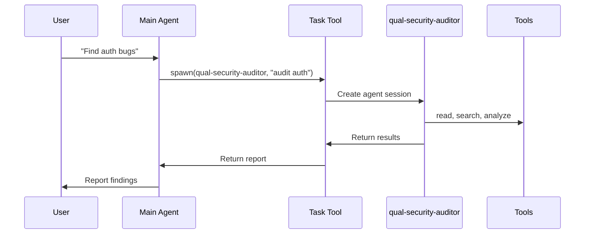

# How to Verify OMP Task Delegation

## What Actually Exists

### Built-in Agents (in OMP core)

These agents are **built into OMP itself** and not defined in `agents/*.md`:

| Agent Type | Description | Model |
|------------|-------------|-------|
| `explore` | Fast read-only codebase scout | Configurable |
| `task` | General-purpose subagent | Configurable |
| `plan` | Multi-file architectural planning | Configurable |
| `oracle` | Senior engineer for complex decisions | Configurable |
| `designer` | UI/UX specialist | Configurable |
| `reviewer` | Code review specialist | Configurable |
| `librarian` | External library researcher | Configurable |
| `quick_task` | Low-reasoning mechanical updates | Configurable |

**You can see these documented in the INVENTORY section of the system prompt:**

```
# Agents
# lang-python-pro — Use this agent when you need to build type-safe...
# plan — Software architect for complex multi-file architectural decisions...
# designer — UI/UX specialist for design implementation...
# reviewer — Code review specialist...
# librarian — Researches external libraries...
# oracle — Wise senior engineer...
# task — General-purpose subagent...
# quick_task — Low-reasoning agent...
# explore — READ-ONLY (no edit/write/exec tools) Fast read-only codebase scout...
```

### Custom Agents (defined in `agents/*.md`)

These are **your custom agents** with fixed model assignments:

| Example Agent | Model | Role |
|---------------|-------|------|
| `lang-python-pro` | `qwen3-coder-next:cloud` | code-specialist |
| `qual-security-auditor` | `deepseek-v4-pro` | deep-audit |
| `meta-multi-agent-coordinator` | `nemotron-3-super` | multi-agent |
| `dev-api-designer` | `kimi-k2.6` | architecture-planning |

**You can inspect these:**

```bash
# List all agents with their models
grep -r "^model:" pi-agent-data/agent/agents/*.md | sort | uniq -c | sort -rn

# See model distribution
grep -r "^model:" pi-agent-data/agent/agents/*.md | cut -d: -f3 | sort | uniq -c | sort -rn
```

**Result (as of your setup):**
- 43 agents use `qwen3-coder-next:cloud` (code specialists)
- 27 agents use `glm-5.1:cloud` (agentic engineering)
- 19 agents use `deepseek-v4-flash` (fast reasoning)
- 15 agents use `deepseek-v4-pro` (deep audit)
- 12 agents use `devstral-small-2:24b-cloud` (fast coding)
- 11 agents use `nemotron-3-super` (multi-agent)
- 10 agents use `qwen3.5:397b` (research synthesis)
- 9 agents use `kimi-k2.6` (architecture planning)
- 4 agents use `gemini-3-flash-preview` (visual analysis)
- 4 agents use `minimax-m2.7` (long document)
- 6 agents use other models

## How to Know if Delegation is Happening

### Method 1: Check Session Logs

OMP logs agent activity. Check a recent session:

```bash
# Find recent sessions
ls -lt pi-agent-data/agent/sessions/ | head -5

# Check for agent spawns in a session
grep -i "agent\|spawn\|delegate" pi-agent-data/agent/sessions/<session-name>/context.md
```

**What to look for:**
- References to `task` tool usage
- Agent names in context files
- IRC messages between agents

### Method 2: Check IRC Messages

Agents communicate via IRC. Look for:

```bash
# Check if IRC messages exist
grep -r "op:.*send\|op:.*receive" pi-agent-data/agent/sessions/
```

### Method 3: Use `/xpert` Command

The `/xpert` command explicitly invokes agents:

```bash
/xpert lang-python-pro  # Explicitly spawn Python specialist
```

**This will show in the session log that an agent was invoked.**

### Method 4: Check `task` Tool Usage

When the main model uses the `task` tool, it spawns subagents:

```bash
# Look for task tool usage in sessions
grep -A5 "task.*agent" pi-agent-data/agent/sessions/*/context.md
```

## What Models Each Agent Uses

### Role-Based Mapping

**Step 1: Agent → Role** (`role-map.yml`)

```yaml
# Example mappings
lang-python-pro = code-specialist
qual-security-auditor = deep-audit
meta-multi-agent-coordinator = multi-agent
```

**Step 2: Role → Model** (`models.yml`)

```yaml
# Role definitions
code-specialist = "ollama/qwen3-coder-next:cloud"
deep-audit = "ollama/qwen3.5:cloud"
multi-agent = "ollama/glm-5.1:cloud"
```

**Step 3: Agent frontmatter** (`agents/*.md`)

```yaml
---
name: lang-python-pro
model: ollama/qwen3-coder-next:cloud  # Direct assignment
---
```

### Model Distribution by Category

**Tier 1 - Frontier Reasoning (deep analysis):**
- `deepseek-v4-pro`: Security audits, architecture review, adversarial analysis
- `kimi-k2.6`: API design, microservices, complex planning
- `qwen3.5:397b`: Research synthesis, literature review
- `glm-5.1`: Agentic engineering (default)

**Tier 2 - Balanced Performance (coding):**
- `qwen3-coder-next:cloud`: Code specialists (43 agents)
- `glm-5.1:cloud`: Full-stack, DevOps, data engineering
- `deepseek-v4-flash`: Fast reasoning for quick analysis

**Tier 3 - Fast Mechanical (quick tasks):**
- `devstral-small-2:24b-cloud`: Fast coding, quick edits
- `nemotron-3-super`: Multi-agent orchestration

**Tier 4 - Multimodal:**
- `gemini-3-flash-preview`: UI/UX, visual analysis
- `qwen3-vl:235b`: Screenshot analysis

## How Delegation Actually Works

### Current Implementation (What You Have)



**Key Points:**
- Main agent decides when to delegate (via `task` tool)
- Subagent has fixed model (from frontmatter)
- Subagent uses same tools as main agent
- No automatic routing - main agent must explicitly invoke

### What's NOT Implemented

From the documentation (ACTUAL-CAPABILITIES.md, HONEST-TRUTH.md, REAL-VS-CONCEPTUAL.md):

**❌ NOT Implemented:**
- Real-time agent dashboard
- Mid-task intervention (pause/resume agents)
- Per-agent token tracking
- Automatic task routing (you must explicitly use `/xpert` or `task` tool)
- Dynamic model switching mid-task
- Tool-level routing (can't route individual `read()` calls)

**✅ Implemented:**
- Model tiers in `models.yml`
- Role mapping in `role-map.yml`
- Static agent model assignments
- `/xpert` command to invoke agents
- `task` tool to spawn subagents
- IRC for agent-to-agent communication

## How to Verify Delegation in Practice

### Test 1: Explicit `/xpert` Invocation

```bash
# In OMP session:
/xpert qual-security-auditor

# Then check session log:
grep "qual-security-auditor" pi-agent-data/agent/sessions/<latest>/context.md
```

You should see:
- Agent invocation in context
- Tools used by that agent
- Results returned

### Test 2: Task Tool Usage

When you ask the main agent to delegate:

```
"Use the plan agent to design an authentication system"
"Spawn multiple task agents to explore the codebase in parallel"
```

Then check:

```bash
# Look for task tool usage
grep -A10 "task" pi-agent-data/agent/sessions/<latest>/context.md
```

### Test 3: IRC Messages

Agents can send messages to each other:

```bash
# Check for IRC activity
grep -i "irc\|op:.*send\|op:.*receive" pi-agent-data/agent/sessions/<latest>/context.md
```

## Summary: What to Check

### To Verify Delegation is Happening

1. **Check session logs** for agent names and `task` tool usage
2. **Use explicit `/xpert` commands** - these are logged
3. **Look for IRC messages** between agents
4. **Check context files** for subagent references

### To Know Which Model an Agent Uses

1. **Check agent frontmatter**: `grep "model:" pi-agent-data/agent/agents/<agent-name>.md`
2. **Check role-map.yml**: Agent → Role mapping
3. **Check models.yml**: Role → Model mapping

### To Understand Model Routing

1. **It's STATIC** - each agent has ONE fixed model
2. **It's NOT automatic** - you must explicitly invoke agents
3. **It's per-agent** - not per-tool or per-task-type

**The model routing happens at the AGENT level, not the tool level.** When you invoke `lang-python-pro`, it uses `qwen3-coder-next:cloud` for ALL its operations (read, write, edit, etc.). There's no system that routes individual tool calls to different models.